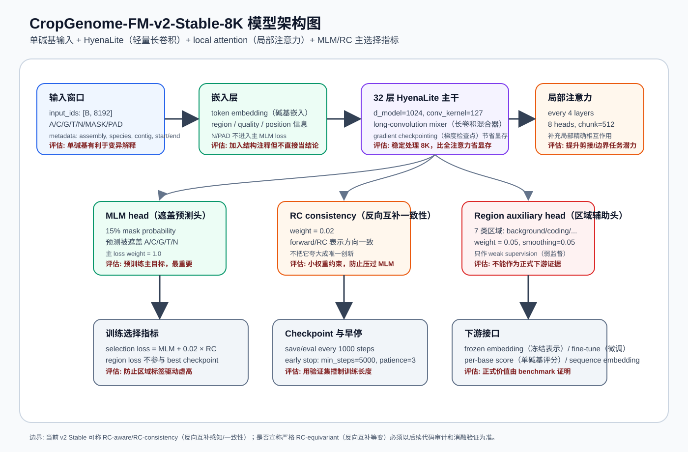

# CropGenome-FM 模型结构解释

更新时间: 2026-06-29 08:20 CST



## 0. 当前主模型

当前主模型是 `CropGenome-FM-v2-Stable-8K`（作物基因组基础模型第二版稳健 8192 碱基版）。设计目标是先稳定训练、稳定验证、稳定产生下游结果，而不是把论文卖点放在复杂架构创新上。

核心结构:

```text
single-base DNA tokens（单碱基 DNA 输入）
  -> token/region/quality embeddings（碱基/区域/质量嵌入）
  -> 32-layer HyenaLite backbone（32 层轻量长卷积主干）
  -> local attention every 4 layers（每 4 层局部注意力）
  -> MLM head（遮盖碱基预测头）
  -> RC consistency regularizer（反向互补一致性约束）
  -> weak region auxiliary head（弱监督区域辅助头）
  -> selection loss for best checkpoint（最佳模型存档点选择指标）
```

解释: 模型使用单碱基 token（输入单位），保留 SNP/indel（单核苷酸变异/插入缺失）解释能力；HyenaLite（轻量长卷积序列模型）负责长上下文建模；local attention（局部注意力）补充剪接边界、启动子 motif（短序列模式）等局部精确交互。

评估: 这是稳健工程路线。它不像大型 Transformer（注意力模型）那样显存爆炸，也不像纯卷积那样完全缺少局部注意力补充。论文表述应强调“作物专用预训练和 benchmark（基准评测）”，不要把架构本身夸成唯一创新。

## 1. 输入定义

### 1.1 token vocabulary（输入词表）

| token（输入符号） | id | 含义 |
|---|---:|---|
| A | 0 | 腺嘌呤 |
| C | 1 | 胞嘧啶 |
| G | 2 | 鸟嘌呤 |
| T | 3 | 胸腺嘧啶 |
| N | 4 | 未知碱基 |
| MASK | 5 | MLM（遮盖碱基预测）使用的遮盖符号 |
| PAD | 6 | padding（补齐符号） |

N/PAD（未知碱基/补齐符号）不参与主 MLM loss（遮盖预测损失）。

解释: 使用单碱基而不是 k-mer（固定长度片段）或 BPE（子词切分），是为了避免一个 SNP（单核苷酸变异）改变多个 token 边界。

评估: 单碱基序列更长，训练更贵；但对变异效应、剪接边界和单碱基注释任务更自然。对于本项目的作物功能基因组任务，这是合理取舍。

### 1.2 batch（批次）字段

| 字段 | 形状/类型 | 用途 |
|---|---|---|
| `input_ids` | `[B, 8192]` | 输入碱基 token（输入符号） |
| `labels_mlm` | `[B, 8192]` | MLM（遮盖碱基预测）标签，非 mask 位置为忽略值 |
| `loss_mask` | `[B, 8192]` | 哪些位置参与 loss（损失） |
| `region_ids` | `[B, 8192]` | 区域弱标签，如 coding（编码区）、promoter（启动子）等 |
| metadata（元数据） | assembly/species/contig/start/end | 追踪来源和防泄漏审计 |

解释: 训练输入窗口已经在本服务器按 Stage（阶段）固化，但 mask（遮盖）、labels（标签）和 batch order（批次顺序）在训练服务器动态生成。

评估: 固化输入提高可复现性，动态 mask/label 提高训练多样性。这个设计也让训练服务器只需要接收 `training_server_transfer/`，不用访问原始 plantDB（植物数据库）全量数据。

## 2. 主干结构

当前配置来自 `training_server_transfer/configs/model_large.json`：

| 参数 | 当前值 | 解释与评估 |
|---|---:|---|
| `d_model` | 1024 | hidden size（隐藏维度）；容量足够，但仍能在单张 A100 40G 上训练。 |
| `n_layers` | 32 | 层数；比小模型更有表达力，训练成本可控。 |
| `conv_kernel` | 127 | HyenaLite（轻量长卷积）卷积核；有助于局部到中程模式。 |
| `attention_every` | 4 | 每 4 层插入 local attention（局部注意力）；平衡显存与局部精确建模。 |
| `attention_heads` | 8 | 注意力头数；用于局部片段内部交互。 |
| `attention_chunk_size` | 512 | 局部注意力块长度；避免全局注意力显存过高。 |
| `dropout` | 0.05 | dropout（随机失活）防过拟合。 |
| `gradient_checkpointing` | true | 梯度检查点，节省显存，增加一点计算时间。 |

解释: HyenaLite（轻量长卷积）适合长 DNA 序列，local attention（局部注意力）补充剪接位点、motif（短序列模式）和边界任务所需的局部精确交互。

评估: 该架构适合先跑通 8K。若后续 64K/128K 扩展，需要重新评估 attention chunk（局部注意力块）和 batch size（批量大小），否则显存或吞吐可能成为瓶颈。

## 3. 训练目标和 loss（损失函数）

### 3.1 MLM loss（遮盖碱基预测损失）

- mask probability（遮盖比例）: 0.15。
- `force_mask_per_sequence=true`，避免某些短有效窗口完全没有 mask。
- 主 loss weight（损失权重）: 1.0。

解释: MLM（masked language modeling，遮盖碱基预测）是主预训练目标。模型需要根据上下文恢复被遮盖的碱基。

评估: MLM loss 是最可信的预训练学习信号；后续 best checkpoint（最佳模型存档点）也主要依赖它。若 MLM loss 不下降，其他辅助任务结果都不应过度解释。

### 3.2 RC consistency（反向互补一致性）

- `rc_consistency_weight=0.02`。
- `rc_selection_weight=0.02`。
- selection loss（选择损失）中用小权重加入 RC loss（反向互补损失）。

解释: DNA 双链有 reverse-complement（反向互补）关系。RC consistency（反向互补一致性）要求模型对正向序列和反向互补序列的表示/预测更一致。

评估: 当前 v2 可以称为 RC-aware / RC-consistency（反向互补感知/一致性约束）。是否宣称严格 RC-equivariant（反向互补等变）必须以后续代码审计、数学定义和消融验证为准；文档和论文不要过度声明。

### 3.3 Region auxiliary head（区域辅助头）

区域类别:

- background（背景）
- coding（编码区）
- gene_body（基因体）
- promoter（启动子）
- splice（剪接区）
- tes（转录终止区）
- utr（非翻译区）

配置:

- `region_classification_weight=0.05`。
- `region_label_smoothing=0.05`。

解释: 区域辅助头给模型一个弱监督信号，让表示更关注结构注释区域。但这些标签来自预训练数据构建过程，不是独立外部验证。

评估: 这个头只能作为 weak supervision（弱监督）和 sanity check（健康检查）。正式结论必须通过独立下游 benchmark（基准评测）证明；不能说“region_acc（区域准确率）高，所以模型学会了作物基因结构”。

## 4. checkpoint（模型存档点）和 early stopping（早停）

原始训练配置来自 `training_server_transfer/configs/train_stage_B.json`；step1570 发生 CUDA OOM（显存不足）后，当前恢复训练使用 `training_server_transfer/configs/train_stage_B_resume_mb4_accum9.json`：

| 项 | 当前值 | 解释 |
|---|---:|---|
| `max_steps` | 50000 | 最大训练步数，不代表一定跑满。 |
| `micro_batch_size` | 4 | OOM 后恢复配置；单次显卡小批量从 5 降到 4。 |
| `grad_accum_steps` | 9 | OOM 后恢复配置；梯度累积从 7 升到 9，使有效 batch（有效批量）约为 36。 |
| `learning_rate` | 1e-4 | 学习率上限。 |
| `warmup_steps` | 1000 | 学习率预热步数。 |
| `save_every` | 1000 | 每 1000 step 保存 checkpoint（模型存档点）。 |
| `eval_every` | 1000 | 每 1000 step 做 validation（验证）。 |
| `early_stopping_min_steps` | 5000 | step5000 前不触发早停。 |
| `early_stopping_patience_evals` | 3 | 连续 3 次验证无有效改善才早停。 |
| `early_stopping_min_delta` | 0.002 | 小于 0.002 的改善不算有效改善。 |

选择指标:

```text
selection_loss = val_mlm_loss + 0.02 × val_rc_loss
```

解释: best checkpoint（最佳模型存档点）按 selection loss（选择损失）保存，而不是按 final step（最后一步）保存。region loss（区域辅助损失）不参与 best checkpoint 选择。

评估: 这是防止过拟合和防止辅助标签虚高的关键。正式下游评测应优先使用 best checkpoint，而不是随手使用最后 checkpoint。

## 5. 下游接口

模型可提供:

- frozen embedding（冻结表示）: 不更新主模型，只训练轻量分类器或 nearest centroid（最近中心分类器）。
- fine-tune（微调）: 在下游任务上更新部分或全部模型参数。
- per-base score（单碱基评分）: 用于 splice（剪接）、TSS/TES（转录起止位点）、variant effect（变异效应）等位置敏感任务。
- sequence embedding（序列向量表示）: 用于 promoter（启动子）、lncRNA/mRNA 分类、区域分类等任务。

解释: frozen embedding（冻结表示）适合快速检查表示是否有信号；fine-tune（微调）更接近实际应用，但更容易过拟合，需要严格 split（划分）。

评估: 第一阶段应先用 frozen embedding 和轻量 baseline（基线）判断 checkpoint 是否值得，再做正式 fine-tune。不要用一个小样本 probe（探针评测）直接宣称模型已优于公开模型。

## 6. 模型边界和论文表述边界

可以说:

- 模型是 crop-specific（作物专用）预训练。
- 使用 single-base tokenization（单碱基输入）。
- 使用 HyenaLite（轻量长卷积）+ local attention（局部注意力）处理 8K 长上下文。
- 使用 RC consistency（反向互补一致性）作为小权重约束。
- 使用 region auxiliary head（区域辅助头）作为弱监督训练辅助。
- best checkpoint（最佳模型存档点）由 MLM+RC 选择指标决定。

不应过度说:

- 不应把 region_bucket（区域桶）辅助任务当作独立 benchmark（基准评测）。
- 不应把旧 formal CaduceusRC（旧反向互补一致性模型）结果混入 v2 Stable 的 from-scratch（从头训练）结论。
- 不应在没有严格消融前宣称 RC-equivariant（反向互补等变）架构带来决定性收益。
- 不应只凭 train loss（训练损失）下降宣称模型成功。

评估: 这些边界能保护论文结论。模型结构是研究载体，最终可信度来自独立下游任务、公开基线和消融。

## 7. 后续架构扩展路线

优先级:

1. 先完成 v2 Stable 8K 的 validation（验证）、best checkpoint（最佳模型存档点）和第一波 benchmark（基准评测）。
2. 若 8K 有收益，再扩展 64K/128K context（上下文长度）。
3. 若 RC consistency（反向互补一致性）消融显示收益，再考虑更显式的 cross-strand communication（跨链通信）模块。
4. 若 EDTA（转座元件注释软件）可靠完成，再纳入 TE/repeat（转座元件/重复序列）专门 head 或下游任务。

解释: 架构扩展必须由结果驱动，而不是为了复杂而复杂。

评估: 当前最重要的不是加模块，而是证明 v2 Stable 在独立下游任务中确实比基线强。只有基线扎实后，扩展模块才有解释价值。
