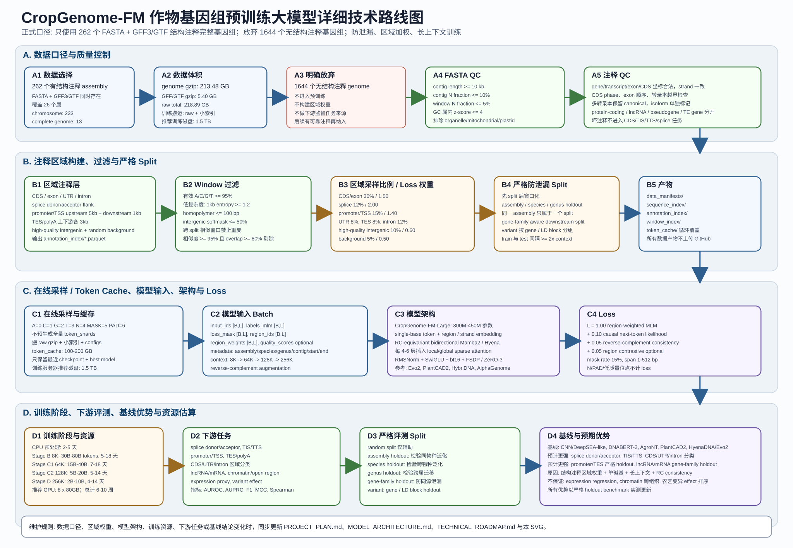

# CropGenome-FM 技术路线图

更新时间: 2026-06-08 11:42:31 CST

## 路线概览

1. 数据输入: 只使用 262 个有 FASTA + GFF3/GTF 的结构注释完整基因组。
2. 预处理: FASTA QC、GFF/GTF 解析、区域构建、严格 split、窗口过滤、token shard。
3. 采样: CDS、splice、UTR、promoter/TSS、TES、intron、high-quality intergenic、background 按目标比例进入 batch。
4. 模型: RC-equivariant Mamba2/Hyena + periodic attention。
5. Loss: region-weighted MLM + causal next-token + RC consistency。
6. 下游: splice、TIS/TTS、promoter/TES、区域分类、lncRNA/mRNA、chromatin、expression、variant effect。
7. 基线: CNN、DNABERT-2、AgroNT、PlantCAD2、HyenaDNA/Evo2。
8. 时间: CPU 预处理 2-5 天；GPU 正式训练 4-10 周；下游评测 1-2 周。

## 路线图维护规则

- 数据口径、模型架构、区域权重、训练阶段或资源估算发生变化时，同步更新 `PROJECT_PLAN.md`、`MODEL_ARCHITECTURE.md` 和本路线图。
- SVG 是仓库内可追踪的技术路线图；生成式图片可作为展示图，但正式计划以 Markdown 和 SVG 为准。
