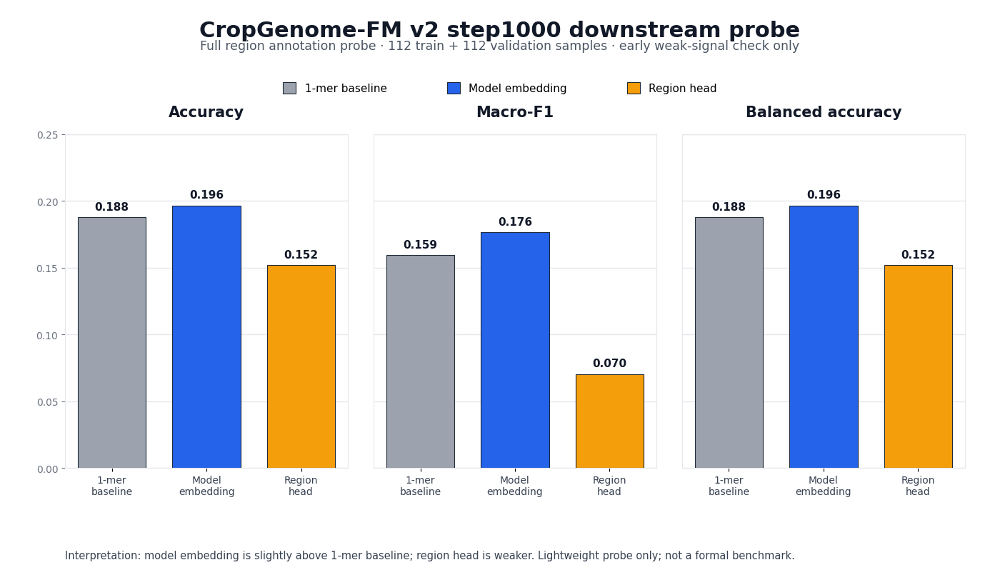

# CropGenome-FM 训练进展与评估

更新时间: 2026-06-29 09:59 CST

本文件是 GitHub 唯一进展入口。用户只需要看本文件；下游 probe（探针评测）明细、confusion matrix（混淆矩阵）、per-class metrics（逐类别指标）、run manifest（运行清单）和训练日志只保留在本地，不上传 GitHub。

## 0. 当前一句话结论

`CropGenome-FM-v2-Stable-8K`（作物基因组基础模型第二版稳健 8192 碱基版）已从 step1000 checkpoint（模型存档点）恢复并继续训练到 step2710；step2000 validation（验证）明显优于 step1000，`checkpoint_best.pt`（最佳模型存档点）已更新到 step2000。

当前最重要结论: 预训练 validation selection loss（验证选择损失）从 step1000 的 1.2375897 降到 step2000 的 1.1890236，训练方向正常。step1000 的轻量下游 probe（探针评测）已完成，但只是早期弱阳性，不是正式 splice/promoter/TES benchmark（剪接/启动子/转录终止基准评测）。

## 1. 当前训练状态

| 项目 | 当前值 | 解释 |
|---|---:|---|
| 训练版本 | `v2_stable_from_scratch` | v2 Stable（第二版稳健版）正式 from scratch（从头训练）；恢复只用于同一 run（训练轮次）中断续跑。 |
| 当前 step（训练步） | 2710 | 已超过 step2000，继续向 step3000 前进。 |
| 最新 train loss（训练损失） | 1.2287162 | 训练曲线噪声较大，单点会上下波动，趋势仍需看滚动中位数和 validation。 |
| 最新 train MLM loss（遮盖碱基预测损失） | 1.1434011 | 主预训练目标仍在正常训练区间。 |
| 最新 train selection loss（选择损失） | 1.1454023 | 单点高于 step2620，但曲线判断以滚动趋势和 step3000 validation 为准。 |
| 最新 validation（验证） | step2000 | 下一次验证/保存是 step3000。 |
| step2000 val loss（验证总损失） | 1.2675664 | 比 step1000 更好。 |
| step2000 val selection loss（验证选择损失） | 1.1890236 | 当前 best checkpoint（最佳模型存档点）依据。 |
| 当前 checkpoint（模型存档点） | `checkpoint_best.pt`, `step_00001000.pt`, `step_00002000.pt` | checkpoint 文件本地保留，不上传 GitHub。 |
| A100 GPU2 | 约 32.3GB / 40GB, 100% | 主训练正常运行。 |
| 下一 checkpoint | step3000 | 需要等 step3000 validation 再判断是否继续改善。 |

## 2. 核心训练曲线

GitHub 只保留两张最有判断价值的曲线，避免文件树再次变乱。其他 RC loss（反向互补损失）、region loss/acc（区域辅助损失/准确率）图本地保留，必要时再汇总进本文，不单独作为入口。

### 2.1 Total loss（总损失）

- 图: [docs/training_progress/figures/v2_stable_stageB_loss.png](docs/training_progress/figures/v2_stable_stageB_loss.png)
- 源数据: [docs/training_progress/source_data/v2_stable_stageB_metrics.tsv](docs/training_progress/source_data/v2_stable_stageB_metrics.tsv)

解释: total loss（总损失）综合主 MLM loss（遮盖碱基预测损失）、小权重 RC consistency（反向互补一致性）和区域辅助项。曲线只用于监控训练是否稳定，不等同于下游 benchmark（基准评测）成功。

### 2.2 Selection loss（选择损失）

- 图: [docs/training_progress/figures/v2_stable_stageB_selection_loss.png](docs/training_progress/figures/v2_stable_stageB_selection_loss.png)
- 曲线摘要: [docs/training_progress/source_data/v2_stable_stageB_curve_summary.tsv](docs/training_progress/source_data/v2_stable_stageB_curve_summary.tsv)

解释: selection loss（选择损失）定义为 `MLM loss + 0.02 × RC loss`。best checkpoint（最佳模型存档点）和 early stopping（早停）按 validation selection loss（验证选择损失）判断，不把 region loss（区域辅助损失）放进主选择指标。

## 3. Validation（验证）趋势

| checkpoint（模型存档点） | val loss（验证总损失） | val MLM loss（验证遮盖损失） | val RC loss（验证反向互补损失） | val selection loss（验证选择损失） | 结论 |
|---|---:|---:|---:|---:|---|
| step1000 | 1.3238202 | 1.2372975 | 0.0146100 | 1.2375897 | 第一个可用 checkpoint；恢复训练从这里继续。 |
| step2000 | 1.2675664 | 1.1879575 | 0.0533046 | 1.1890236 | 明显优于 step1000，当前 best checkpoint。 |

评估: step2000 的 validation selection loss 下降约 0.0486，这是实质改善。当前应继续训练观察 step3000/4000/5000，而不是在 step2000 就停止。

## 4. 公正评估与外部指标尺度参考

### 4.1 当前训练是否有效

公正结论: 当前预训练是有效的，但还不能说下游已经成功。判断依据如下:

| 证据 | 当前数字 | 怎么看 | 结论 |
|---|---:|---|---|
| validation selection loss（验证选择损失） | step1000: 1.2375897 → step2000: 1.1890236 | 下降 0.0485661，约 3.92%。 | 明确正向，step2000 比 step1000 好。 |
| validation total loss（验证总损失） | step1000: 1.3238202 → step2000: 1.2675664 | 下降 0.0562538，约 4.25%。 | 与 selection loss 一致，非单一指标偶然。 |
| 最新 train selection loss（训练选择损失） | step2710: 1.1454023 | 训练单点有噪声；是否真正泛化改善要看 step3000 validation。 | 训练仍应继续到 step3000；不能用单个 train 点替代 validation。 |
| step1000 下游 embedding probe（向量探针） | Accuracy 0.1964, Macro-F1 0.1764 | 7 类均衡任务，随机/多数类 Accuracy 约 0.1429；比 1-mer baseline（单碱基组成基线）Accuracy 高 0.0089，Macro-F1 高 0.0172。 | 弱阳性，只说明 embedding 有一点信号。 |
| region head（区域预测头） | Macro-F1 0.0702 | 明显低于 embedding probe 和 1-mer baseline。 | 只能作训练健康检查，不能作为论文主结果。 |

保守判断: 预训练 loss（损失）在正常改善；step1000 的下游 probe 只能算“早期弱信号”，还远不到“模型已经学到稳定可迁移生物功能”的程度。是否值得继续，关键看 step3000/5000 的 validation（验证）和固定 benchmark（基准评测）是否继续改善。

### 4.2 与公开基因组模型指标的尺度参考

重要限制: 下面不是直接胜负比较。我们的 full region annotation probe（完整区域注释探针）是自定义 7 类小样本任务；公开模型通常报告 GenomicBenchmarks（基因组分类基准）、GUE（Genome Understanding Evaluation，基因组理解评测）、NT tasks（Nucleotide Transformer 任务集）等标准任务。预训练 loss（损失）也不能跨模型直接比较，因为 tokenizer（分词方式）、masking objective（遮盖目标）、物种/序列长度、训练数据都不同。

| 来源/模型 | 公开任务与指标 | 公开数字 | 对我们的含义 |
|---|---|---:|---|
| HyenaDNA（Nguyen et al., 2023） | GenomicBenchmarks Top-1 Accuracy（8 个短序列分类任务平均准确率） | HyenaDNA 约 88.46%；CNN baseline 约 79.24%；DNABERT 约 83.05%。 | 公开标准分类任务的成熟模型通常在 70%–97% accuracy 区间；我们的 step1000 probe Accuracy 0.1964 不能按同一尺度解读。 |
| Caduceus（Schiff et al., 2024） | GenomicBenchmarks Top-1 Accuracy（5-fold CV，5 折交叉验证） | Caduceus-PS 约 0.869；Caduceus-Ph 约 0.866；HyenaDNA 约 0.853；CNN 约 0.803。 | 这些是标准二分类/近二分类任务，且样本和 protocol（流程）成熟；我们当前 probe 只是内部早期诊断。 |
| Caduceus / NT tasks（Dalla-Torre et al. 任务） | Histone/enhancer 用 MCC（马修斯相关系数），promoter/splice 用 F1/accuracy（F1/准确率） | 例: promoter all F1: NT-v2 0.976、DNABERT-2 0.971、HyenaDNA 0.960、Caduceus-Ph 0.970；splice all accuracy: NT-v2 0.983、HyenaDNA 0.956、Caduceus-Ph 0.940。 | promoter/splice 这类公开任务接近饱和；我们必须后续做同口径 splice/promoter/TES benchmark，不能拿当前小 probe 代替。 |
| DNABERT-2（Zhou et al., ICLR 2024） | GUE 28 个数据集平均 evaluation score（平均评测分数，混合 F1/MCC） | DNABERT-2 66.80；DNABERT-2 继续在 GUE 训练集预训练后 67.77；NT-2500M-multi 66.93；NT-2500M-1000g 61.41。 | 这是跨任务平均分，不等同 accuracy；可作为“成熟公开模型在标准 benchmark 上约 60–70 分”的尺度。 |
| HyenaDNA ultra-long species classification（超长物种分类） | 5-way species Top-1 Accuracy（5 类物种准确率） | 1k: 61.1%；32k: 93.4%；250k: 97.9%；450k: 99.4%；1M: 99.5%。 | 长上下文任务可很高，但任务类型完全不同；不能用来证明我们当前 8K 作物模型好坏。 |

当前最公平的对比方式: 下一步不要再只看 step1000 内部 probe，应在固定 benchmark 上对比 1-mer/CNN/公开模型或公开模型 embedding（向量表示）。只有同一 split（划分）、同一 metric（指标）、同一任务的结果，才可写成论文主表。

## 5. 下游 probe（探针评测）摘要

GitHub 不上传 `docs/training_progress/downstream_evaluations/step_*/...` 明细目录；该目录只在本地保留，供自动 watcher（检查器）判断某个 checkpoint 是否已经评估过。对外只在本节保留最小摘要。

### 5.1 step1000 full region annotation probe（完整区域注释探针）

状态: 已完成，2026-06-28 13:31 CST，RTX 2080 Ti 上运行。

- 图: [docs/training_progress/figures/v2_step1000_downstream_probe_summary.png](docs/training_progress/figures/v2_step1000_downstream_probe_summary.png)

| 方法 | Accuracy（准确率） | Macro-F1（类别平均 F1） | Balanced accuracy（类别均衡准确率） | 解释 |
|---|---:|---:|---:|---|
| 1-mer nearest centroid（单碱基组成最近中心基线） | 0.1875 | 0.1592 | 0.1875 | 最低限度序列组成 baseline（基线）。 |
| model embedding nearest centroid（模型向量最近中心） | 0.1964 | 0.1764 | 0.1964 | 略高于 1-mer，说明 step1000 表示有弱信号。 |
| model region head argmax（区域预测头直接分类） | 0.1518 | 0.0702 | 0.1518 | 较弱；region head 只能作健康检查。 |

评估: step1000 下游结果是弱阳性，不是正式成功。它只能说明 embedding（向量表示）比简单单碱基组成略好；正式结论必须等 splice/promoter/TES 等独立 benchmark（基准评测）和后续 checkpoint 趋势。

### 5.2 step2000 下游状态

step2000 checkpoint 已产生，但 step2000 下游 probe 尚未完成。原因是原计划使用 gpu05 的 2080Ti 自动评估，而 gpu05 曾出现 `No route to host`（无法路由到主机）。A100 GPU4 目前被其他用户任务占用 13.4GB 显存且 GPU 利用率 100%，不建议抢占或共用。

## 6. 文件整理规则

为了避免 GitHub 再次变成一堆目录，后续固定执行下面规则:

1. GitHub 只看 `README.md`、`PROJECT_PLAN.md`、`MODEL_ARCHITECTURE.md`、`TRAINING_PROGRESS.md`。
2. `docs/training_progress/` 只跟踪少量核心 PNG（位图）曲线和必要 TSV（表格源数据）。
3. `docs/training_progress/downstream_evaluations/` 只本地保留，不上传 GitHub。
4. 旧 `docs/downstream/*`、`docs/training_curves/*`、临时 handoff（交接）文档、旧训练指标散表都不再作为 GitHub 入口。
5. checkpoint（模型存档点）、训练日志、run manifest（运行清单）、per-class/confusion 明细和逐样本预测一律本地保留。

## 7. 下一步: CropGenome-Bench v1 正式下游评估

正式任务注册文件: [training_server_transfer/configs/downstream_v2_benchmark.json](training_server_transfer/configs/downstream_v2_benchmark.json)。

目标: 不再只看 step1000 内部 probe（探针），而是建立 CropGenome-Bench v1（作物基因组正式基准），检验 CropGenome-FM 是否在作物任务上优于通用 DNA 大模型。

| 优先级 | 事件 | 要做什么 | 判断标准 |
|---|---|---|---|
| P0 | step3000 validation（验证） | 更新本文件和核心曲线 | val selection loss 是否继续低于 1.1890。 |
| P0 | core gene syntax（核心基因结构语法） | 构建 splice hard-negative、exon/intron/UTR segmentation、TIS/TTS context 三个任务 | 同一 split 下比较 random/majority/k-mer/CNN/DNABERT-2/HyenaDNA/Caduceus/CropGenome-FM。 |
| P0 | crop regulatory elements（作物调控元件） | 构建 promoter/TSS hard-negative、TES/polyA；ATAC/ACR 只在 assembly QC 通过后加入 | 主指标用 AUPRC/MCC/Macro-F1，不只看 accuracy。 |
| P0 | transfer and few-shot（迁移与少样本） | 做 species/genus holdout、monocot-to-dicot、1%/5%/10% label panels | 若作物预训练有效，跨作物保留率和少标签增益应高于通用模型。 |
| P1 | crop-specific structure（作物结构特色） | EDTA 高置信后做 TE boundary；Stage C/D 后做 long-context gene boundary | 标签 QC 未过关前不进主结论。 |
| P1 | variant/QTL ranking（变异和育种排序） | 只用已发表 processed VCF/GWAS/QTL/eQTL 表做 ref/alt delta 与候选基因排序 | 不下载 WGS/FASTQ/BAM 原始重测序，不重做 variant calling。 |
| P0 | 公平比较 | 所有模型同一 train/valid/test split、同一输入窗口、同一下游头、5 seeds mean ± std | 只有同任务同协议结果能进入论文主表。 |

论文主结论门槛: 至少 3 个 P0 作物任务完成固定 test（测试集）评估；CropGenome-FM 平均超过最强可运行通用/植物 DNA 模型至少 3% relative improvement（相对提升）；至少一个 species/genus holdout 或 low-homology holdout 中仍保留收益。
