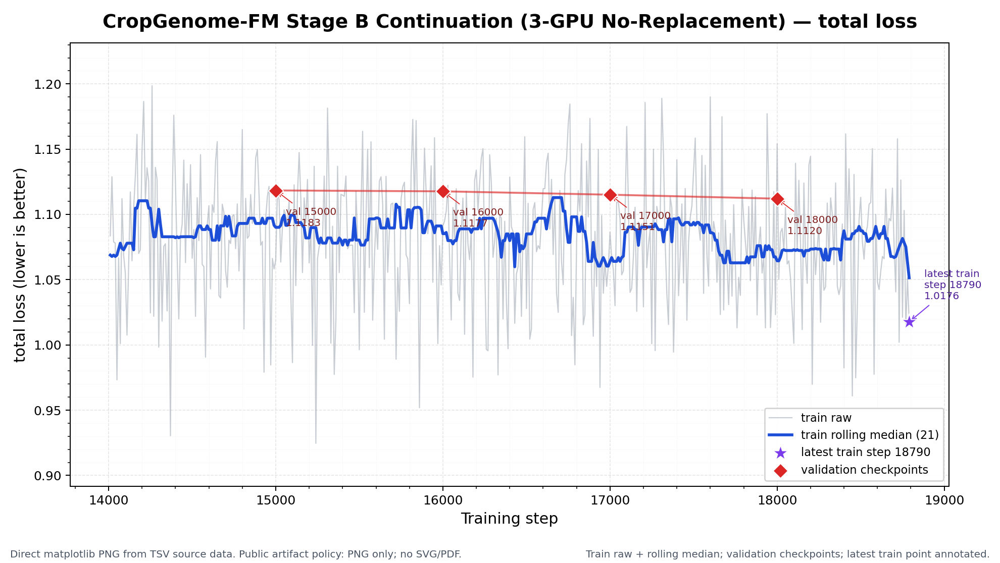
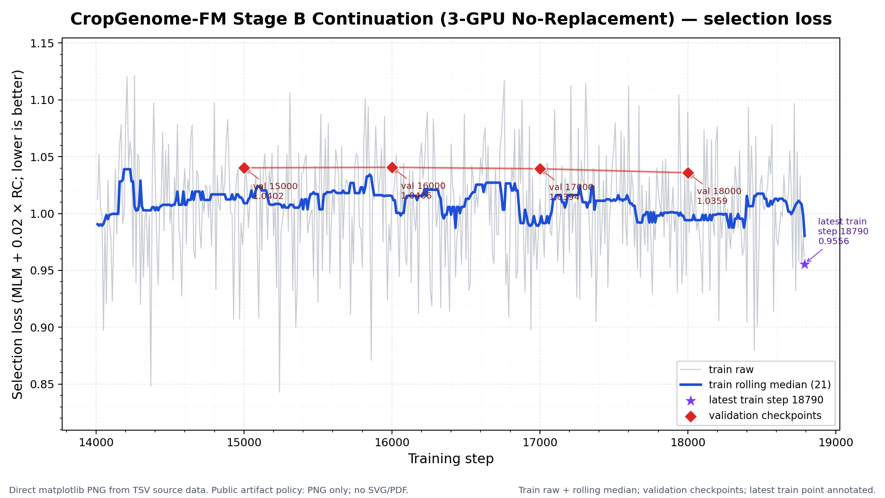

# CropGenome-FM 训练进展与评估

更新时间：2026-07-30 09:03 CST

本文件是 GitHub 上的训练进展主入口。详细方案见 `PROJECT_PLAN.md`，模型结构见 `MODEL_ARCHITECTURE.md`，本次正式结果的小白版逐项解读见 [CropGenome-Bench v1 A100 正式评估](docs/training_progress/cropgenome_bench_v1_formal_a100/README.md)。

## 1. 当前一句话结论

2026年7月21日冻结的publication-v2正式证据仍绑定`CropGenome-FM step14000`；新的Stage B三GPU全局无放回续训已从step14000启动，当前曲线同步到step18790，最近一次validation为step18000且刷新当前最佳selection loss。训练继续到目标step50000，每500步永久保存完整checkpoint。下游不再要求自动触发：A类10项和B类7项已全部保留，待17项协议冻结后手动评估候选checkpoint。

## 2. 当前状态表

| 项目 | 当前值 | 解释 |
|---|---:|---|
| 正式结果基座 | `CropGenomeFM_step14000` | publication-v2冻结模型；历史正式结论不被续训追溯修改。 |
| 当前训练代际 | `Stage_B_continuation_3gpu_no_replacement_from_step14000` | 三GPU DDP；coverage cycle内全局无放回。 |
| 最新 train step/loss | 18790 / 1.0176 | 训练原始点波动较大，应结合rolling median（滚动中位数）观察。 |
| 最新 validation | step18000 | val loss=1.1120；val selection loss=1.0359。 |
| 当前best validation | step18000 | `selection_loss = MLM loss + 0.02 × RC loss`；早停关闭。 |
| 保存/目标 | 每500步 / step50000 | 完整checkpoint永久保留，不滚动删除。 |
| 正式 benchmark | 3 个 GFF-derived hard-negative 任务完成 | promoter/TSS、splice donor/acceptor、TES/poly(A)。 |
| publication-v2完整评估 | 核心3类＋外部7类 | 旧step14000正式证据已完成；不代表新续训checkpoint已评估。 |
| 已选下游面板 | A类10项＋B类7项 | 全部保留；等待数据与协议冻结后手动执行。 |
| 历史Stage C1 64K | Gate 4/4 PASS，训练停在step569 | 无validation、无正式下游结果；不是当前运行。 |
| GitHub 上传策略 | 只传轻量产物 | Markdown、聚合 TSV/JSON、PNG；不上传原始数据、checkpoint、cache、逐样本预测或日志。 |

## 3. GFF-derived CropGenome-Bench v1 正式结果

### 3.1 数据与协议

- 每任务 `6,144` 个样本：train/validation/test=`4096/1024/1024`。
- 每个 split 正负样本严格平衡。
- test 物种固定为黄瓜、水稻、马铃薯；与 train、validation 物种不重叠。
- 输入窗口统一为 512 bp。
- splice 负样本也含典型 GT/AG 基序；promoter/TES 使用同 assembly 平移诱饵。
- 正负样本完成 GC matching（GC 含量匹配）、坐标唯一性和物种隔离审计。
- 下游协议为 frozen embedding + linear probe（冻结向量 + 相同线性分类头）。
- 1%/10% 标签设置使用 5 个少样本抽样 seeds；100% 数据的确定性重复不能解释成独立模型稳定性。

### 3.2 全量标签 balanced accuracy

| 任务 | Best k-mer | Random init | DNABERT-2 | NT-v2 100M* | step14000 | step17000 |
|---|---:|---:|---:|---:|---:|---:|
| promoter/TSS | 0.6113 | 0.5869 | 0.6494 | 0.6689 | 0.6875 | **0.6885** |
| splice donor/acceptor | 0.6797 | 0.6270 | 0.7090 | 0.7158 | **0.8896** | 0.8672 |
| TES/poly(A) | 0.6289 | 0.5762 | 0.6182 | **0.6592** | 0.6387 | 0.6455 |
| 三任务平均 | 0.6400 | 0.5967 | 0.6589 | 0.6813 | **0.7386** | 0.7337 |

`*` NT-v2 为读取主结果后追加的同口径补充模型，不替代预锁定主表，也不用来重新选择 checkpoint。

怎么解读：

- splice 是最强证据：step14000 相对 DNABERT-2 高 `18.07` 个百分点，相对 NT-v2 高 `17.38` 个百分点。
- promoter 有中等提升：step17000 相对 DNABERT-2 高 `3.91` 个百分点，相对 NT-v2 高 `1.95` 个百分点。
- TES 是当前短板：step17000 高于 DNABERT-2 和最佳 k-mer，但低于 NT-v2 `1.37` 个百分点。
- step14000 与 step17000 的任务赢家不同，所以论文表保留两者；运营上不再保留成对候选，唯一续训基座为 early-stop step14000。

### 3.3 少样本标签效率

| 标签比例 | DNABERT-2 | NT-v2 100M* | step14000 | step17000 |
|---|---:|---:|---:|---:|
| 1% | 0.5661 | 0.5663 | 0.6602 | **0.6669** |
| 10% | 0.6306 | 0.6225 | **0.7010** | 0.6876 |
| 100% | 0.6589 | 0.6813 | **0.7386** | 0.7337 |

1% 标签只有约 45–47 个训练样本，两个 CropGenome-FM checkpoint 仍明显高于公开模型，支持“作物预训练减少下游标注需求”的方向。详细每任务 mean±SD（平均值±标准差）、指标解释和结论边界见 [详细报告](docs/training_progress/cropgenome_bench_v1_formal_a100/README.md)。

### 3.4 正式结果文件

- [详细小白版解读](docs/training_progress/cropgenome_bench_v1_formal_a100/README.md)
- [全量主指标表](docs/training_progress/cropgenome_bench_v1_formal_a100/source_data/headline_full_data_metrics.tsv)
- [少样本指标表](docs/training_progress/cropgenome_bench_v1_formal_a100/source_data/fewshot_metrics.tsv)
- [逐任务相对提升](docs/training_progress/cropgenome_bench_v1_formal_a100/source_data/task_comparisons.tsv)
- [跨任务平均表](docs/training_progress/cropgenome_bench_v1_formal_a100/source_data/method_mean_balanced_accuracy.tsv)
- [Stage C1 gate JSON](docs/training_progress/cropgenome_bench_v1_formal_a100/source_data/stage_c1_64k_gate.json)

## 4. 历史Stage C1 64K gate

A100 GPU2 真实执行结果：

| 项目 | 结果 |
|---|---:|
| batch shape | `[1, 65536]` |
| checkpoint 参数加载 | 430 keys 全匹配，missing/unexpected=0 |
| 初始化语义 | strict model load；optimizer/global step/best tracking 重置 |
| 依赖跨度 | 128-chunk 等拓扑梯度支持由旧结构 992 个局部位置扩展到 8192/8192 全长位置 |
| 混合长度目标 | MLM/RC/region 分别按有效 token/标签数归一化 |
| 固定验证面板 | 256 windows；22 assemblies、11 species、7 regions、76 个 64K |
| 总 loss / MLM loss | 0.717403 / 0.586707 |
| 峰值 allocated / reserved 显存 | 26,416.9 / 27,946.0 MiB |
| forward/backward/optimizer step | PASS |

结论：四项前置gate均通过，证明“真实64K拓扑可用且优化语义正确”；但该历史运行停在step569、未到第一次validation，当前也没有继续运行。因此不能声称64K训练完成或64K下游优于8K。

## 5. 训练曲线

### 5.1 Total loss（总损失）

- 图：[docs/training_progress/figures/v2_stable_stageB_loss.png](docs/training_progress/figures/v2_stable_stageB_loss.png)
- 源数据：[docs/training_progress/source_data/v2_stable_stageB_metrics.tsv](docs/training_progress/source_data/v2_stable_stageB_metrics.tsv)

### 5.2 Selection loss（选择损失）

- 图：[docs/training_progress/figures/v2_stable_stageB_selection_loss.png](docs/training_progress/figures/v2_stable_stageB_selection_loss.png)
- 曲线摘要：[docs/training_progress/source_data/v2_stable_stageB_curve_summary.tsv](docs/training_progress/source_data/v2_stable_stageB_curve_summary.tsv)

`selection_loss = MLM loss + 0.02 × RC loss`。region loss/accuracy（区域辅助损失/准确率）只作健康检查，不作为论文主证据。

### 5.3 三GPU无放回续训：Total loss

- 图：[docs/training_progress/figures/v2_stageB_continuation_no_replacement_loss.png](docs/training_progress/figures/v2_stageB_continuation_no_replacement_loss.png)
- 灰线为原始训练点，蓝线为21点滚动中位数，红色菱形为每1,000步validation，紫色星形为最新训练点。

### 5.4 三GPU无放回续训：Selection loss

- 图：[docs/training_progress/figures/v2_stageB_continuation_no_replacement_selection_loss.png](docs/training_progress/figures/v2_stageB_continuation_no_replacement_selection_loss.png)
- 源数据：[docs/training_progress/source_data/v2_stageB_continuation_no_replacement_metrics.tsv](docs/training_progress/source_data/v2_stageB_continuation_no_replacement_metrics.tsv)
- 曲线摘要：[docs/training_progress/source_data/v2_stageB_continuation_no_replacement_curve_summary.tsv](docs/training_progress/source_data/v2_stageB_continuation_no_replacement_curve_summary.tsv)
- 当前4个validation点从step15000到step18000连续改善selection loss，但该趋势只代表预训练验证，不代替完整下游任务。

## 6. 证据分层与历史入口

| 目录 | 用途 | 当前边界 |
|---|---|---|
| [formal A100](docs/training_progress/cropgenome_bench_v1_formal_a100/) | GFF-derived 正式 benchmark 与 Stage C1 gate | 当前主结果；NT-v2 明确标为事后补充。 |
| [formal-lite 2080Ti](docs/training_progress/cropgenome_bench_v1_formal_lite_test/) | Stage B proxy 标签的 checkpoint 决策 | 历史阶段证据，不再替代 GFF-derived 正式结果。 |
| `docs/training_progress/cropgenome_bench_v1_medium_validation/` | validation-only 候选筛选 | 只用于 checkpoint 选择，不当正式 test。 |
| `docs/training_progress/downstream_evaluations_2080/` | 逐 checkpoint diagnostic probe | 只看趋势，不进论文主表。 |

当前证据优先级：GFF-derived 正式结果 > formal-lite proxy > medium validation-only > diagnostic probe。

## 7. 当前决策

1. publication-v2正式报告继续绑定step14000，不用新训练结果追溯改写旧final manifest。
2. 当前Stage B续训从step14000出发，使用三GPU全局无放回抽样，目标step50000，早停关闭。
3. 所有每500步checkpoint永久保留；候选身份必须绑定run ID、路径、SHA-256和step，不能只看同名step目录。
4. 自动下游队列暂不作为阻塞；17项面板设计完成后手动运行候选checkpoint。
5. A类10项和B类7项全部保留。新增B类任务尚无结果，不能写成已经验证。
6. 论文主表不能写“所有任务都超过公开模型”，因为旧正式结果中PlantCAD2和PlantCaduceus在部分外部任务更强。

## 8. 下一步计划

| 优先级 | 任务 | 完成标准 |
|---|---|---|
| P0 | 继续三GPU无放回续训 | 每500步永久checkpoint、每1,000步validation，目标step50000。 |
| P0 | 冻结17项下游注册表 | A类10项沿用现有冻结数据；B类7项完成标签、split、指标和QC合同。 |
| P0 | 等待EDTA完成 | 为TE边界与TE超家族任务提供高置信标签；不运行RepeatModeler。 |
| P1 | 构建结构任务 | exon/intron/UTR分割、长内含子配对、完整基因边界、外显子归属。 |
| P1 | 冻结迁移协议 | leave-one-species/genus-out及低同源审计，不把物种分类捷径当主结果。 |
| P1 | 手动checkpoint评估 | 面板冻结后只重算候选CropGenome-FM表征和probe，复用哈希一致的公开基线。 |

## 9. 当前续训与公开边界

- 训练代际：`Stage_B_continuation_3gpu_no_replacement_from_step14000`。
- 起点/目标：step14000 → step50000。
- 全局有效batch：每rank micro-batch 4 × 梯度累积3 × 3 ranks = 36。
- 抽样：按真实长度分桶，一个coverage cycle内全局无放回；跨cycle允许再次使用窗口。
- checkpoint：每500步完整永久保存；validation：每1,000步。
- 公开仓库只保存本页、轻量TSV和PNG。训练日志、checkpoint、sampler状态、GPU信息和完整评估目录均不上传。
- 训练曲线下降是健康证据，不是论文性能结论；最终模型仍需17项固定下游面板和强公开模型基线验证。
