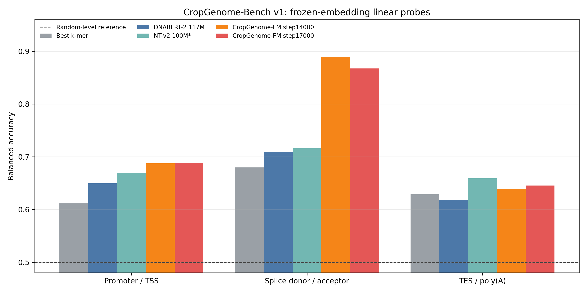
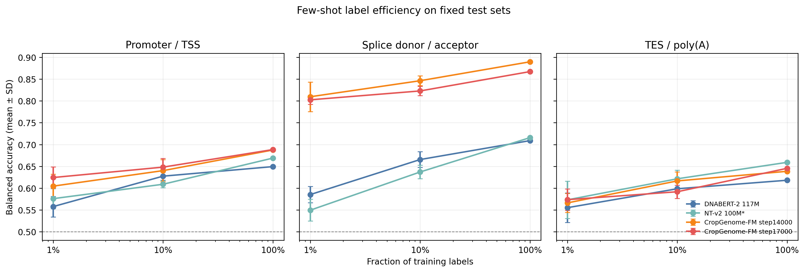

# CropGenome-FM 训练进展与评估

更新时间：2026-07-10 19:03 CST

本文件是 GitHub 上的训练进展主入口。详细方案见 `PROJECT_PLAN.md`，模型结构见 `MODEL_ARCHITECTURE.md`，本次正式结果的小白版逐项解读见 [CropGenome-Bench v1 A100 正式评估](docs/training_progress/cropgenome_bench_v1_formal_a100/README.md)。

## 1. 当前一句话结论

`CropGenome-FM-v2-Stable-8K` 训练运行到 step17000 后 early stop（早停）并冻结，**唯一 8K 最终版统一为 early-stop `checkpoint_best.pt = step14000`**。修复后的 Stage C1 已同时通过真实 64K 执行、64K 依赖跨度、token-aware objective（按有效 token 加权目标）和固定验证选择四项 gate；corrected 正式训练正在 A100 GPU2 运行。

## 2. 当前状态表

| 项目 | 当前值 | 解释 |
|---|---:|---|
| 主模型 | `CropGenome-FM-v2-Stable-8K` | 8K context（8192 碱基上下文）作物基因组预训练模型。 |
| Stage B 状态 | step17000 early stop | 当前阶段已冻结，不再盲目加训或扫描更多 checkpoint。 |
| 最新 train loss | 1.0611 | step17000 训练损失。 |
| 最新 val loss | 1.1410 | step17000 验证总损失。 |
| 最新 val selection loss | 1.0729 | `MLM loss + 0.02 × RC loss`。 |
| Stage B 8K 最终版 | early-stop `checkpoint_best.pt = step14000` | 唯一续训基座；SHA-256=`c81bce39...c83fed`。 |
| 正式 benchmark | 3 个 GFF-derived hard-negative 任务完成 | promoter/TSS、splice donor/acceptor、TES/poly(A)。 |
| 正式主比较 | k-mer、random-init、DNABERT-2、step14000、step17000 | 读取 test 前锁定。 |
| 补充公开模型 | NT-v2 100M multi-species | 同口径运行，但因 test 后添加标记为 post-hoc supplementary。 |
| Stage C1 64K gate | 4/4 PASS | 真实执行、远程依赖、目标归一化、固定验证选择全部通过。 |
| Stage C1 正式训练 | running | A100 GPU2；launcher PID=54388，training PID=55762；只发布轻量状态，不上传运行日志。 |
| GitHub 上传策略 | 只传轻量产物 | Markdown、聚合 TSV/JSON、PNG；不上传原始数据、checkpoint、cache、逐样本预测或日志。 |

## 3. GFF-derived CropGenome-Bench v1 正式结果

### 3.1 数据与协议

- 每任务 `6,144` 个样本：train/validation/test=`4096/1024/1024`。
- 每个 split 正负样本严格平衡。
- test 物种固定为黄瓜、水稻、马铃薯；与 train、validation 物种不重叠。
- 输入窗口统一为 512 bp。
- splice 负样本也含典型 GT/AG 基序；promoter/TES 使用同 assembly 平移诱饵。
- 正负样本完成 GC matching（GC 含量匹配）、坐标唯一性和物种隔离审计。
- 下游协议为 frozen embedding + linear probe（冻结向量 + 相同线性分类头）。
- 1%/10% 标签设置使用 5 个少样本抽样 seeds；100% 数据的确定性重复不能解释成独立模型稳定性。

### 3.2 全量标签 balanced accuracy

| 任务 | Best k-mer | Random init | DNABERT-2 | NT-v2 100M* | step14000 | step17000 |
|---|---:|---:|---:|---:|---:|---:|
| promoter/TSS | 0.6113 | 0.5869 | 0.6494 | 0.6689 | 0.6875 | **0.6885** |
| splice donor/acceptor | 0.6797 | 0.6270 | 0.7090 | 0.7158 | **0.8896** | 0.8672 |
| TES/poly(A) | 0.6289 | 0.5762 | 0.6182 | **0.6592** | 0.6387 | 0.6455 |
| 三任务平均 | 0.6400 | 0.5967 | 0.6589 | 0.6813 | **0.7386** | 0.7337 |

`*` NT-v2 为读取主结果后追加的同口径补充模型，不替代预锁定主表，也不用来重新选择 checkpoint。



怎么解读：

- splice 是最强证据：step14000 相对 DNABERT-2 高 `18.07` 个百分点，相对 NT-v2 高 `17.38` 个百分点。
- promoter 有中等提升：step17000 相对 DNABERT-2 高 `3.91` 个百分点，相对 NT-v2 高 `1.95` 个百分点。
- TES 是当前短板：step17000 高于 DNABERT-2 和最佳 k-mer，但低于 NT-v2 `1.37` 个百分点。
- step14000 与 step17000 的任务赢家不同，所以论文表保留两者；运营上不再保留成对候选，唯一续训基座为 early-stop step14000。

### 3.3 少样本标签效率

| 标签比例 | DNABERT-2 | NT-v2 100M* | step14000 | step17000 |
|---|---:|---:|---:|---:|
| 1% | 0.5661 | 0.5663 | 0.6602 | **0.6669** |
| 10% | 0.6306 | 0.6225 | **0.7010** | 0.6876 |
| 100% | 0.6589 | 0.6813 | **0.7386** | 0.7337 |



1% 标签只有约 45–47 个训练样本，两个 CropGenome-FM checkpoint 仍明显高于公开模型，支持“作物预训练减少下游标注需求”的方向。详细每任务 mean±SD（平均值±标准差）、指标解释和结论边界见 [详细报告](docs/training_progress/cropgenome_bench_v1_formal_a100/README.md)。

### 3.4 正式结果文件

- [详细小白版解读](docs/training_progress/cropgenome_bench_v1_formal_a100/README.md)
- [全量主指标表](docs/training_progress/cropgenome_bench_v1_formal_a100/source_data/headline_full_data_metrics.tsv)
- [少样本指标表](docs/training_progress/cropgenome_bench_v1_formal_a100/source_data/fewshot_metrics.tsv)
- [逐任务相对提升](docs/training_progress/cropgenome_bench_v1_formal_a100/source_data/task_comparisons.tsv)
- [跨任务平均表](docs/training_progress/cropgenome_bench_v1_formal_a100/source_data/method_mean_balanced_accuracy.tsv)
- [Stage C1 gate JSON](docs/training_progress/cropgenome_bench_v1_formal_a100/source_data/stage_c1_64k_gate.json)

## 4. Stage C1 64K gate

A100 GPU2 真实执行结果：

| 项目 | 结果 |
|---|---:|
| batch shape | `[1, 65536]` |
| checkpoint 参数加载 | 430 keys 全匹配，missing/unexpected=0 |
| 初始化语义 | strict model load；optimizer/global step/best tracking 重置 |
| 依赖跨度 | 128-chunk 等拓扑梯度支持由旧结构 992 个局部位置扩展到 8192/8192 全长位置 |
| 混合长度目标 | MLM/RC/region 分别按有效 token/标签数归一化 |
| 固定验证面板 | 256 windows；22 assemblies、11 species、7 regions、76 个 64K |
| 总 loss / MLM loss | 0.717403 / 0.586707 |
| 峰值 allocated / reserved 显存 | 26,416.9 / 27,946.0 MiB |
| forward/backward/optimizer step | PASS |

结论：四项前置 gate 均通过，corrected Stage C1 已正式启动。当前证明“真实 64K 拓扑可用且优化语义正确”，但仍不能声称 64K 比 8K 的下游任务更准；该结论必须等待 Stage C1 独立验证和长程任务。

## 5. 训练曲线

### 5.1 Total loss（总损失）


- 图：[docs/training_progress/figures/v2_stable_stageB_loss.png](docs/training_progress/figures/v2_stable_stageB_loss.png)
- 源数据：[docs/training_progress/source_data/v2_stable_stageB_metrics.tsv](docs/training_progress/source_data/v2_stable_stageB_metrics.tsv)

### 5.2 Selection loss（选择损失）


- 图：[docs/training_progress/figures/v2_stable_stageB_selection_loss.png](docs/training_progress/figures/v2_stable_stageB_selection_loss.png)
- 曲线摘要：[docs/training_progress/source_data/v2_stable_stageB_curve_summary.tsv](docs/training_progress/source_data/v2_stable_stageB_curve_summary.tsv)

`selection_loss = MLM loss + 0.02 × RC loss`。region loss/accuracy（区域辅助损失/准确率）只作健康检查，不作为论文主证据。

## 6. 证据分层与历史入口

| 目录 | 用途 | 当前边界 |
|---|---|---|
| [formal A100](docs/training_progress/cropgenome_bench_v1_formal_a100/) | GFF-derived 正式 benchmark 与 Stage C1 gate | 当前主结果；NT-v2 明确标为事后补充。 |
| [formal-lite 2080Ti](docs/training_progress/cropgenome_bench_v1_formal_lite_test/) | Stage B proxy 标签的 checkpoint 决策 | 历史阶段证据，不再替代 GFF-derived 正式结果。 |
| `docs/training_progress/cropgenome_bench_v1_medium_validation/` | validation-only 候选筛选 | 只用于 checkpoint 选择，不当正式 test。 |
| `docs/training_progress/downstream_evaluations_2080/` | 逐 checkpoint diagnostic probe | 只看趋势，不进论文主表。 |

当前证据优先级：GFF-derived 正式结果 > formal-lite proxy > medium validation-only > diagnostic probe。

## 7. 当前决策

1. Stage B 停止在 step17000，不继续盲目加训或扩大 checkpoint test 扫描。
2. 正式报告保留 step14000 和 step17000，明确任务级差异。
3. 唯一 8K 最终版为 early-stop step14000；Stage C1 使用 `checkpoint_stage_B_8k_final.pt → checkpoint_best.pt` 初始化，不再用 formal test 任务差异反向切换续训基座。
4. Stage C1 只继承 step14000 模型权重，重置 optimizer（优化器）、global step（全局步数）和 best tracking（最佳模型跟踪）；新阶段 warmup=6000，最早 step12000（约 1.97 遍训练窗口）允许早停，连续 4 次验证无至少 0.002 改善则停止。
5. 论文主表不能写“所有任务都超过公开模型”，因为 TES/poly(A) 低于 NT-v2。
6. 下一轮优先补长上下文真正相关的任务、TE/基因边界任务和独立模型 seed，而不是继续在这三个 test 任务上调参。

## 8. 下一步计划

| 优先级 | 任务 | 完成标准 |
|---|---|---|
| P0 | 监控 Stage C1 64K 正式训练 | 已从唯一 8K 最终版 step14000 启动；等待首个 step10 进度和 step500 原子 checkpoint，不改 formal test。 |
| P0 | Stage C1 validation-only 监控 | 只在预选 checkpoint 上跑验证，不反复触碰正式 test。 |
| P1 | 长程任务 | gene boundary、长内含子/外显子结构或 TE boundary 显示 64K 相对 8K 的收益。 |
| P1 | 扩展公开模型 | 在资源允许时补充其他可运行 DNA/植物模型；新模型均标明 predeclared 或 post-hoc。 |
| P1 | 独立训练稳定性 | 至少增加独立预训练或微调 seeds，不能用确定性 100% probe 冒充模型稳定性。 |
| P1 | TES 标签增强 | 引入可靠转录组/poly(A) 证据后重新构建新版本数据，旧 test 不原地修改。 |

## 9. Stage C1 64K 唯一启动入口

Stage C1 package preflight（运行包预检查）已通过：21 shards（分片）、20,470,165,504 tokens（碱基 token）、779,304 windows（窗口）。启动脚本会自动加载 `checkpoint_stage_B_8k_final.pt → checkpoint_best.pt = step14000`，不需要再手写 `--resume`。

非交互 SSH 会优先解析 `PYTHON_BIN_OVERRIDE`/`CONDA_ENV_PREFIX`，其次使用可验证的 mamba 或 `$HOME/.local/share/mamba/envs/zuowu_genomemodel/bin/python`；preflight 会在使用 GPU 前打印实际 `sys.executable` 并导入 NumPy/PyTorch。

真实 64K 单步 gate：

```bash
cd training_server_transfer
CUDA_VISIBLE_DEVICES=2 DRY_RUN=1 bash scripts/run_stage.sh Stage_C1 1
```

正式训练：

```bash
cd training_server_transfer
CUDA_VISIBLE_DEVICES=2 bash scripts/run_stage.sh Stage_C1 1
```

资源口径：单张 A100 40GB，`micro_batch_size=1`，`grad_accum_steps=128`；禁止使用 GPU0，启动前必须同时确认 `fuser -v /dev/nvidia2` 和 `nvidia-smi` 没有其他 compute process（计算进程）。
