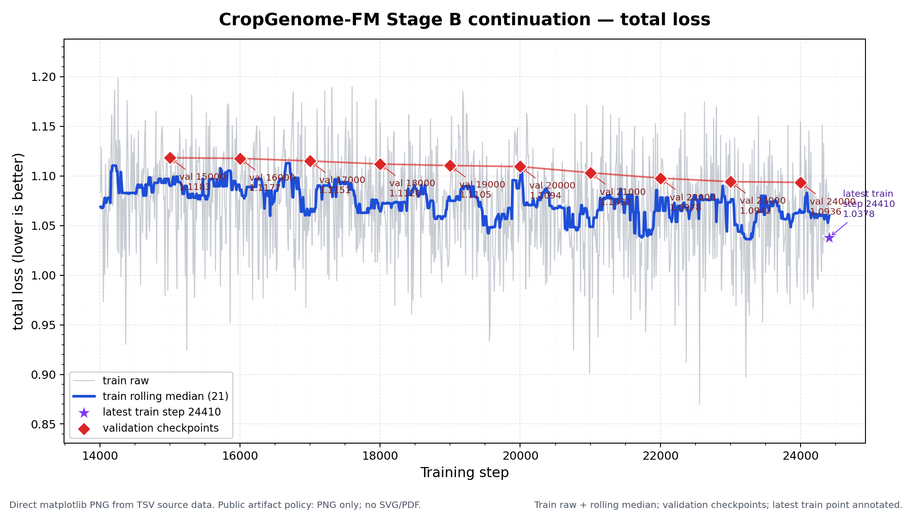
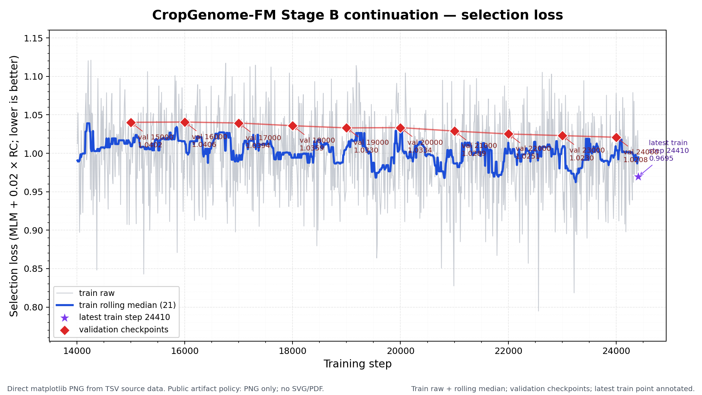

# CropGenome-FM 当前进展

更新时间：2026-07-31 06:09 CST

## 一句话结论

Stage B 8K续训仍在3张A100上稳定运行，公开曲线同步到train step24410；最新完整validation为step24000并刷新当前最佳。step19000的非EDTA下游评估已完成6/10个embedding job，剩余任务由动态2080Ti控制器继续执行。训练曲线下降只能说明预训练健康，不能替代下游基准。

## 1. 训练状态

| 项目 | 当前值 |
|---|---|
| 运行代际 | `Stage_B_continuation_3gpu_no_replacement_from_step14000` |
| 起点 / 目标 | step14000 / step50000 |
| 最新训练点 | step24410；loss=1.037846；selection loss=0.969523 |
| 最新validation | step24000 |
| validation loss | 1.093558 |
| validation selection loss | 1.020819 |
| 当前best | step24000 |
| 保存 / 验证频率 | 每500步完整checkpoint / 每1000步validation |
| 有效全局batch | 4 micro-batch × 3梯度累积 × 3 ranks = 36 |
| 抽样 | 同长度桶内全局无放回；coverage cycle之间允许复用 |
| GPU实况 | A100 GPU0–2三rank持续运行 |

### Total loss（总损失）

### Selection loss（模型选择损失）

源数据：
- [完整聚合TSV](docs/training_progress/source_data/stage_b_continuation_metrics.tsv)
- [曲线摘要](docs/training_progress/source_data/stage_b_continuation_curve_summary.tsv)

图中灰线是原始训练点，蓝线是21点滚动中位数，红色菱形是validation，紫色星形是最新训练点。单个训练点波动较大，应以validation和整体趋势判断。

## 2. step19000非EDTA下游

checkpoint由validation结果选择，未使用下游test挑选。

| 阶段 | 状态 |
|---|---|
| A1–A3核心结构任务embedding | 完成512/2048/8192三种上下文 |
| A4–A10公开任务embedding | 6000 bp三组中已完成两组，第一组仍运行；512 bp已完成 |
| B14/B15 4096 bp结构任务 | 运行中 |
| B16 2048 bp | 待运行 |
| B13逐碱基7态任务 | 待运行 |
| B17低同源审计 | 四项结构任务审计完成 |
| probes与终报 | embedding闭包后运行；当前尚无step19000最终指标 |

总job状态：完成6、运行2、等待2；没有failure marker。B17口径是“下游训练属与测试属隔离，但预训练见过测试属的其他组装”，不称zero-shot。

## 3. EDTA任务

- q04数组：2个正在运行，117个等待资源。
- 显式禁用RepeatModeler。
- B11 TE边界和B12 TE超家族分类必须等待正式EDTA标签；不使用替代标签补齐结果。

## 4. 已冻结正式结果

以下是旧publication-v2冻结证据，用于说明模型已具备信号；它不代表当前续训checkpoint的结果。

| 任务 | Best k-mer | DNABERT-2 | NT-v2 100M* | CropGenome-FM step14000 |
|---|---:|---:|---:|---:|
| promoter/TSS | 0.6113 | 0.6494 | 0.6689 | **0.6875** |
| splice donor/acceptor | 0.6797 | 0.7090 | 0.7158 | **0.8896** |
| TES/poly(A) | 0.6289 | 0.6182 | **0.6592** | 0.6387 |
| 三任务平均 | 0.6400 | 0.6589 | 0.6813 | **0.7386** |

指标为balanced accuracy（平衡准确率）。`*` NT-v2是读取预锁定主结果后的同口径补充，不能反向用于挑checkpoint。TES仍是明确短板，因此不能写成“所有任务都超过公开模型”。

- [全量标签源表](docs/results/formal_full_data_metrics.tsv)
- [少样本源表](docs/results/formal_fewshot_metrics.tsv)
- [少样本图](docs/results/formal_fewshot_balanced_accuracy.png)

## 5. 下一步与停止规则

1. 继续Stage B到目标step50000，每500步永久保存checkpoint。
2. 完成step19000的A1–A10与B13–B17五seed评估，再生成机器回执和中文终报。
3. EDTA标签齐备后才执行B11/B12。
4. 不因可见test分数反复挑checkpoint；如test参与选择，必须如实称为开发证据。
5. GitHub只滚动更新本页、两张曲线和轻量聚合表，不再上传逐checkpoint目录。
