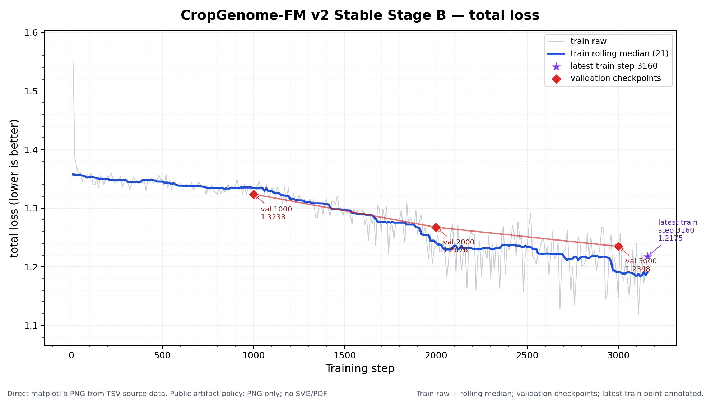
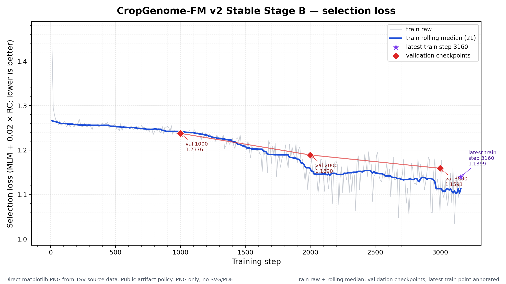

# CropGenome-FM 训练进展与评估

更新时间: 2026-06-29 15:10 CST

本文件是 GitHub 唯一进展入口。用户只需要看本文件；本次 2080 GPU 下游 probe（探针评测）只上传轻量 TSV（表格）、JSON（运行清单）和 PNG（位图），不上传 checkpoint（模型存档点）、训练日志、PDF/SVG（矢量图）或原始大数据。

## 0. 当前一句话结论

`CropGenome-FM-v2-Stable-8K`（作物基因组基础模型第二版稳健 8192 碱基版）已从 step1000 checkpoint（模型存档点）恢复并继续训练到 step3160；step3000 validation（验证）继续优于 step2000，`checkpoint_best.pt`（最佳模型存档点）已更新到 step3000。

当前最重要结论: 预训练 validation selection loss（验证选择损失）从 step1000 的 1.2375897、step2000 的 1.1890236 继续降到 step3000 的 1.1591112，训练方向正常。2080Ti 上复跑的轻量 full-region annotation probe（完整区域注释探针）也显示 embedding Macro-F1（模型向量类别平均 F1）从 step1000 的 0.1742、step2000 的 0.2053 继续提升到 step3000 的 0.2195；但这仍是 diagnostic probe（诊断性探针），不是正式 splice/promoter/TES benchmark（剪接/启动子/转录终止基准评测）。

## 1. 当前训练状态

| 项目 | 当前值 | 解释 |
|---|---:|---|
| 训练版本 | `v2_stable_from_scratch` | v2 Stable（第二版稳健版）正式 from scratch（从头训练）；恢复只用于同一 run（训练轮次）中断续跑。 |
| 当前 step（训练步） | 3160 | 已超过 step3000，继续向 step4000/5000 前进。 |
| 最新 train loss（训练损失） | 1.2175107 | 训练曲线噪声较大，单点会上下波动，趋势仍需看滚动中位数和 validation。 |
| 最新 train MLM loss（遮盖碱基预测损失） | 1.1384272 | 主预训练目标仍在正常训练区间。 |
| 最新 train selection loss（选择损失） | 1.1399129 | 训练单点有噪声；是否真正泛化改善要看后续 validation。 |
| 最新 validation（验证） | step3000 | step3000 已完成验证，下一次关键验证是 step4000。 |
| step3000 val loss（验证总损失） | 1.2347787 | 比 step2000 更好。 |
| step3000 val selection loss（验证选择损失） | 1.1591112 | 当前 best checkpoint（最佳模型存档点）依据。 |
| 当前 checkpoint（模型存档点） | `checkpoint_best.pt`, `step_00001000.pt`, `step_00002000.pt`, `step_00003000.pt` | checkpoint 文件本地保留，不上传 GitHub。 |
| A100 GPU2 | 约 32.3GB / 40GB, 100% | 主训练正常运行。 |
| 下一 checkpoint | step4000 | 需要等 step4000 validation 再判断是否继续改善。 |

## 2. 核心训练曲线

GitHub 只保留两张最有判断价值的曲线，避免文件树再次变乱。两张核心曲线已改为 Python matplotlib（Python 绘图库）正式坐标图，包含标题、横坐标、纵坐标、刻度、图例、validation checkpoints（验证检查点）和 latest train point（最新训练点）。其他 RC loss（反向互补损失）、region loss/acc（区域辅助损失/准确率）图本地保留，必要时再汇总进本文，不单独作为入口。

### 2.1 Total loss（总损失）

- 图: [docs/training_progress/figures/v2_stable_stageB_loss.png](docs/training_progress/figures/v2_stable_stageB_loss.png)
- 源数据: [docs/training_progress/source_data/v2_stable_stageB_metrics.tsv](docs/training_progress/source_data/v2_stable_stageB_metrics.tsv)

解释: total loss（总损失）综合主 MLM loss（遮盖碱基预测损失）、小权重 RC consistency（反向互补一致性）和区域辅助项。曲线只用于监控训练是否稳定，不等同于下游 benchmark（基准评测）成功。

### 2.2 Selection loss（选择损失）

- 图: [docs/training_progress/figures/v2_stable_stageB_selection_loss.png](docs/training_progress/figures/v2_stable_stageB_selection_loss.png)
- 曲线摘要: [docs/training_progress/source_data/v2_stable_stageB_curve_summary.tsv](docs/training_progress/source_data/v2_stable_stageB_curve_summary.tsv)

解释: selection loss（选择损失）定义为 `MLM loss + 0.02 × RC loss`。best checkpoint（最佳模型存档点）和 early stopping（早停）按 validation selection loss（验证选择损失）判断，不把 region loss（区域辅助损失）放进主选择指标。

## 3. Validation（验证）趋势

| checkpoint（模型存档点） | val loss（验证总损失） | val MLM loss（验证遮盖损失） | val RC loss（验证反向互补损失） | val selection loss（验证选择损失） | 结论 |
|---|---:|---:|---:|---:|---|
| step1000 | 1.3238202 | 1.2372975 | 0.0146100 | 1.2375897 | 第一个可用 checkpoint；恢复训练从这里继续。 |
| step2000 | 1.2675664 | 1.1879575 | 0.0533046 | 1.1890236 | 明显优于 step1000，当前 best checkpoint。 |

评估: step3000 的 validation selection loss 相比 step1000 下降 0.0785（约 6.34%），相比 step2000 继续下降 0.0299（约 2.52%）。这是实质改善；当前应继续训练观察 step4000/5000，而不是在 step3000 就停止。

## 4. 公正评估与外部指标尺度参考

### 4.1 当前训练是否有效

公正结论: 当前预训练是有效的，但还不能说下游已经成功。判断依据如下:

| 证据 | 当前数字 | 怎么看 | 结论 |
|---|---:|---|---|
| validation selection loss（验证选择损失） | step1000: 1.2375897 → step2000: 1.1890236 → step3000: 1.1591112 | step1000 到 step3000 下降 0.0785，约 6.34%。 | 明确正向，step3000 继续刷新 best。 |
| validation total loss（验证总损失） | step1000: 1.3238202 → step2000: 1.2675664 → step3000: 1.2347787 | step1000 到 step3000 下降 0.0890，约 6.73%。 | 与 selection loss 一致，非单一指标偶然。 |
| 最新 train selection loss（训练选择损失） | step3160: 1.1399129 | 训练单点有噪声；是否真正泛化改善要看后续 validation。 |
| step1000 2080 下游 embedding probe（向量探针） | Accuracy 0.2143, Macro-F1 0.1742 | 7 类均衡任务；比 1-mer baseline（单碱基组成基线）Macro-F1 0.1542 高 0.0199。 | 弱阳性，只说明 embedding 有一点信号。 |
| step2000 2080 下游 embedding probe（向量探针） | Accuracy 0.2589, Macro-F1 0.2053 | 比 step1000 embedding Macro-F1 高 0.0311；比同一 1-mer baseline 高 0.0511。 | 比 step1000 更好，方向一致。 |
| step2000 region head（区域预测头） | Macro-F1 0.1646 | 比 step1000 region head 0.0777 明显提高，但仍低于 step2000 embedding。 | 只能作训练健康检查，不能作为论文主结果。 |
| step3000 2080 下游 embedding probe（向量探针） | Accuracy 0.2679, Macro-F1 0.2195 | 比 step2000 embedding Macro-F1 高 0.0142；比同一 1-mer baseline 高 0.0653。 | 继续提升，和 validation 改善方向一致。 |
| step3000 region head（区域预测头） | Macro-F1 0.1853 | 比 step2000 region head 0.1646 继续提高。 | 仍只作辅助健康检查，不能作为论文主结果。 |

保守判断: 预训练 loss（损失）在正常改善；2080Ti 复跑的 step1000→step2000→step3000 下游 probe 也同向改善，说明 checkpoint 质量有早期正信号。但 full-region annotation probe 仍然样本小、任务内部构造，不能写成正式下游成功。是否值得继续，关键看 step4000/5000 的 validation（验证）和 CropGenome-Bench v1 固定 benchmark（基准评测）是否继续改善。

### 4.2 与公开基因组模型指标的尺度参考

重要限制: 下面不是直接胜负比较。我们的 full region annotation probe（完整区域注释探针）是自定义 7 类小样本任务；公开模型通常报告 GenomicBenchmarks（基因组分类基准）、GUE（Genome Understanding Evaluation，基因组理解评测）、NT tasks（Nucleotide Transformer 任务集）等标准任务。预训练 loss（损失）也不能跨模型直接比较，因为 tokenizer（分词方式）、masking objective（遮盖目标）、物种/序列长度、训练数据都不同。

| 来源/模型 | 公开任务与指标 | 公开数字 | 对我们的含义 |
|---|---|---:|---|
| HyenaDNA（Nguyen et al., 2023） | GenomicBenchmarks Top-1 Accuracy（8 个短序列分类任务平均准确率） | HyenaDNA 约 88.46%；CNN baseline 约 79.24%；DNABERT 约 83.05%。 | 公开标准分类任务的成熟模型通常在 70%–97% accuracy 区间；我们的 step1000 probe Accuracy 0.1964 不能按同一尺度解读。 |
| Caduceus（Schiff et al., 2024） | GenomicBenchmarks Top-1 Accuracy（5-fold CV，5 折交叉验证） | Caduceus-PS 约 0.869；Caduceus-Ph 约 0.866；HyenaDNA 约 0.853；CNN 约 0.803。 | 这些是标准二分类/近二分类任务，且样本和 protocol（流程）成熟；我们当前 probe 只是内部早期诊断。 |
| Caduceus / NT tasks（Dalla-Torre et al. 任务） | Histone/enhancer 用 MCC（马修斯相关系数），promoter/splice 用 F1/accuracy（F1/准确率） | 例: promoter all F1: NT-v2 0.976、DNABERT-2 0.971、HyenaDNA 0.960、Caduceus-Ph 0.970；splice all accuracy: NT-v2 0.983、HyenaDNA 0.956、Caduceus-Ph 0.940。 | promoter/splice 这类公开任务接近饱和；我们必须后续做同口径 splice/promoter/TES benchmark，不能拿当前小 probe 代替。 |
| DNABERT-2（Zhou et al., ICLR 2024） | GUE 28 个数据集平均 evaluation score（平均评测分数，混合 F1/MCC） | DNABERT-2 66.80；DNABERT-2 继续在 GUE 训练集预训练后 67.77；NT-2500M-multi 66.93；NT-2500M-1000g 61.41。 | 这是跨任务平均分，不等同 accuracy；可作为“成熟公开模型在标准 benchmark 上约 60–70 分”的尺度。 |
| HyenaDNA ultra-long species classification（超长物种分类） | 5-way species Top-1 Accuracy（5 类物种准确率） | 1k: 61.1%；32k: 93.4%；250k: 97.9%；450k: 99.4%；1M: 99.5%。 | 长上下文任务可很高，但任务类型完全不同；不能用来证明我们当前 8K 作物模型好坏。 |

当前最公平的对比方式: 下一步不要再只看 step1000 内部 probe，应在固定 benchmark 上对比 1-mer/CNN/公开模型或公开模型 embedding（向量表示）。只有同一 split（划分）、同一 metric（指标）、同一任务的结果，才可写成论文主表。

## 5. 下游 probe（探针评测）摘要

本节记录已经真实在 gpu05 的 RTX 2080 Ti 上复跑的 lightweight downstream probe（轻量下游探针）。GitHub 只上传轻量 TSV（表格）、JSON（运行清单）和 PNG（位图）；不上传 PDF/SVG（矢量图）、checkpoint（模型存档点）、训练日志或原始大数据。

运行环境:

- 机器: `gpu05`，NVIDIA GeForce RTX 2080 Ti。
- GPU: `CUDA_VISIBLE_DEVICES=0`。
- 脚本: `scripts/evaluate_v2_checkpoint_region_probe.py`。
- model config（模型配置）: `training_server_transfer/configs/model_large.json`。第一次误用 `model_large_v2_no_region.json` 会因 checkpoint 含 `region_head` 权重而失败，已改正后复跑。
- 采样: 每类 train/eval 最多 32 个窗口；共 224 train + 224 eval 样本。
- 任务边界: 这是 `full_region_annotation_probe`（完整区域注释探针），只用于诊断 embedding（向量表示）和 region head（区域预测头）是否有早期信号，不进入论文主表。

### 5.1 2080Ti step1000 / step2000 / step3000 对比

| checkpoint（模型存档点） | 方法 | Accuracy（准确率） | Macro-F1（类别平均 F1） | Balanced accuracy（类别均衡准确率） | 解释 |
|---|---|---:|---:|---:|---|
| step1000 | 1-mer nearest centroid（单碱基组成最近中心基线） | 0.1875 | 0.1542 | 0.1875 | 最低限度序列组成 baseline（基线）。 |
| step1000 | model embedding nearest centroid（模型向量最近中心） | 0.2143 | 0.1742 | 0.2143 | 比 1-mer Macro-F1 高 0.0199，弱阳性。 |
| step1000 | model region head argmax（区域预测头直接分类） | 0.1518 | 0.0777 | 0.1518 | 很弱，只能作健康检查。 |
| step2000 | 1-mer nearest centroid（单碱基组成最近中心基线） | 0.1875 | 0.1542 | 0.1875 | 同一采样和同一 baseline，便于比较 checkpoint。 |
| step2000 | model embedding nearest centroid（模型向量最近中心） | 0.2589 | 0.2053 | 0.2589 | 比 step1000 高 0.0311；比 1-mer baseline 高 0.0511。 |
| step2000 | model region head argmax（区域预测头直接分类） | 0.2232 | 0.1646 | 0.2232 | 比 step1000 明显提高，但仍只作辅助健康检查。 |
| step3000 | 1-mer nearest centroid（单碱基组成最近中心基线） | 0.1875 | 0.1542 | 0.1875 | 同一采样和同一 baseline，便于比较 checkpoint。 |
| step3000 | model embedding nearest centroid（模型向量最近中心） | 0.2679 | 0.2195 | 0.2679 | 比 step2000 高 0.0142；比 1-mer baseline 高 0.0653。 |
| step3000 | model region head argmax（区域预测头直接分类） | 0.2411 | 0.1853 | 0.2411 | 比 step2000 region head 继续提高，但仍只作辅助健康检查。 |

结论: step3000 在同一 2080Ti、同一采样、同一 probe 上继续优于 step2000，和 validation selection loss（验证选择损失）下降方向一致。这个结果支持继续训练到 step4000/5000，但不能单独证明正式下游成功。

### 5.2 2080Ti 下游结果文件

step1000:

- 图: [docs/training_progress/downstream_evaluations_2080/step_00001000/full_region_annotation_probe/figures/region_probe_macro_f1.png](docs/training_progress/downstream_evaluations_2080/step_00001000/full_region_annotation_probe/figures/region_probe_macro_f1.png)
- 指标: [docs/training_progress/downstream_evaluations_2080/step_00001000/full_region_annotation_probe/source_data/metrics_summary.tsv](docs/training_progress/downstream_evaluations_2080/step_00001000/full_region_annotation_probe/source_data/metrics_summary.tsv)
- run manifest（运行清单）: [docs/training_progress/downstream_evaluations_2080/step_00001000/full_region_annotation_probe/run_manifest.json](docs/training_progress/downstream_evaluations_2080/step_00001000/full_region_annotation_probe/run_manifest.json)

step2000:

- 图: [docs/training_progress/downstream_evaluations_2080/step_00002000/full_region_annotation_probe/figures/region_probe_macro_f1.png](docs/training_progress/downstream_evaluations_2080/step_00002000/full_region_annotation_probe/figures/region_probe_macro_f1.png)
- 指标: [docs/training_progress/downstream_evaluations_2080/step_00002000/full_region_annotation_probe/source_data/metrics_summary.tsv](docs/training_progress/downstream_evaluations_2080/step_00002000/full_region_annotation_probe/source_data/metrics_summary.tsv)
- run manifest（运行清单）: [docs/training_progress/downstream_evaluations_2080/step_00002000/full_region_annotation_probe/run_manifest.json](docs/training_progress/downstream_evaluations_2080/step_00002000/full_region_annotation_probe/run_manifest.json)

### 5.3 解释边界

这个 2080Ti probe 结果可以写成“checkpoint 质量早期改善的诊断证据”，不能写成“作物基因组基础模型已经在正式下游任务上成功”。正式论文主结论仍必须来自 CropGenome-Bench v1（作物基因组正式基准评测）中的 splice/promoter/TES、跨作物迁移、低样本效率和强外部模型对比。

## 6. 文件整理规则

为了避免 GitHub 再次变成一堆目录，后续固定执行下面规则:

1. GitHub 只看 `README.md`、`PROJECT_PLAN.md`、`MODEL_ARCHITECTURE.md`、`TRAINING_PROGRESS.md`。
2. `docs/training_progress/` 只跟踪少量核心 PNG（位图）曲线和必要 TSV（表格源数据）。
3. `docs/training_progress/downstream_evaluations_2080/` 只上传本次 2080Ti probe 的轻量 TSV/JSON/PNG；旧 `docs/training_progress/downstream_evaluations/` 明细目录仍只本地保留。
4. 旧 `docs/downstream/*`、`docs/training_curves/*`、临时 handoff（交接）文档、旧训练指标散表都不再作为 GitHub 入口。
5. checkpoint（模型存档点）、训练日志、PDF/SVG、逐样本预测和原始大数据一律不上传 GitHub；本次 per-class/confusion TSV 和 run manifest 体积很小，可作为可复核源数据上传。

## 7. 下一步: CropGenome-Bench v1 正式下游评估

正式任务注册文件: [training_server_transfer/configs/downstream_v2_benchmark.json](training_server_transfer/configs/downstream_v2_benchmark.json)。

目标: 不再只看 step1000 内部 probe（探针），而是建立 CropGenome-Bench v1（作物基因组正式基准），检验 CropGenome-FM 是否在作物任务上优于通用 DNA 大模型。

| 优先级 | 事件 | 要做什么 | 判断标准 |
|---|---|---|---|
| P0 | step4000 validation（验证） | 更新本文件和核心曲线 | val selection loss 是否继续低于 1.1591。 |
| P0 | core gene syntax（核心基因结构语法） | 构建 splice hard-negative、exon/intron/UTR segmentation、TIS/TTS context 三个任务 | 同一 split 下比较 random/majority/k-mer/CNN/DNABERT-2/HyenaDNA/Caduceus/CropGenome-FM。 |
| P0 | crop regulatory elements（作物调控元件） | 构建 promoter/TSS hard-negative、TES/polyA；ATAC/ACR 只在 assembly QC 通过后加入 | 主指标用 AUPRC/MCC/Macro-F1，不只看 accuracy。 |
| P0 | transfer and few-shot（迁移与少样本） | 做 species/genus holdout、monocot-to-dicot、1%/5%/10% label panels | 若作物预训练有效，跨作物保留率和少标签增益应高于通用模型。 |
| P1 | crop-specific structure（作物结构特色） | EDTA 高置信后做 TE boundary；Stage C/D 后做 long-context gene boundary | 标签 QC 未过关前不进主结论。 |
| P1 | variant/QTL ranking（变异和育种排序） | 只用已发表 processed VCF/GWAS/QTL/eQTL 表做 ref/alt delta 与候选基因排序 | 不下载 WGS/FASTQ/BAM 原始重测序，不重做 variant calling。 |
| P0 | 公平比较 | 所有模型同一 train/valid/test split、同一输入窗口、同一下游头、5 seeds mean ± std | 只有同任务同协议结果能进入论文主表。 |

论文主结论门槛: 至少 3 个 P0 作物任务完成固定 test（测试集）评估；CropGenome-FM 平均超过最强可运行通用/植物 DNA 模型至少 3% relative improvement（相对提升）；至少一个 species/genus holdout 或 low-homology holdout 中仍保留收益。
