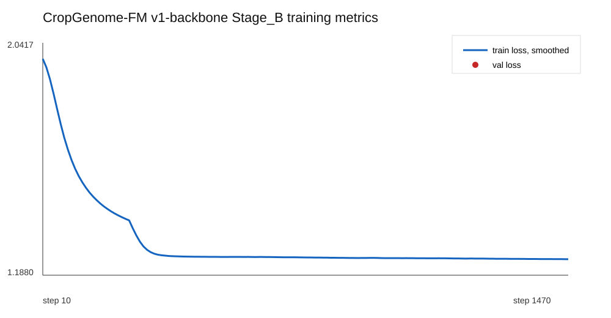

# Training Metrics

更新时间: 2026-06-15 17:42:58 CST

## v1-backbone Stage_B

- 训练日志: `training_server_transfer/logs/v1_backbone_stage_B_gpu2_20260614_230834.log`
- 当前 step: `1470`
- 当前 train loss: `1.249657`
- 当前 learning rate: `2.94e-05`
- 第一次 validation: step `2500`
- 当前运行进程 checkpoint 间隔: 每 `5000` step
- 已更新配置文件 checkpoint 间隔: 每 `1000` step，需训练进程重启或从 checkpoint resume 后生效
- 最近 checkpoint: `尚未生成`
- 最近 val loss: 尚未到第一次 validation

## 更新规则

- 每到 checkpoint 后，刷新本文件和 SVG 曲线。
- checkpoint 文件本身不上传 GitHub，只记录 step、loss、val loss、learning rate 和本地路径。
- 若训练配置、数据或 checkpoint 路径变化，新增记录，不覆盖历史结论。
