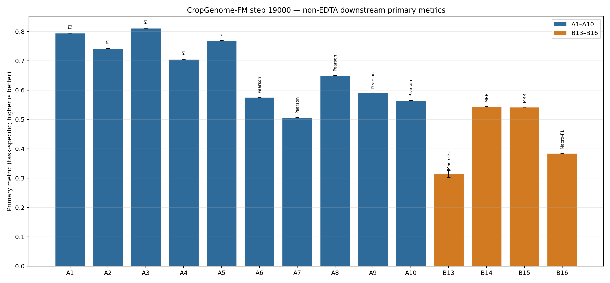
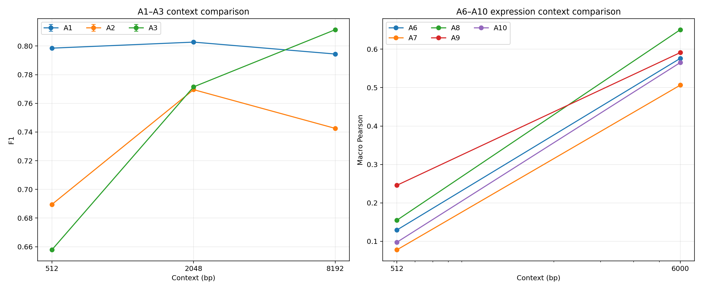
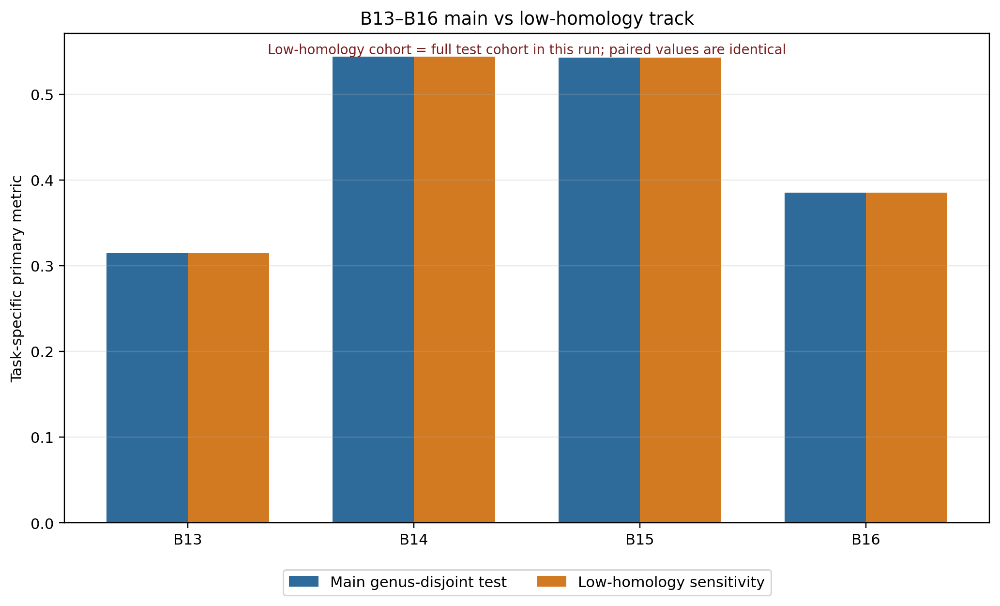

# CropGenome-FM step19000 非EDTA下游详细结果

更新时间：2026-07-31T08:36:28+08:00

## 结论先行

- A1–A10与B13–B17已完成；B11/B12继续等待正式EDTA标签。
- checkpoint只由validation selection loss选择，未使用本页test结果挑选checkpoint。
- 本轮是CropGenome-FM单模型内部评估，不是与AgroNT、PlantCAD、NT-v2或Evo2的同任务正式对比，因此不能据此声称超过公开模型。
- B17低同源筛选在当前test集上保留了全部样本，所以与主track数值完全相同；它不是独立鲁棒性证据。
- B13区域类别有一定信号，但边界定位仍弱；B14/B15排序和B16三分类仅显示有限信号，需要强基线与任务设计继续验证。

## 1. 运行身份与协议

- 模型：`CropGenomeFM_step19000_continuation`
- checkpoint：step19000，SHA256 `957051f1adf574168d8efed46810a8a74779d0a88ba9e69552294fa08823ac35`
- 编码器：冻结；下游头：全新线性/岭回归头；预训练region head未复用。
- 选择：validation-only；test只在每个seed的validation选择结束后读取一次。
- seeds：13、29、43、71、97；表达回归使用确定性ridge，因此不是5个独立seed。
- B13–B16监督split按属隔离；测试属在预训练中见过其他组装，因此不称pretraining-unseen或zero-shot。

## 2. 主结果

|编号|任务|context|主指标|结果|seeds|
|---|---|---:|---|---:|---:|
|A1|剪接供体/受体识别|8192|f1|0.7944 ± 0.0000|5|
|A2|启动子/TSS识别|8192|f1|0.7425 ± 0.0000|5|
|A3|TES/poly(A)识别|8192|f1|0.8114 ± 0.0000|5|
|A4|多物种lncRNA识别|6000|f1|0.7058 ± 0.0000|5|
|A5|木薯增强子识别|6000|f1|0.7696 ± 0.0000|5|
|A6|大豆基因表达预测|6000|pearson_macro|0.5761 ± 0.0000|1|
|A7|水稻基因表达预测|6000|pearson_macro|0.5065 ± 0.0000|1|
|A8|玉米基因表达预测|6000|pearson_macro|0.6508 ± 0.0000|1|
|A9|番茄基因表达预测|6000|pearson_macro|0.5912 ± 0.0000|1|
|A10|拟南芥基因表达预测|6000|pearson_macro|0.5652 ± 0.0000|1|
|B13|基因结构7态逐碱基分割|2048|macro_f1|0.3145 ± 0.0120|5|
|B14|长内含子剪接配对排序|4096|mrr|0.5441 ± 0.0000|5|
|B15|完整基因边界配对排序|4096|mrr|0.5425 ± 0.0000|5|
|B16|外显子顺序/同基因归属|2048|macro_f1|0.3851 ± 0.0000|5|

注意：柱图混合了F1、Pearson和MRR，只用于一眼查看各任务自身指标，不能把不同任务柱高直接当成统一总分。

## 3. 上下文长度比较

- A1–A3比较512/2048/8192 bp；A6–A10比较512/6000 bp。
- 上下文更长是否更好必须逐任务判断；不能从单一任务外推为模型整体长程能力。
- A4/A5的两个context完整数值在聚合源表中提供。

## 4. B13–B17结构与迁移任务

|编号|任务|主指标|主track|低同源track|
|---|---|---|---:|---:|
|B13|基因结构7态逐碱基分割|macro_f1|0.3145 ± 0.0120|0.3145 ± 0.0120|
|B14|长内含子剪接配对排序|mrr|0.5441 ± 0.0000|0.5441 ± 0.0000|
|B15|完整基因边界配对排序|mrr|0.5425 ± 0.0000|0.5425 ± 0.0000|
|B16|外显子顺序/同基因归属|macro_f1|0.3851 ± 0.0000|0.3851 ± 0.0000|

### 怎么看

- B13：macro-F1看7类逐碱基分类，mIoU看区域重叠，±20 bp boundary-F1看边界定位。类别识别与边界定位是不同难度，不能只报macro-F1。
- B14/B15：MRR看正确候选的平均倒数排名，Recall@1看第一名正确率，Recall@5在当前候选规模下已饱和，区分度有限。
- B16：macro-F1衡量三分类，当前约0.385，属于有限信号而非强结果。
- B17：当前MinHash门槛把所有test样本都标成低相似，故低同源track与主track完全重合。后续需更严格阈值或基因家族/orthogroup审计，才能形成独立证据。

## 5. 完整源数据

- [A1–A10聚合指标](source_data/a_metrics_summary.tsv)
- [A1–A10逐seed指标](source_data/a_metrics_by_seed.tsv)
- [B13–B17聚合指标](source_data/b_metrics_summary.tsv)
- [B13–B17逐seed指标](source_data/b_metrics_by_seed.tsv)
- [主结果规范表](source_data/primary_metrics.tsv)
- [任务注册表](source_data/task_registry.tsv)
- [净化运行回执](source_data/run_summary.json)

## 6. 不能说明什么

1. 没有在本轮同任务、同split、同head预算下重跑强公开模型，所以不能做公开模型胜负结论。
2. 多个任务的5 seeds标准差为0，说明线性头在当前数据/优化设置下收敛到相同解，不等于5次独立预训练稳定性。
3. A4–A10沿用公开数据原始split，不应写成跨属迁移结果。
4. B14/B15是候选组内排序，不能直接解释为全基因组自动注释准确率。
5. B11/B12尚无正式结果，必须等EDTA标签闭包，不能使用替代标签补数。
