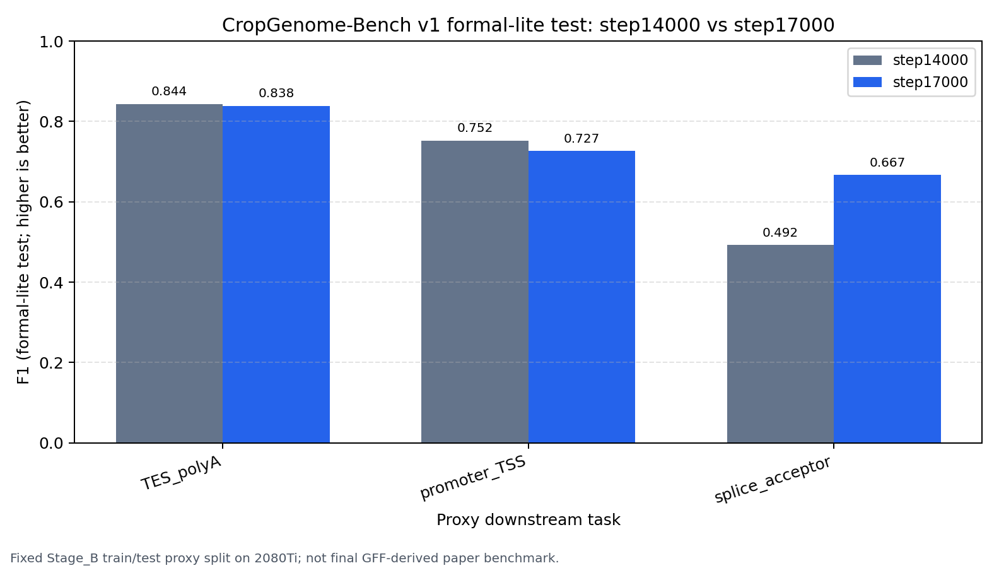

# CropGenome-Bench v1 formal-lite test

更新时间: 2026-07-10 16:40 CST

本目录保存 2080Ti 上完成的 CropGenome-Bench v1 formal-lite（轻量正式化）评估结果。目的不是直接作为论文正式 test（正式测试集），而是在不使用 A100 的条件下，固定 train/test split（训练/测试划分）来解决 step14000 vs step17000 的阶段候选选择。

当前状态：本页保留当时的 proxy（代理评测）证据；后续正式 benchmark 已完成，运营最终版已统一为 early-stop `checkpoint_best.pt = step14000`。step17000 仅保留为论文敏感性对照，不再是续训候选。

## 1. 评估口径

| 项目 | 值 | 解释 |
|---|---:|---|
| benchmark id | `CropGenome-Bench-v1-formal-lite-test` | 阶段性固定 proxy benchmark。 |
| mode | `formal_lite_stage_b_train_test_proxy` | 使用 Stage_B proxy labels（代理标签），不是最终 GFF-derived 标签。 |
| context（上下文） | 8192 bp | 与当前 8K 模型一致。 |
| seed（随机种子） | 20260707 | 固定采样，便于复核。 |
| train split | `train` | 每个任务每类 512 个样本，共 1024 train。 |
| test split | `test` | 每个任务每类 256 个样本，共 512 test。 |
| GPU | RTX 2080 Ti | step14000 和 step17000 在 2080Ti 并行完成。 |
| 模型方法 | `model_embedding_nearest_centroid` | 冻结模型向量 + 最近中心分类器；不微调编码器。 |
| baseline（基线） | majority、1-mer nearest centroid | majority（多数类）和单碱基组成最近中心。 |

## 2. 结论

该历史 proxy 在当时更支持 step17000：3 个任务平均模型向量 F1 = 0.7439，高于 step14000 的 0.6961，提升 +0.0478。主要收益来自 splice_acceptor（剪接受体）任务从 0.4921 提升到 0.6667。

但 step14000 仍需要保留：它在 TES_polyA 和 promoter_TSS 两个任务上略好/更好。因此正式 GFF-derived paper benchmark（由 GFF 精确标签构建的论文正式基准）前，不应只删除 step14000。

## 3. step14000 vs step17000

| 任务 | step14000 F1 | step17000 F1 | delta（17000-14000） | 赢家 |
|---|---:|---:|---:|---|
| TES_polyA | 0.8436 | 0.8385 | -0.0051 | step14000 |
| promoter_TSS | 0.7525 | 0.7266 | -0.0259 | step14000 |
| splice_acceptor | 0.4921 | 0.6667 | +0.1745 | step17000 |
| mean | 0.6961 | 0.7439 | +0.0478 | step17000 |

## 4. 文件说明

| 文件/目录 | 内容 |
|---|---|
| `dataset_manifest.json` | 脱敏后的数据集设置、seed、split 和任务清单。 |
| `dataset_summary.tsv` | 每个任务 train/test 正负样本数量。 |
| `formal_lite_summary.json` | 机器可读的总结、平均 F1 和当前决策。 |
| `step14000_vs_step17000_embedding.tsv` | 只看模型向量方法的候选对比表。 |
| `step14000_vs_step17000_embedding.png` | 候选对比图。 |
| `summary_metrics_long.tsv` | 全部 checkpoint × task × method 指标长表。 |
| `summary_method_means.tsv` | 每个 checkpoint、每种方法的 3 任务平均指标。 |
| `evaluations/step_00014000/` | step14000 的轻量 TSV/JSON/PNG。 |
| `evaluations/step_00017000/` | step17000 的轻量 TSV/JSON/PNG。 |

## 5. 边界

可以说：2080Ti 上的固定 proxy formal-lite 结果曾提供阶段筛选证据；它支持继续正式比较两个 checkpoint，但不再决定当前续训基座。当前唯一续训基座为 early-stop step14000。

不能说：这已经是最终论文正式 benchmark，或已经证明 CropGenome-FM 全面超过公开 DNA 大模型。正式结论仍需要 GFF-derived hard negatives（GFF 精确构建硬负样本）、固定 train/valid/test、多 seed 和外部 baseline 同口径评估。
