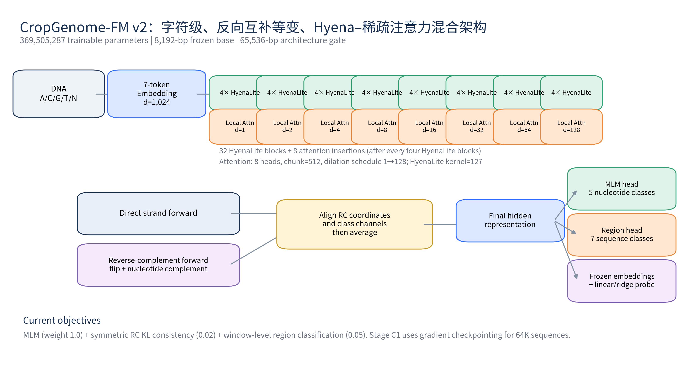
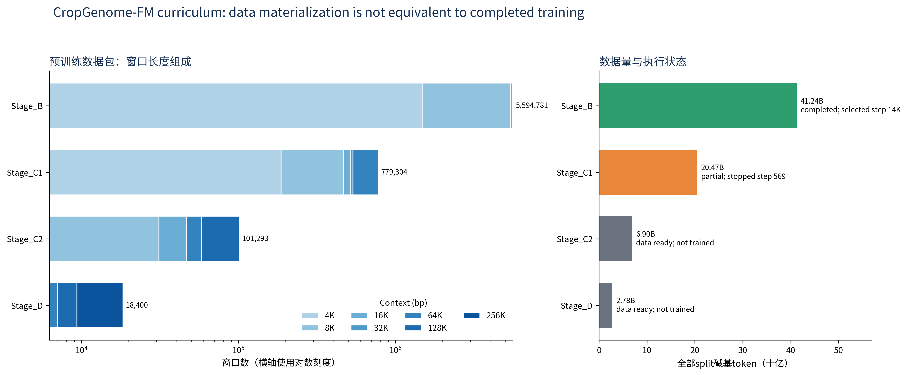
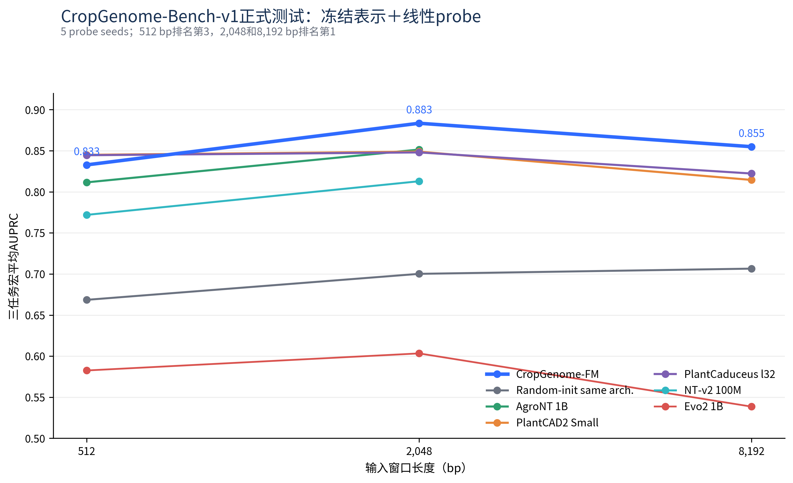
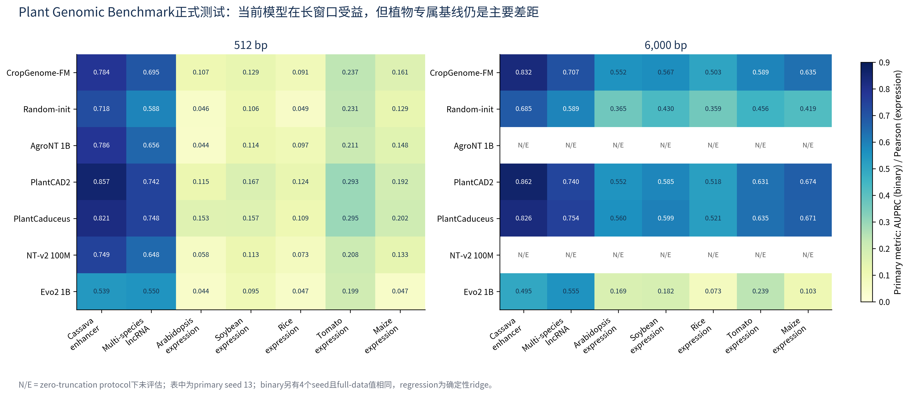
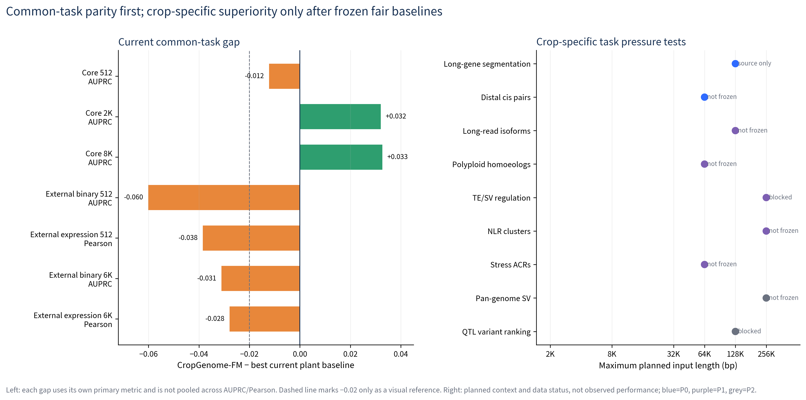

# CropGenome-FM作物基因组基础模型
## 详细研究设计、数据字典、模型架构、预训练与下游评估报告

- **文档版本：** 2.3（Stage B数据生成与区域训练覆盖完整版）
- **机器证据截止：** 2026-07-21 14:04 CST（UTC+08:00）
- **本次文档更新：** 2026-07-29（未新增或重跑formal test）
- **当前冻结基座：** `CropGenomeFM_step14000`
- **文档性质：** 当前事实审计＋下一阶段预注册式研究设计

**重要原则：** 所有“当前性能”来自已存在的机器结果；所有“计划任务、最低样本数、成功阈值”均为未来设计，不是已完成结果。

> 一句话状态：目前真正完成并经过正式下游评估的是8,192 bp阶段。我们训练到第17,000次参数更新，按验证集选出第14,000次保存的模型，并完成了10类下游评估。64K版本只证明“程序和显存能跑”，随后训练了569次参数更新，还没来得及做第一次验证；128K和256K只准备好了DNA片段文件，没有开始训练。因此现在不能把64K、128K或256K写成已经完成，也不能说本模型全面超过PlantCAD2、PlantCaduceus或尚未评估的NT-v2 500M。

## 1. 阅读指南与证据等级

本报告把内容分成三层，避免把计划写成结果。

1. **F（正式结果）**：训练、验证、模型选择方法和最终测试都已经固定。测试集只在最后使用。
2. **D（过程检查）**：只用验证集尝试设置、选择模型存档或做小规模测试。这类结果能帮助决定下一步，但不能当作正式结论。
3. **P（未来计划）**：数据或训练还没有完成。文中写的样本数是计划达到的最低数量，不是现在已经拥有的数量。

### 1.1 一眼看懂：我们具体是怎么做的

| 步骤 | 我们实际做了什么 | 为什么这样做 |
| ---: | --- | --- |
| 1 | 从NCBI下载258个公开的作物和植物参考基因组，同时下载DNA序列文件和基因坐标注释。 | DNA序列给模型读取；注释告诉我们哪里是基因、启动子、剪接位点和转录末端。 |
| 2 | 以“基因组版本”为单位分组：258个原始版本预先分成训练192个、验证35个、测试候选31个。经过序列和窗口筛选后，最终有238个版本真正贡献Stage B片段，分别为180、29和29个。 | 同一个基因组版本不能同时出现在两组；真实42个窗口索引扫描确认三组交叉数都是0。 |
| 3 | 根据GFF3基因注释，从编码区、剪接附近、启动子、UTR、转录末端和整个基因范围截取4,096、8,192或16,384 bp片段，并补充随机背景片段。 | 这不是沿染色体每隔1 bp机械滑窗；区域配额让7类来源都进入候选池，随后还要做序列质量过滤。 |
| 4 | 把通过质量检查的约41.24 GB DNA编码主动拆成42个数据文件。每个完整文件尽量装到约10亿个碱基，不要求片段条数相同。 | 这是为了随机读取、逐文件校验和损坏后局部重建，不是生物学分组。旧Stage B读取器还有一个小的抽样权重偏差，5.5节如实说明。 |
| 5 | 随机遮住每条DNA片段中15%的碱基，让模型猜回A、C、G或T；同时让模型学习正向序列和反向互补序列应给出一致结果。 | 模型没有人工答案也能从DNA本身学习序列规律。 |
| 6 | 每训练1,000次参数更新，就用固定的验证数据检查一次。验证效果连续三次没有明显改善时停止。 | 防止继续训练却没有收益，也防止用最终测试集来挑模型。 |
| 7 | 训练在第17,000次更新停止。验证集认为第14,000次保存的模型最好，所以正式模型是`CropGenomeFM_step14000`。 | “最后一次保存”不一定是“最好的一次保存”，必须由验证集决定。 |
| 8 | 比较基础模型时先锁住它们的参数，只训练一个很简单的分类器或回归器。 | 这样主要比较“基础模型读懂DNA后给出的内部特征是否有用”，而不是比较谁用了更复杂的下游网络。 |
| 9 | 在启动子、剪接、转录末端、增强子、lncRNA和基因表达等任务上比较CropGenome-FM与AgroNT、PlantCAD2、PlantCaduceus、NT-v2、Evo2等模型。 | 通用任务用于检查本模型是否达到公开基线；作物专属任务用于检验长基因、多倍体、TE/SV和NLR基因簇等真正困难的问题。 |
| 10 | 只报告实际运行得到的结果。尚未运行的NT-v2 500M和9项新任务只写研究设计，不写成绩。 | 防止把计划、推测或“理论上能做”误写成已经证明。 |

### 1.2 术语快速解释

| 术语 | 白话解释 | 在本项目中的具体含义 |
| --- | --- | --- |
| 基因组版本（assembly） | 一个机构公开发布的一套完整参考基因组 | 同一物种可以有多个版本；每个版本用NCBI数据库编号区分 |
| 数据库编号（accession） | NCBI等数据库给文件或基因组版本分配的唯一编号 | 它相当于公开数据的“身份证号”，可以据此重新下载同一版本 |
| 数据清单（manifest） | 逐项记录文件、物种、数据划分、大小和校验值的表 | 它告诉我们实际使用了哪些数据，不是模型输入 |
| FASTA / GFF3 | FASTA保存A、C、G、T组成的DNA序列；GFF3保存基因和外显子等坐标 | FASTA给模型读，GFF3告诉程序从哪里截取片段、标签是什么 |
| DNA片段（window） | 从染色体上连续截取的一段DNA | 例如8,192 bp片段就是连续8,192个碱基；一个片段通常作为一个训练样本 |
| 可见范围（context） | 模型一次能够同时看到的DNA长度 | Stage B训练文件包含最长16,384 bp片段，但当前正式下游比较只做到8,192 bp；64K版本还没有完成验证 |
| 模型读取单位（token） | 模型每一步读入的最小单位 | CropGenome-FM基本是一碱基一单位；AgroNT和NT-v2把连续6个碱基合成一个单位，所以不能直接把“单位数”等同于“碱基数” |
| 数据分片（shard） | 为了方便读取和校验，把大量DNA片段分装成的一个数据文件 | 它只是文件包装方式，没有额外生物学含义。Stage B共有42个；完整分片都接近10亿个碱基，但因片段有4K、8K和16K三种长度，所以片段条数不相同 |
| 一遍数据（epoch） | 按传统训练方式，把所有训练样本各看一遍 | 本项目是随机有放回抽样，不能严格说“完成了第几个epoch”，只能换算成大约相当于看过训练池的多少比例 |
| 训练/验证/测试 | 训练数据负责更新模型；验证数据负责选模型；测试数据只负责最后评分 | 测试数据不能用来改参数、选任务或决定什么时候停止 |
| 模型存档（checkpoint） | 训练到某一次参数更新时保存的模型文件 | 正式模型是验证集选出的第14,000次存档，不是最后的第17,000次存档 |
| 简单预测头（probe） | 锁住基础模型，只在它输出的特征上训练一个简单分类器或回归器 | 这样比较的是基础模型给出的DNA特征是否有用，不代表全参数微调后的最高性能 |
| 反向互补（RC） | 同一段DNA从另一条链方向读取时，需要把顺序反过来，并交换A/T和C/G | 模型同时读取两个方向，再把结果对齐合并 |
| 整段读取/分块读取（native/chunked） | 整段读取是一次看到全部DNA；分块读取是切成多段分别处理后再汇总 | 短模型处理64K以上序列时只能分块，不能把“无法整段读取”记成0分 |
| 未纳入比较（N/E） | 模型不能完整读取该长度，或当前没有运行该项评估 | 这不是得分为0；程序不允许偷偷截掉超长序列后继续比较 |
| 分类/回归主指标（AUPRC/Pearson） | AUPRC评价正负样本排序，越高越好；Pearson评价预测值和真实值的同步变化，越接近1越好 | 不同任务和不同指标的绝对数值不能直接横向比较 |
| 困难负样本（hard negative） | 外观很像正例、但实际上不是目标的样本 | 例如剪接负样本也带GT/AG，让模型不能只靠看到两个字母就猜答案 |
| 随机种子（seed） | 控制随机初始化和抽样的一组编号 | 多个seed用于检查结果是否稳定；缺少独立seed时不能声称结果非常稳定 |
| 95%不确定性区间（bootstrap CI） | 反复重抽物种或位点后得到的成绩波动范围 | 比较模型时既看平均提升，也看区间下界是否仍高于0 |
| 最小有意义提升（MMED） | 预先规定至少提升多少才值得称为科学改进 | 防止把非常小、可能没有实际意义的数值差异写成突破 |

## 2. 研究目标、核心假设与不能预设的结论

### 2.1 总目标

构建一个真正面向作物和植物基因组的基础模型：既能在启动子、剪接、转录终止、增强子、lncRNA和表达预测等通用任务上接近或超过公开基因组大模型，也能在多倍体同源基因、TE插入调控、超长基因结构、NLR抗病基因簇、作物pan-genome结构变异等作物专属复杂问题上形成可验证优势。

### 2.2 可检验假设

- **H1：作物数据预训练确实有用。** 已经学习过作物DNA的模型，应稳定超过“结构完全相同、但参数从随机数开始且没有预训练”的模型。当前正式数据支持这一点。
- **H2：看得更长带来的提升必须是真的。** 比较2K、8K和64K时，中心位点和样本必须相同，只增加两侧更远的DNA。不能通过换样本、补很多空字符或换更复杂的预测头制造提升。当前只正式验证到8K，64K还没有正式成绩。
- **H3：作物域优于纯规模。** 在作物专属任务上，中等规模作物模型可超过更大的通用模型；当前部分任务支持，但PlantCAD2/PlantCaduceus仍是强对手。
- **H4：多任务预训练改善结构理解。** MLM＋RC一致性＋区域辅助目标应改善启动子/剪接/TES表征；需通过消融而非只看单个最终模型验证。
- **H5：复杂作物区域可能必须一次看很长的DNA。** 长基因、多倍体基因两侧区域、转座子/结构变异和NLR抗病基因簇可能跨越64K–256K碱基。长模型要和两类对手比较：能整段读入的长模型，以及把长DNA切成小块后汇总的短模型。不能把“短模型无法整段读入”伪装成0分。

**不能预设的结论：** 新任务不能为了让本模型赢而事后筛选；PlantCAD2、PlantCaduceus、AgroNT、NT-v2 500M、Evo2必须在结果揭盲前注册；若本模型不超过它们，应如实报告。

## 3. 当前项目状态总表

| 模块 | 当前状态 | 可以支持的表述 | 不能支持的表述 |
| --- | --- | --- | --- |
| Stage B 8K | 原计划最多训练50,000次；验证成绩不再明显改善，所以第17,000次停止；验证集选中第14,000次模型存档 | 8K阶段和正式下游评估已经完成 | 已把全部训练片段完整看过一遍，或已经充分训练到完全收敛 |
| Stage C1 64K | 用真实65,536 bp片段完成过一次前向计算、误差反传和参数更新；正式训练停在第569次更新 | 程序、显存和反向传播流程可以运行64K样本 | 64K训练完成、通过验证，或64K已经带来下游提升 |
| Stage C2 128K | 128K DNA片段已经截取并写入文件，但没有开始训练 | 128K训练数据文件已经准备好 | 已有128K模型 |
| Stage D 256K | 256K DNA片段已经截取并写入文件，但没有开始训练 | 256K训练数据文件已经准备好 | 已有256K模型 |
| CropGenome-Bench-v1 | 3个任务都用相同中心样本裁成512、2,048和8,192 bp，共完成9组正式比较 | 能比较相同样本在不同可见长度下的核心结构任务成绩 | 已覆盖所有作物功能问题 |
| Plant Genomic Benchmark | 完成7个外部任务；每个模型只参加它能完整读取的512或6,000 bp比较 | 提供外部增强子、lncRNA和表达预测证据 | 所有任务都经过多次独立随机训练并证明稳定 |
| NT-v2 500M | 已确认官方模型名称和配置，但还没有下载、固定版本和运行 | 下一版必须加入的基线 | 任何当前性能比较 |

## 4. 预训练原始数据：数据从哪里来、如何分组

### 4.1 原始来源

- 数据来自NCBI GenBank和RefSeq公开发布的植物/作物参考基因组。每个基因组版本都包含DNA序列文件（FASTA）和基因坐标注释（GFF3）。
- 最终数据清单记录了**258个基因组版本、30个物种、23个属**。
- 按基因组版本预先分组后，192个版本进入训练组、35个进入验证组、31个进入测试候选组；合计仍为258个。经过Stage B染色体、坐标和序列质量筛选后，实际留下片段的版本为训练180个、验证29个、测试候选29个，详见5.4.1节。
- 来源构成为GenBank 209、RefSeq 49。
- 数据清单中的压缩下载文件合计：DNA序列约16.66 GB，注释约2.32 GB。这是下载文件的压缩后大小，不是解压后的DNA碱基总量。
- 程序中的分组策略名为`assembly_accession_level_genus_stratified_v2`。这个名字表示“尽量在属层面分层”，不表示训练、验证和测试的属完全互不重叠。因为同一物种或同一属可能有多个基因组版本，严格的跨属零样本任务还需要单独建立。

### 4.2 数据用途

- **训练组的基因组版本**用于截取训练DNA片段，并真正更新模型参数。
- **验证组的基因组版本**用于固定的过程检查、选择模型存档和决定何时停止；它们不直接更新模型参数。
- **测试候选组的基因组版本**只用于后期检查或正式评估，不能用来决定何时停止训练。
- GFF3坐标既用于建立下游任务，也用于告诉预训练程序“这段DNA来自启动子、编码区还是剪接附近”。因此未来的结构任务还必须排除高度相似的基因家族和近重复序列，不能只看基因组版本是否不同。

### 4.3 全部物种组成

完整30物种逐项表见附录A；表中的文件大小都是压缩下载文件的大小。

## 5. 预训练窗口数据包

### 5.1 四阶段总量

| 训练阶段 | 实际进度 | DNA片段总数 | 片段包含的碱基总数 | 训练片段 | 验证片段 | 测试候选片段 | 各片段长度的数量 |
| --- | --- | ---: | ---: | ---: | ---: | ---: | --- |
| Stage B | 训练停止在第17,000次更新；正式选择第14,000次模型 | 5,594,781 | 41.243B | 5,485,240 | 54,695 | 54,846 | 4,096 bp: 1,494,149；8,192 bp: 3,913,853；16,384 bp: 186,779 |
| Stage C1 | 训练到第569次更新后正常保存并停止；尚未做第一次验证 | 779,304 | 20.470B | 764,070 | 7,576 | 7,658 | 4,096 bp: 186,779；8,192 bp: 280,160；16,384 bp: 46,705；32,768 bp: 23,360；65,536 bp: 242,300 |
| Stage C2 | DNA片段文件已准备，训练未开始 | 101,293 | 6.898B | 99,316 | 970 | 1,007 | 8,192 bp: 31,138；16,384 bp: 15,576；65,536 bp: 11,686；131,072 bp: 42,893 |
| Stage D | DNA片段文件已准备，训练未开始 | 18,400 | 2.778B | 18,040 | 176 | 184 | 8,192 bp: 6,236；65,536 bp: 787；131,072 bp: 2,344；262,144 bp: 9,033 |

### 5.2 训练、验证和测试候选分别包含多少碱基

| 训练阶段 | 训练组碱基数 | 验证组碱基数 | 测试候选组碱基数 | 全部碱基数 |
| --- | ---: | ---: | ---: | ---: |
| Stage_B | 40,435,101,696 | 403,083,264 | 404,320,256 | 41,242,505,216 |
| Stage_C1 | 20,073,304,064 | 195,743,744 | 201,117,696 | 20,470,165,504 |
| Stage_C2 | 6,766,624,768 | 63,365,120 | 68,214,784 | 6,898,204,672 |
| Stage_D | 2,726,723,584 | 24,510,464 | 26,607,616 | 2,777,841,664 |

### 5.3 区域类型组成

程序把DNA片段按来源分成7类：普通背景区域（background）、编码区（coding）、整个基因范围（gene body）、启动子（promoter）、剪接附近（splice）、转录末端（TES）和非翻译区（UTR）。下面给出每类片段数量；这些类别用于辅助训练，不代表每个碱基都有精确功能标签。

| Stage | 区域窗口组成 |
| --- | --- |
| Stage_B | background:223487;coding:1790629;gene_body:559494;promoter:783111;splice:1175065;tes:447604;utr:615391 |
| Stage_C1 | background:31122;coding:249390;gene_body:77931;promoter:109128;splice:163650;tes:62340;utr:85743 |
| Stage_C2 | background:4045;coding:32425;gene_body:10127;promoter:14175;splice:21286;tes:8094;utr:11141 |
| Stage_D | background:742;coding:5880;gene_body:1842;promoter:2578;splice:3868;tes:1470;utr:2020 |

### 5.4 5,594,781条Stage B DNA片段是怎样得到的

先给结论：这5,594,781条是**经过坐标选择、配额控制和序列质量检查后写入数据包的片段记录**。它们不是把258个基因组沿染色体每隔1 bp机械滑动得到的，也不代表5,594,781条彼此完全不同的DNA。相邻基因、重叠注释或相近坐标可能产生部分重叠片段；当前构建流程没有做全数据集序列相似性去重。

#### 5.4.1 从哪些基因组开始，怎样分组

原始清单含258个NCBI GenBank/RefSeq基因组版本，每个版本都尽量配套FASTA DNA序列和GFF3基因坐标注释。首先按**整个基因组版本**预先分组，再生成片段；不是先把片段混在一起后随机拆分。

| 数据层级 | 合计版本数 | 训练组 | 验证组 | 测试候选组 | 白话解释 |
| --- | ---: | ---: | ---: | ---: | --- |
| 原始258个版本的预设划分 | 258 | 192 | 35 | 31 | 这是生成片段前的基因组版本分组 |
| 最终实际贡献Stage B片段 | 238 | 180 | 29 | 29 | 其余20个版本在筛选后没有留下最终Stage B片段 |

对最终42个窗口索引的真实扫描确认：训练、验证和测试候选三组贡献片段的基因组版本交叉数均为0。也就是说，同一个基因组版本不会同时给两组贡献Stage B片段。逐组统计见`source_data/stage_b_split_assembly_coverage.tsv`。

#### 5.4.2 GFF3注释怎样变成7类候选区域

程序先读取GFF3中的基因结构，再按下面的规则生成候选坐标。这里的“上游”和转录方向有关：负链基因会自动反向处理，不是简单地只看染色体坐标左边。

| 最终区域类别 | 从什么注释或位置得到 | 实际截取依据 |
| --- | --- | --- |
| 编码区（coding） | CDS和exon | 从编码区或外显子范围内选择，过短时以区域中心向两侧扩展 |
| 剪接附近（splice） | exon的两个边界 | 每个外显子起点和终点两侧各建立约±2,000 bp候选区域 |
| 启动子（promoter） | gene、mRNA、transcript、lnc_RNA或pseudogene的转录起点 | 核心启动子为转录起点上游0–5 kb；远端启动子为上游5–20 kb |
| 非翻译区（UTR） | UTR、five_prime_UTR和three_prime_UTR | 从注释的5′或3′非翻译区选择 |
| 转录末端（TES） | 基因或转录本的转录终点 | 在转录终点两侧建立约±3,000 bp候选区域 |
| 整个基因范围（gene body） | gene、mRNA、transcript、lnc_RNA和pseudogene | 从完整注释范围内选择；它可能与编码区、UTR等区域在坐标上重叠 |
| 普通背景（background） | 不依赖某个功能注释的合格染色体位置 | 按每条染色体可放置片段的位置数量加权随机抽取，长染色体通常提供更多候选位置 |

为了避免数量特别多的宽区域淹没其他类别，远端启动子候选只稳定保留约60%，整个基因范围候选稳定保留约75%。这里的“稳定保留”是根据坐标生成固定数字指纹后筛选，因此使用相同输入和参数重新运行会得到相同结果。

#### 5.4.3 怎样决定片段长度和具体位置

Stage B只生成4,096、8,192和16,384 bp三种长度。最初设计按**碱基预算**分配20%、70%和10%，不是要求三种片段条数按这个比例。程序根据基因组版本、染色体、区域类型和坐标生成固定数字指纹，再确定候选片段长度，所以同一输入重复构建不会随意换长度。

具体位置按以下顺序确定：

1. 先做染色体级初筛：长度至少4,096 bp，未知碱基N不超过5%，最长连续N少于1,000个，而且该染色体被清单标为可用于训练数据构建。
2. 如果注释区域本身长于目标片段，就在区域内部根据固定数字指纹选择一个起点；如果区域较短，就以区域中心向两侧扩展。
3. 染色体必须至少比目标片段多2,000 bp；最终片段两端都要距离染色体边界至少1,000 bp。
4. 对训练、验证、测试候选三组分别控制配额。验证和测试候选的碱基预算各约为训练组的1%，防止它们过大。
5. 候选生成阶段通常先准备目标数量约2倍的坐标，因为后续读取真实DNA后还会淘汰低质量片段。
6. 当某个“数据组×长度×区域类别”候选过多时，按固定数字指纹排序保留，不依赖每次运行临时产生的随机顺序。

#### 5.4.4 读取真实DNA后怎样做质量检查

程序随后打开对应FASTA，从候选坐标提取真实DNA。坐标越界、实际长度不符、未知碱基过多或序列过于单一的片段都会被删除。

| 检查项目 | 普通功能区域 | 普通背景、整个基因范围和远端启动子 | 为什么检查 |
| --- | ---: | ---: | --- |
| N或其他非A/C/G/T字符占比 | 不超过1% | 不超过0.5% | 避免大量未知序列进入训练 |
| A/C/G/T有效碱基占比 | 至少98% | 至少99.5% | 确保绝大部分位置是真实可读碱基 |
| 任意单一种碱基最高占比 | 不超过75% | 不超过72% | 删除几乎全是A、T等低复杂度片段 |
| 最长连续N | 不超过99个 | 不超过99个 | 避免长段未知区域 |

通过检查后，每个碱基编码成1个字节：A、C、G、T、N分别记为0、1、2、3、4；其他字符按N处理。程序同时保存片段所属组、基因组版本、染色体、起止坐标、长度和区域类别，训练时可以根据“分片＋文件内位置”直接读取。

#### 5.4.5 为什么设计预算是300亿碱基，最后却得到412.43亿碱基

300亿碱基是Stage B构建时用于分配非主长度候选的参考预算，不是最终文件的硬上限。8,192 bp是Stage B主长度；编码程序会保留生成后通过质量检查的全部8K主长度候选，而4K和16K按各自预算停止。因此最终数据包大于300亿碱基，得到5,594,781条片段和41,242,505,216个碱基。

最终片段中，5,485,240条属于训练池、54,695条属于验证池、54,846条属于测试候选池；三种长度和四阶段汇总见5.1节。这里的“测试候选”只表示预训练数据组，不等于后续10个下游任务的正式测试样本。

### 5.5 为什么拆成42个文件，每个文件的片段数为什么不同

先纠正上一版的一句错误表述：**5,594,781个Stage B片段并不是物理上“不能塞进一个文件”。** 理论上可以写成一个约41.24 GB的大文件。我们主动拆成42个数据分片（shard），是工程上的文件管理选择，不是生物学分组。

每个碱基在训练文件里用1个字节保存。构建程序规定：一个完整分片最多装接近1,000,000,000个碱基，也就是约1 GB。这样做有三个直接好处：

1. 训练时只从当前选中的文件读取目标片段，不必把约41.24 GB数据整体读入内存。
2. 每个文件都有自己的SHA-256校验值；某个文件损坏时，可以单独发现、重传或重建，不必处理整个数据包。
3. 随机读取某条片段时，程序只需根据“文件名＋片段在文件里的起始位置”找到它，文件转移和检查也更容易。

**每个分片按碱基总数装满，不是按片段条数装满。** Stage B同时有4,096、8,192和16,384 bp三种片段。长片段占的空间更大，所以同样接近10亿个碱基时，装入的片段条数自然更少。前41个完整分片各含999,993,344至999,997,440个碱基，几乎一样大，但片段数从122,062到141,012不等；第42个分片只是最后剩余的数据。

| 真实分片例子 | 碱基总数 | 片段总数 | 为什么条数不同 |
| --- | ---: | ---: | --- |
| `shard_000001` | 999,997,440 | 140,897 | 平均每条约7,097 bp，4K片段较多，所以能装更多条 |
| `shard_000041` | 999,997,440 | 122,070 | 全部是8,192 bp片段，所以同样大小只能装122,070条 |
| `shard_000042` | 242,679,808 | 29,624 | 这是装完前41个文件以后剩下的8,192 bp片段，不再补齐到1 GB |

42个分片的逐项统计见`source_data/stage_b_shard_sampling_audit.tsv`，其中同时记录了训练、验证、测试候选数量、三种片段长度组成和下文所述的相对抽样权重。

片段在生成时先按基因组版本、染色体和坐标排序，再依次写入文件；程序没有要求每个分片中的物种、区域类别或训练/验证/测试片段都平均。需要控制的是**整个数据池**的组成，而不是让每个存储文件都长得一样。

#### 5.5.1 旧Stage B训练实际怎样抽样

每次训练按下面四步取数据：

1. 先在42个分片中随机选一个。旧读取器按照该分片记录的**全部片段数**计算被选概率；片段多的分片更容易被选中。
2. 打开这个分片后，只保留本次用途对应的数据。Stage B训练时只会抽取标记为训练组的片段，验证和测试候选片段不会用于更新模型参数。
3. 在该分片的训练片段中等概率随机抽取一条。抽过的片段不会从池中删除，所以以后仍可能再次抽到，这叫“有放回抽样”。
4. 每条抽到的DNA有50%概率改成反向互补序列，让模型适应DNA从两个方向读取。

如果每个分片里全都是训练片段，那么“先按分片片段数选文件，再在文件内等概率选一条”可以让每条训练片段具有相同机会。例如A文件有100条、B文件有200条，就让A被选中的概率为1/3、B为2/3；最后300条中的每一条都具有相同机会。

但旧Stage B的42个分片混合保存了训练、验证和测试候选片段，而第一步使用的是三组片段的**总数**，第二步才过滤出训练片段。因此现有实现没有做到数学上完全均匀的训练片段抽样。逐个扫描5,485,240条训练片段后，单条片段的实际相对抽样权重最低约为理想均匀值的0.980倍，最高约为1.067倍，即约−2.0%到+6.7%的差异。

这是已完成Stage B训练的一个历史实现局限，不能在事后把它写成“严格均匀抽样”。它**不会造成验证或测试片段进入参数更新**，但会让部分训练片段被抽到的机会略高。下一版重新训练时应把训练、验证和测试分别建立分片清单，或者在清单中记录每个分片的训练片段数，并只按训练片段数计算第一步概率。

#### 5.5.2 已抽取数据相当于训练池的多少

这种方式不是“把所有片段按顺序各看一遍，再开始下一遍”。所以这里不能直接说训练完成了几个epoch（完整遍历次数），只能把已经抽取的片段数换算成“相当于训练池的多少比例”：

- 到第14,000次参数更新时，模型累计抽取约503,000个Stage B片段，相当于训练片段池的9.17%。这些片段约含37.08亿个碱基，约等于每个模型参数对应读过10.03个碱基。
- 到第17,000次参数更新时，累计抽取约611,000个片段，相当于训练片段池的11.14%；约含45.04亿个碱基。
- 按当前每次抽样数量估算，大约要到第152,396次参数更新，累计抽取量才等于完整训练片段池的大小。注意，这仍不保证每个片段刚好出现一次，因为抽样允许重复。
- 64K阶段训练到第569次更新时共抽取72,832个片段，相当于该阶段训练池的9.53%；但它只完成原计划180,000次更新的0.316%，而且仍在最初6,000次“逐渐增大学习步长”的热身期。

因此，Stage B虽然没有完整遍历全部片段，但正式评估已经证明它学到了有用特征；我们仍不能说它完整看过一遍语料。64K阶段更不能称为训练完成。

### 5.6 训练时是否保障7类区域都参与了训练

最准确的结论是：**数据池层面有覆盖；实际训练中7类区域几乎肯定都被大量抽到；但旧程序没有按区域强制配额，也没有保存逐区域实际抽样计数，所以不能把“几乎肯定”写成有日志证明的严格保证。**

#### 5.6.1 数据池层面：7类区域全部存在

下面的“全部片段”包含训练、验证和测试候选三组；“训练片段”才是允许更新模型参数的池。7类区域在训练池中都不是少数几个样本，而是至少有219,169条。

| 区域类别 | Stage B全部片段 | 训练池片段 | 训练池占比 | 预计到第14,000次抽取 | 预计到第17,000次抽取 |
| --- | ---: | ---: | ---: | ---: | ---: |
| 普通背景 | 223,487 | 219,169 | 4.0% | 约20,040次 | 约24,343次 |
| 编码区 | 1,790,629 | 1,755,568 | 32.0% | 约161,084次 | 约195,670次 |
| 整个基因范围 | 559,494 | 548,536 | 10.0% | 约50,314次 | 约61,117次 |
| 启动子 | 783,111 | 767,774 | 14.0% | 约70,416次 | 约85,535次 |
| 剪接附近 | 1,175,065 | 1,152,040 | 21.0% | 约105,693次 | 约128,387次 |
| 转录末端 | 447,604 | 438,839 | 8.0% | 约40,246次 | 约48,888次 |
| 非翻译区 | 615,391 | 603,314 | 11.0% | 约55,206次 | 约67,059次 |
| 合计 | 5,594,781 | 5,485,240 | 100% | 约503,000次 | 约611,000次 |

表中的预计次数不是简单地用7个目标百分比相乘，而是逐个分片统计训练区域数量，再按旧读取器“先选分片、后选训练片段”的真实概率计算，因此已经包含5.5.1节所述的0.980–1.067倍抽样偏差。逐项机器表见`source_data/stage_b_region_training_coverage.tsv`。

#### 5.6.2 为什么说“几乎肯定训练过”，却不能说“严格保证”

训练到正式第14,000次模型存档时累计抽取约503,000条片段。即使数量最少的普通背景区域也预计被抽到约20,040次；到第17,000次预计约24,343次。因此某一整类区域一次都没有出现的概率在实际意义上接近0，7类区域几乎肯定都参与了大量参数更新。

但旧训练器有三个证据边界：

1. 它没有规定每个小批次必须同时包含7类区域，也没有规定每隔多少次参数更新必须抽到每一类。
2. 它采用有放回抽样：抽过的片段可能再次出现，未抽到的片段仍留在池中。因此不能保证5,485,240条具体训练片段每条都被看过。
3. 当时的训练日志没有保存每次抽到的区域类别，也没有累计输出7类区域的真实抽取计数。所以上表是根据已验证读取器计算的**期望值**，不是从历史训练日志读出的实际计数。

每条实际抽到并带有区域标签的片段都会参加遮盖碱基恢复、正反向一致性和7类区域判断；区域判断在总训练误差中的权重是0.05。因此，只要某类片段被抽到，它确实会对模型参数更新产生作用。

下一版如果要把“区域覆盖”升级为严格机器保证，应同时做到两点：训练抽样器按区域设最低配额或采用分层抽样；训练日志每次累计并保存7类区域的实际样本数。这样才能区分“理论预计覆盖”与“历史日志证明覆盖”。

## 6. 模型架构详解

### 6.1 总体结构

可以把模型理解成一个有40层处理单元的DNA阅读器。每个碱基先被转换成1,024个数字组成的内部特征，然后依次经过32个“寻找附近序列模式”的HyenaLite单元和8个“让相距较远的位置交换信息”的注意力单元。模型实际有**369,505,287个可以通过训练更新的参数**。

输入词表只有7个符号：A、C、G、T、N、MASK和PAD。N表示未知碱基，MASK表示“这个位置被故意遮住，请模型猜回来”，PAD用于把不同长度样本补齐到相同批次长度。

| 组件 | 参数 | 数值 | 实现状态 | 白话解释 |
| --- | --- | --- | --- | --- |
| model_total | trainable_parameters | 369505287 | 训练程序实测 | 可以通过训练更新的参数总数 |
| tokenizer | vocabulary | A,C,G,T,N,MASK,PAD (7) | 已实现 | 基本一碱基一个输入符号；最终只要求模型预测A/C/G/T/N |
| embedding | d_model | 1024 | 已实现 | 每个碱基先转换成1,024个数字组成的内部特征 |
| backbone | HyenaLite_blocks | 32 | 已实现 | 32层主要寻找附近碱基组合和局部模式 |
| HyenaLite | expand/kernel/mlp_ratio | 2 / 127 / 1.25 | 已实现 | 单层主要在约127个相邻位置内提取模式，再变换特征 |
| local_attention | insertions | 8（每4个HyenaLite块后插入1个） | 已实现 | 共32个HyenaLite单元＋8个注意力单元＝40个处理单元 |
| local_attention | heads/chunk | 8 heads / 512 positions | 已实现 | 每个注意力小组一次比较最多512个重排后的位置 |
| local_attention | dilations | 1,2,4,8,16,32,64,128 | 只写入64K阶段配置 | 越到深层，位置重排跨度越大，让较远区域间接交换信息 |
| normalization | norm | RMSNorm eps=1e-6 | 已实现 | 控制每层数值尺度，减少训练不稳定 |
| regularization | dropout | 0.05 | 已实现 | 训练时随机关闭5%的部分连接，降低死记硬背风险 |
| strand_symmetry | RC_equivariance | 正向和反向互补各读一次，再对齐平均 | 已实现 | 同一段DNA换一个链方向，模型应给出一致结果 |
| MLM_head | output | 5种碱基类别 | 已实现 | 对被遮住的位置预测A/C/G/T/N，不预测MASK或PAD |
| region_head | classes | 7 | 已实现 | 判断整段DNA主要来自背景、编码区、基因、启动子、剪接、转录末端或UTR |
| memory | gradient_checkpointing | true | 已实现 | 训练时少保存部分中间结果，需要时重新计算，用更多计算时间换更低显存 |
| context | Stage_B_evaluated | 8192 bp | 正式评估完成 | 正式冻结第14,000次模型存档 |
| context | Stage_C1_gate | 65536 bp | 只完成可运行检查和部分训练 | 已完成一次完整参数更新；正式训练只到第569次且没有验证成绩 |

### 6.2 HyenaLite块

单个HyenaLite单元主要回答：“这个碱基附近约127个位置里出现了什么模式？”它先稳定输入数值，再用一维卷积扫描局部序列，并用门控决定哪些模式应该保留。随后把结果投回1,024维，并与原输入相加，避免深层网络丢失原信息。

技术上，这个单元使用RMSNorm、2倍通道扩展、kernel=127的depthwise 1D卷积、SiLU门控和SwiGLU前馈层。它是轻量版Hyena，不是完整的长隐式滤波Hyena。单个单元主要看局部；更远的信息要靠多层叠加和后面的注意力单元传递。

### 6.3 局部扩张注意力

每经过4个局部阅读单元，模型插入一个“远距离信息交换”单元，共8个。它不会让整条长DNA上的所有位置两两比较，因为那会占用太多显存；程序先按不同间隔重新排列位置，再让每组最多512个位置互相比较。

64K阶段的8个注意力单元依次采用1、2、4、8、16、32、64和128的位置间隔。浅层先交换近处信息，深层逐步连接更远的位置。这个间隔设置不增加模型参数，但会改变信息传播路线，所以Stage B和64K阶段的计算过程并不完全相同。

### 6.4 RC等变设计

DNA没有固定的“从左往右”方向。同一段DNA换到另一条链上，会变成反向互补序列。模型把原序列和反向互补序列各读一次，再把第二次结果翻回原来的坐标，交换A/T和C/G对应的预测类别，最后平均两次的碱基预测分数和内部特征。

这样做能减少读取方向带来的差异，但代价也很直接：每个样本要经过主干网络两次，计算量接近翻倍。

### 6.5 三个输出用途

1. **遮住碱基再恢复：** 对被遮住的位置预测A、C、G、T或N。
2. **判断片段来自什么区域：** 把整段DNA的信息汇总后，判断它主要来自启动子、编码区、剪接附近等7类区域。这只是整段分类，不是给每一个碱基做精确标注。
3. **给下游任务提供DNA特征：** 正式比较时锁住基础模型参数，取出它生成的内部特征，只训练一个简单分类器或岭回归器。这样比较的是各基础模型的特征是否容易被利用。

## 7. 预训练任务与损失

训练时，模型同时完成三份作业：猜回被遮住的碱基、让两个DNA方向的结果尽量一致、判断整段DNA来自哪类区域。三份作业相加形成总训练误差：`总误差 = 遮盖碱基误差 + 0.02×方向一致性误差 + 0.05×区域分类误差`。0.02和0.05只是当前模型采用的权重，后续版本可以用验证数据重新选择。

选择正式模型存档时，只看“遮住碱基再恢复”和“两个方向保持一致”两项，没有让区域分类成绩直接决定哪个模型最好。这样可以降低人工注释区域对模型选择的影响。下表前三项已经训练，后四项只是下一版建议，没有当前训练曲线、模型存档或下游成绩。

| 模型要完成的任务 | 属于哪个版本 | 需要给出的答案 | 怎样计算错误 | 权重 | 是否用于选择正式模型 | 当前状态 | 不能过度解释的地方 |
| --- | --- | --- | --- | --- | --- | --- | --- |
| 遮住碱基再恢复（MLM） | 当前模型 | 随机遮住15%的A/C/G/T位置并恢复原碱基 | 只统计被遮住位置的分类错误 | 1.0 | 是 | 已实现 | 学会DNA规律不等于已经学会具体生物功能 |
| 两个DNA方向保持一致（RC consistency） | 当前模型 | 原序列和反向互补序列在对齐后应给出相近预测 | 计算两个方向预测分布的差异 | 0.02 | 是 | 已实现 | 随机参数模型也可能因架构设计获得部分一致性，不能只看这一项证明模型有效 |
| 判断片段来源区域 | 当前模型 | 判断整段DNA属于背景、编码区、基因、启动子、剪接、转录末端或UTR | 带少量标签平滑的7分类误差 | 0.05 | 否 | 已实现 | 这是整段分类，不是每个碱基的精确结构标注 |
| 给每个碱基标注区域 | 下一版候选 | 逐碱基或逐小块标注启动子、UTR、CDS、内含子、剪接、TES和背景 | 类别平衡分类误差＋区域重叠误差 | 待验证集小规模试验后确定 | 候选 | 尚未实现 | 必须隔离预训练标签和下游测试标签来源 |
| 预测离功能边界有多远 | 下一版候选 | 预测当前位置到TSS、TES、剪接或TE边界的距离 | 距离误差＋边界分类误差 | 待确定 | 候选 | 尚未实现 | 只能用训练组基因组产生标签 |
| 同一位置在不同长度下保持一致 | 下一版候选 | 同一中心位点在1K到128K输入中，近处特征应稳定，同时允许远端信息增加 | 比较不同长度下内部特征差异 | 待确定 | 候选 | 尚未实现 | 不能强迫所有层完全相同，否则长序列新增信息会被抹掉 |
| 比较参考和变异序列 | 下一版候选 | 同一位点的参考序列和变异序列应产生与真实变化相符的特征差异 | 成对特征差异和序列变化重建误差 | 待确定 | 候选 | 尚未实现 | 一旦使用功能效应标签，就属于监督训练，不能再混入同一个正式测试集 |

### 7.1 遮住碱基再恢复

每个有效A/C/G/T位置有15%的概率被选中。被选中的位置中，80%替换成MASK，10%换成随机碱基，10%仍保留原碱基。模型只在这些被选中的位置上接受评分。每条样本至少选一个位置，避免出现“整条DNA没有任何题目可做”的情况。

### 7.2 两个DNA读取方向保持一致

程序比较原序列与反向互补序列在每个有效位置的预测差异，并让两者尽量接近。由于模型结构本身已经把两个方向平均，即使没有预训练也可能表现出部分一致，所以不能只靠这一项误差证明模型学到了生物规律，仍要看正式下游任务。

### 7.3 区域分类

对于有区域来源标签的DNA片段，模型进行7分类。训练时给标签保留5%的不确定性，避免模型把注释当成绝对无误。总训练误差由三项组成；决定何时停止和选择哪个模型时，只使用遮盖碱基误差与方向一致性误差，避免区域辅助标签主导模型选择。

## 8. 训练超参数、验证与当前终态

### 8.1 Stage B 8K

“一次参数更新”是模型读完若干DNA片段、计算错误并修改全部参数一次。受显存限制，程序不能一次放入完整的大批数据，因此先处理几个小批次，累计误差后再统一更新参数。

- 原计划最多更新50,000次。前1,000次每个小批次放5条样本，累计7个小批次后更新一次；之后每个小批次放4条，累计9个小批次后更新一次。
- 使用AdamW更新方法。学习步长从小逐渐增大，前1,000次是热身期；最高学习率为0.0001，最低为0.00001。`bf16`表示用较低精度数字训练以节省显存。
- 每更新1,000次，就在固定的64批验证数据上检查一次，并保存一个模型存档。
- 最早到第5,000次才允许停止。若连续3次验证都没有至少0.002的明显改善，就停止训练。
- 验证集认为第14,000次模型最好。到第17,000次时虽然某个误差数值略有下降，但改善小于预先规定的0.002，而且已经连续3次没有明显进步，所以停止。
- 正式主模型固定为第14,000次存档；第17,000次存档只用于检查结论是否敏感，不能看到测试结果后再换成主模型。

### 8.2 Stage C1 64K

- 64K阶段从第14,000次Stage B模型继续。每次显存只容纳1条长样本，因此累计128个小批次后才更新一次参数。
- 原计划更新180,000次；前6,000次逐渐增大学习步长；每1,500次更新用256批固定验证数据检查一次。
- 启动前要求程序必须真实抽到65,536 bp样本，并完成前向计算、误差反传和一次参数更新，不能只用短样本冒充64K测试。训练时开启“需要时重新计算中间结果”的省显存功能。
- 正式训练收到系统终止信号后，在第569次更新处正常保存并退出。第一次验证原本安排在第1,500次，所以当前没有任何64K验证结果。
- 旧配置在重新启动时不会恢复原来的参数更新器状态，而且会把步数重新从0计算。未来若要从第569次准确续训，必须明确恢复哪些状态，不能把旧默认配置当成无缝续训。

### 8.3 Stage C2/D

128K阶段旧草案计划更新90,000次，最高学习率0.00008；256K阶段旧草案计划更新45,000次，最高学习率0.00005。两个阶段都没有启动。旧配置只是历史草案，必须先在H20上真实检查显存、速度和样本长度，并先建立P0下游任务，才能决定是否使用。

## 9. 下游评估总原则

1. 比较基础模型时，先锁住它们的全部参数，只训练一个简单线性分类器或岭回归器。这样比较的是“基础模型给出的DNA特征是否容易使用”，不是全参数重新训练后的最高上限。
2. 学习率、正则化强度等设置只能根据验证数据选择，最终测试数据不参与选择。
3. 程序先检查模型能否完整读取序列。如果输入超过模型上限，就标记为“未纳入比较（N/E）”，不允许偷偷截掉一部分后继续评分。
4. 核心三任务在512、2,048和8,192 bp下使用同一批中心样本，只改变左右两侧保留的DNA长度，避免“长输入成绩更好”其实是换了一批容易样本。
5. 分类任务主要看AUPRC，表达回归主要看多个输出的平均Pearson相关系数。AUROC、Spearman、R²和MAE只作为补充指标。
6. 核心任务用5组随机种子训练简单预测头。外部二分类也使用5组随机种子（13/29/47/71/101），现有结果恰好相同；五个表达回归任务只保留了确定性的seed 13，因此不能宣称表达任务已经证明多次随机训练都稳定。
7. 候选模型先用验证数据筛选。不会对每个训练存档反复运行最终测试，否则相当于间接用测试数据挑模型，会造成测试集泄漏。

## 10. 核心正式任务：CropGenome-Bench-v1

### 10.1 数据构建

三项任务都重新从原始DNA序列和基因坐标注释建立，没有直接复制预训练阶段的区域分类标签。每个任务在每种输入长度下都有6,144条样本：4,096条用于训练简单预测头，1,024条用于验证和选择设置，1,024条只用于最终评分。每组正例和负例各占一半。

| 任务 | 正确答案从哪里来 | 同一中心保留的DNA长度 | 训练 | 验证 | 最终测试 | 困难负样本怎样选择 |
| --- | --- | --- | --- | --- | --- | --- |
| 剪接供体/受体 | GFF/GTF中的内含子边界坐标＋原始DNA | 同一中心裁成512、2,048、8,192 bp | 4,096 | 1,024 | 1,024 | 负样本也必须含GT/AG，但位于已注释内含子内部且不是真实剪接边界 |
| 启动子/转录起点 | GFF/GTF中的转录起点＋原始DNA | 同一中心裁成512、2,048、8,192 bp | 4,096 | 1,024 | 1,024 | 在同一基因组的上游区域平移取假启动子，同时排除已注释基因边界 |
| 转录末端/poly(A) | GFF/GTF中的转录末端＋原始DNA | 同一中心裁成512、2,048、8,192 bp | 4,096 | 1,024 | 1,024 | 在同一基因组的下游区域平移取假末端，同时排除已注释基因边界 |

### 10.2 训练、验证和测试分别用了哪些物种

- **训练物种：** 桃、谷子、高粱、绿豆和葡萄；启动子与转录末端任务还加入了白菜。
- **验证物种：** 甜菜、胡萝卜和木薯。
- **最终测试物种：** 黄瓜、水稻和马铃薯。

三个组在这个下游任务中没有共享物种，这叫“下游跨物种划分”。但这不等于基础模型预训练时从未见过测试物种。判断严格零样本能力时，还必须回头检查258个预训练基因组版本。

### 10.3 三个任务的生物学意义

- **启动子/转录起点：** 判断DNA片段中心是不是注释中的转录起始位置。模型既要看中心附近的短序列模式，也可能需要看更远的上游背景。
- **转录末端/poly(A)：** 判断中心是不是注释中的转录终止位置。它检查3′端附近信号和下游背景。这里的答案来自GFF注释，不等于实验精确测得的RNA切割位置。
- **剪接供体/受体：** 正例是真实注释的内含子边界。负例也含常见GT/AG序列，但不是真实边界。这样可以防止模型看到GT或AG就直接猜正例。

每个任务中，正负样本的GC含量尽量匹配；训练、验证和测试不重复使用同一坐标；未知碱基N最多占5%。

### 10.4 下游科、属、种独立性与预训练交叉审计

“下游最终测试物种没有出现在下游训练组”与“基础模型预训练从未见过这个物种”是两件不同的事。我们逐项读取核心3任务、外部7任务的样本表，并与258个预训练基因组版本核对。详细核对结果保存为`source_data/downstream_taxonomy_detail.tsv`，共有71行；10个任务的汇总保存在`source_data/downstream_taxonomy_summary.tsv`。

#### 10.4.1 下游训练组和最终测试组是否共享物种、属或科

| 面板/任务 | 训练与测试不共享物种 | 不共享属 | 不共享科 | 测试中有多少科未在训练出现 |
| --- | --- | --- | --- | --- |
| Core promoter_TSS | 是 | 是 | 否 | 2/3 |
| Core TES_polyA | 是 | 是 | 否 | 2/3 |
| Core splice_donor_acceptor | 是 | 是 | 否 | 2/3 |
| External cassava enhancer | 否 | 否 | 否 | 0/1 |
| External Arabidopsis expression | 否 | 否 | 否 | 0/1 |
| External soybean expression | 否 | 否 | 否 | 0/1 |
| External rice expression | 否 | 否 | 否 | 0/1 |
| External tomato expression | 否 | 否 | 否 | 0/1 |
| External maize expression | 否 | 否 | 否 | 0/1 |
| External multispecies lncRNA | 否 | 否 | 否 | 0/4个科 |

#### 10.4.2 最终测试相对基础模型预训练到底有多独立

| 面板/任务 | 测试基因组版本未用于预训练 | 预训练未见测试物种 | 预训练未见测试属 | 预训练未见测试科 |
| --- | --- | --- | --- | --- |
| Core promoter_TSS | 是 | 1/3 | 0/3 | 0/3 |
| Core TES_polyA | 是 | 1/3 | 0/3 | 0/3 |
| Core splice_donor_acceptor | 是 | 1/3 | 0/3 | 0/3 |
| External cassava enhancer | 原数据没有提供可一一对应的基因组版本号，无法核对 | 0/1 | 0/1 | 0/1 |
| External Arabidopsis expression | 原数据没有提供可一一对应的基因组版本号，无法核对 | 1/1 | 1/1 | 0/1 |
| External soybean expression | 原数据没有提供可一一对应的基因组版本号，无法核对 | 0/1 | 0/1 | 0/1 |
| External rice expression | 原数据没有提供可一一对应的基因组版本号，无法核对 | 0/1 | 0/1 | 0/1 |
| External tomato expression | 原数据没有提供可一一对应的基因组版本号，无法核对 | 0/1 | 0/1 | 0/1 |
| External maize expression | 原数据没有提供可一一对应的基因组版本号，无法核对 | 0/1 | 0/1 | 0/1 |
| External multispecies lncRNA | 原数据没有提供可一一对应的基因组版本号，无法核对 | 0/6 | 0/6 | 0/4个科 |

核心最终测试物种是黄瓜、水稻和马铃薯。它们没有出现在下游训练或验证物种中，所属的属也没有共享；三个测试使用的具体基因组版本都没有进入Stage B预训练。但是，水稻与训练组中的谷子、高粱都属于禾本科，所以测试组与训练组并不是“科完全隔离”。

与Stage B预训练相比，黄瓜这个物种没有进入训练，但同属的甜瓜以及同科物种进入过；水稻和马铃薯都有同物种的其他基因组版本进入过。因此准确说法是：3个测试基因组版本都未用于预训练；3个测试物种中只有黄瓜这个物种未见；3个属和3个科都不是预训练完全未见。不能把它统一写成“跨未见科、属、种的零样本测试”。

外部7个任务沿用原数据集给出的样本划分。六个单物种任务在训练、验证和测试中都是同一个物种；多物种lncRNA任务的6个物种也同时出现在三个组中。拟南芥这个物种和属没有进入Stage B训练，但同属十字花科的白菜进入过，而且下游回归器仍使用拟南芥训练样本。因此它是“基础模型预训练未见这个物种/属，但下游仍有监督训练”，不是零样本预测。

## 11. 核心任务全部正式性能

下面是使用全部正式测试数据得到的结果。核心任务中的简单预测头用5组随机种子训练，表中列出5次AUPRC的平均值。某个模型如果不能完整读取该长度，就不参加该长度的排名，而不是记成0分。

#### 512 bp

| 排名 | 模型/方法 | TES/poly(A) | promoter/TSS | splice donor/acceptor | 宏平均AUPRC |
| ---: | --- | ---: | ---: | ---: | ---: |
| 1 | PlantCAD2_Small | 0.8526 | 0.8627 | 0.8197 | 0.8450 |
| 2 | PlantCaduceus_l32 | 0.8658 | 0.8628 | 0.8049 | 0.8445 |
| 3 | CropGenomeFM_step14000 | 0.8015 | 0.8513 | 0.8455 | 0.8328 |
| 4 | AgroNT_1B | 0.8180 | 0.8231 | 0.7934 | 0.8115 |
| 5 | NTv2_100M_multi_species | 0.7797 | 0.7958 | 0.7403 | 0.7719 |
| 6 | central_33bp_linear_probe | 0.6997 | 0.7271 | 0.8476 | 0.7582 |
| 7 | HyenaDNA_medium_160k | 0.7775 | 0.7700 | 0.7037 | 0.7504 |
| 8 | Caduceus_PS_131k | 0.7494 | 0.7580 | 0.7324 | 0.7466 |
| 9 | DNABERT2_117M | 0.7734 | 0.7399 | 0.7174 | 0.7436 |
| 10 | 3mer_linear_probe | 0.7494 | 0.6686 | 0.6583 | 0.6921 |
| 11 | 6mer_linear_probe | 0.6925 | 0.6717 | 0.6531 | 0.6724 |
| 12 | CropGenomeFM_random_init | 0.6660 | 0.6677 | 0.6717 | 0.6685 |
| 13 | composition_linear_probe | 0.6141 | 0.5604 | 0.6644 | 0.6130 |
| 14 | 1mer_linear_probe | 0.5980 | 0.5555 | 0.6186 | 0.5907 |
| 15 | Evo2_1B_base | 0.5761 | 0.5554 | 0.6161 | 0.5826 |
| 16 | majority_baseline | 0.3073 | 0.3073 | 0.3073 | 0.3073 |
#### 2,048 bp

| 排名 | 模型/方法 | TES/poly(A) | promoter/TSS | splice donor/acceptor | 宏平均AUPRC |
| ---: | --- | ---: | ---: | ---: | ---: |
| 1 | CropGenomeFM_step14000 | 0.9064 | 0.8892 | 0.8548 | 0.8835 |
| 2 | AgroNT_1B | 0.9016 | 0.8722 | 0.7805 | 0.8514 |
| 3 | PlantCAD2_Small | 0.9006 | 0.8823 | 0.7638 | 0.8489 |
| 4 | PlantCaduceus_l32 | 0.9049 | 0.8621 | 0.7768 | 0.8480 |
| 5 | NTv2_100M_multi_species | 0.8577 | 0.8465 | 0.7344 | 0.8129 |
| 6 | Caduceus_PS_131k | 0.8249 | 0.8081 | 0.6895 | 0.7741 |
| 7 | HyenaDNA_medium_160k | 0.8372 | 0.7866 | 0.6896 | 0.7712 |
| 8 | central_33bp_linear_probe | 0.6997 | 0.7271 | 0.8476 | 0.7582 |
| 9 | CropGenomeFM_random_init | 0.7432 | 0.7527 | 0.6046 | 0.7002 |
| 10 | 3mer_linear_probe | 0.7590 | 0.6171 | 0.6264 | 0.6675 |
| 11 | 6mer_linear_probe | 0.6395 | 0.6372 | 0.5875 | 0.6214 |
| 12 | Evo2_1B_base | 0.5921 | 0.6162 | 0.6017 | 0.6033 |
| 13 | composition_linear_probe | 0.5476 | 0.5097 | 0.6480 | 0.5684 |
| 14 | 1mer_linear_probe | 0.5401 | 0.5108 | 0.5945 | 0.5485 |
| 15 | majority_baseline | 0.3073 | 0.3073 | 0.3073 | 0.3073 |
#### 8,192 bp

| 排名 | 模型/方法 | TES/poly(A) | promoter/TSS | splice donor/acceptor | 宏平均AUPRC |
| ---: | --- | ---: | ---: | ---: | ---: |
| 1 | CropGenomeFM_step14000 | 0.9036 | 0.8984 | 0.7628 | 0.8549 |
| 2 | PlantCaduceus_l32 | 0.9258 | 0.8809 | 0.6601 | 0.8222 |
| 3 | PlantCAD2_Small | 0.9257 | 0.9025 | 0.6151 | 0.8144 |
| 4 | Caduceus_PS_131k | 0.8582 | 0.8574 | 0.5994 | 0.7717 |
| 5 | central_33bp_linear_probe | 0.6997 | 0.7271 | 0.8476 | 0.7582 |
| 6 | CropGenomeFM_random_init | 0.8090 | 0.7875 | 0.5230 | 0.7065 |
| 7 | HyenaDNA_medium_160k | 0.8284 | 0.6813 | 0.5495 | 0.6864 |
| 8 | 3mer_linear_probe | 0.7495 | 0.6950 | 0.5293 | 0.6579 |
| 9 | 6mer_linear_probe | 0.6561 | 0.6085 | 0.5554 | 0.6067 |
| 10 | composition_linear_probe | 0.5533 | 0.5116 | 0.5686 | 0.5445 |
| 11 | 1mer_linear_probe | 0.5469 | 0.5104 | 0.5625 | 0.5400 |
| 12 | Evo2_1B_base | 0.5220 | 0.5599 | 0.5337 | 0.5386 |
| 13 | majority_baseline | 0.3073 | 0.3073 | 0.3073 | 0.3073 |

### 11.1 关键解释

- 512 bp：本模型宏平均0.8328，排名3；PlantCAD2为0.8450、PlantCaduceus为0.8445，本模型比两者约低0.012。它高于AgroNT 1B的0.8115。
- 2,048 bp：本模型0.8835，排名1；高于AgroNT 1B约0.0320，也高于PlantCAD2/PlantCaduceus约0.0345/0.0355。
- 8,192 bp：本模型0.8549，排名1；高于PlantCaduceus约0.0327、PlantCAD2约0.0405。
- 8,192 bp宏平均优势主要来自splice任务：本模型0.7628，PlantCaduceus 0.6601，PlantCAD2 0.6151；而TES上两个植物基线仍约0.9258，高于本模型0.9036。不能只报宏平均而隐藏任务异质性。
- 与“结构相同但没有预训练、参数从随机数开始”的模型相比，本模型在512/2,048/8,192 bp上的平均成绩分别提高约0.1642、0.1833和0.1484，支持作物DNA预训练有效。
- Evo2在当前“锁住基础模型、只训练简单线性预测头、最多输入本地8K”的比较方式下较弱。这不能证明Evo2的生成能力或其他重新训练方式都弱。

### 11.2 AUPRC并列分数完整性审计

检查代码时发现，旧AUPRC计算方法没有正确处理“很多样本得到完全相同分数”的情况。它逐行累计正例，因此某些简单方法的结果会受到文件中样本排列顺序影响。最明显的例子是：测试数据有512个正例和512个负例，如果所有样本分数完全相同，标准Average Precision应等于正例比例0.5，但旧表给出了0.30734。

我们没有覆盖原来的正式结果文件，而是从三个输入长度的逐样本预测重新计算“能正确处理并列分数”的AUPRC，并把核对结果保存为`source_data/core_auprc_tie_audit_summary.tsv`。结果如下：

- `majority_baseline`应由0.30734校正为0.50000。
- 只看1/3/6-mer短序列或只看碱基组成等容易产生并列分数的简单方法变化较明显；单个任务、单个随机种子的最大差异约0.06245。
- CropGenome-FM、PlantCAD2、PlantCaduceus、AgroNT等连续概率学习模型只发生极小数值变化；512/2,048/8,192 bp的主学习模型排名均不变。
- 外部二分类也使用过同一计算函数。重新计算34组任务×模型×输入长度后，最大绝对变化约0.000384，模型排名不变。
- 下一次正式发布必须改用经过单元测试的标准Average Precision，并重新生成全部表、图和结果清单。在此之前，旧表中对并列分数敏感的简单基线只作历史记录，不用于科学结论。

## 12. 外部任务：Plant Genomic Benchmark

### 12.1 来源与去泄漏

外部数据来自Hugging Face公开数据集`InstaDeepAI/plant-genomic-benchmark`。我们把下载版本固定为`78ec8156c2ffb3e5475277fdb7eb603294224e53`，共下载33个原始文件，约1.356 GB。

建表后，程序检查训练、验证和测试之间是否存在完全相同的DNA序列。若发现重复，只从训练或验证组删除冲突样本，已经冻结的测试组不动。处理后，每个任务在三个组之间都没有完全相同的DNA序列。

#### 12.1.1 样本规模、输出维度和序列长度

| 任务 | 任务类型/需要预测的数值个数 | 总样本 | 训练 | 验证 | 测试 | 最短/中位/最长序列(bp) |
| --- | --- | ---: | ---: | ---: | ---: | --- |
| lncrna_multispecies | binary / 1 | 56,795 | 45,588 | 5,112 | 6,095 | 102/498/6000 |
| enhancer_cassava_proseq | binary / 1 | 18,893 | 16,852 | 1,229 | 812 | 1000/1000/1000 |
| gene_expression_arabidopsis_thaliana | multi_regression / 56 | 32,529 | 25,728 | 3,399 | 3,402 | 6000/6000/6000 |
| gene_expression_glycine_max | multi_regression / 14 | 56,709 | 47,105 | 4,801 | 4,803 | 6000/6000/6000 |
| gene_expression_oryza_sativa | multi_regression / 7 | 38,626 | 31,224 | 3,700 | 3,702 | 6000/6000/6000 |
| gene_expression_solanum_lycopersicum | multi_regression / 10 | 34,960 | 27,307 | 3,826 | 3,827 | 6000/6000/6000 |
| gene_expression_zea_mays | multi_regression / 23 | 43,452 | 34,487 | 4,482 | 4,483 | 6000/6000/6000 |

#### 12.1.2 三个数据组之间的重复清理和验证组来源

| 任务 | 清理前跨组重复数 | 从训练/验证删除数 | 清理后重复数 | 验证组怎样得到 |
| --- | ---: | --- | ---: | --- |
| lncrna_multispecies | 1,074 | 1,260 / 7 | 0 | 从官方训练数据按样本哈希稳定划出10%作验证；官方测试保持不动 |
| enhancer_cassava_proseq | 0 | 0 / 0 | 0 | 使用官方验证组 |
| gene_expression_arabidopsis_thaliana | 5 | 3 / 2 | 0 | 使用官方验证组 |
| gene_expression_glycine_max | 5 | 31 / 2 | 0 | 使用官方验证组 |
| gene_expression_oryza_sativa | 20 | 20 / 2 | 0 | 使用官方验证组 |
| gene_expression_solanum_lycopersicum | 15 | 14 / 1 | 0 | 使用官方验证组 |
| gene_expression_zea_mays | 7 | 6 / 1 | 0 | 使用官方验证组 |

### 12.2 七项任务含义

1. **木薯增强子：** 判断一段1,000 bp木薯DNA是不是PRO-seq实验支持的活性增强子。所谓6,000 bp输入只是在1,000 bp真实序列后补空位，没有增加新的远端DNA，因此不能用512与6,000 bp的差异证明模型学会了长距离调控。
2. **多物种lncRNA：** 判断一条序列是不是长链非编码RNA。序列长度为102–6,000 bp，中位数只有498 bp；6,000 bp设置会保留每条样本的全部真实序列，但很多样本本身远短于6,000 bp。
3. **拟南芥表达：** 根据DNA预测56个表达相关数值。
4. **大豆表达：** 预测14个表达相关数值，是最直接的大豆外部任务之一。
5. **水稻表达：** 预测7个表达相关数值。
6. **番茄表达：** 预测10个表达相关数值。
7. **玉米表达：** 预测23个表达相关数值。

表达任务先分别计算每个输出的Pearson相关系数，再让每个输出等权平均。因为不同输出可用样本数不同，还必须看每个输出的成绩，不能只看最后一个平均值。

## 13. 外部任务全部正式性能

表中木薯增强子和lncRNA两列使用AUPRC；五个表达任务使用各输出等权平均后的Pearson。为了放在同一张表中，这里显示全部数据、随机种子13的结果。二分类另外运行了29、47、71、101四组随机种子，当前数值与seed 13相同；表达回归只保留了确定性的seed 13。`—`表示模型不能完整读取该长度或未运行，不是0分。

#### 512 bp

| 模型 | Cassava enhancer | lncRNA | Arabidopsis expr. | Soybean expr. | Rice expr. | Tomato expr. | Maize expr. |
| --- | ---: | ---: | ---: | ---: | ---: | ---: | ---: |
| CropGenomeFM_step14000 | 0.7842 | 0.6947 | 0.1066 | 0.1286 | 0.0908 | 0.2367 | 0.1611 |
| CropGenomeFM_random_init | 0.7183 | 0.5883 | 0.0462 | 0.1055 | 0.0494 | 0.2312 | 0.1286 |
| AgroNT_1B | 0.7856 | 0.6562 | 0.0439 | 0.1135 | 0.0967 | 0.2113 | 0.1479 |
| PlantCAD2_Small | 0.8572 | 0.7419 | 0.1151 | 0.1668 | 0.1235 | 0.2932 | 0.1921 |
| PlantCaduceus_l32 | 0.8207 | 0.7480 | 0.1534 | 0.1568 | 0.1088 | 0.2952 | 0.2019 |
| NTv2_100M_multi_species | 0.7487 | 0.6485 | 0.0585 | 0.1133 | 0.0725 | 0.2085 | 0.1328 |
| DNABERT2_117M | 0.7404 | 0.6570 | 0.0536 | 0.0965 | 0.0739 | 0.2231 | 0.1340 |
| HyenaDNA_medium_160k | 0.6886 | 0.6198 | 0.0309 | 0.1154 | 0.0652 | 0.2316 | 0.1200 |
| Caduceus_PS_131k | 0.7543 | 0.6177 | 0.0697 | 0.1223 | 0.0557 | 0.2529 | 0.1240 |
| Evo2_1B_base | 0.5387 | 0.5499 | 0.0439 | 0.0954 | 0.0470 | 0.1989 | 0.0471 |
#### 6,000 bp

| 模型 | Cassava enhancer | lncRNA | Arabidopsis expr. | Soybean expr. | Rice expr. | Tomato expr. | Maize expr. |
| --- | ---: | ---: | ---: | ---: | ---: | ---: | ---: |
| CropGenomeFM_step14000 | 0.8321 | 0.7072 | 0.5520 | 0.5673 | 0.5028 | 0.5891 | 0.6350 |
| CropGenomeFM_random_init | 0.6854 | 0.5894 | 0.3654 | 0.4298 | 0.3595 | 0.4560 | 0.4187 |
| PlantCAD2_Small | 0.8615 | 0.7400 | 0.5518 | 0.5855 | 0.5181 | 0.6306 | 0.6739 |
| PlantCaduceus_l32 | 0.8263 | 0.7535 | 0.5596 | 0.5988 | 0.5210 | 0.6352 | 0.6711 |
| HyenaDNA_medium_160k | 0.7033 | 0.6226 | 0.4967 | 0.5164 | 0.4455 | 0.4942 | 0.4577 |
| Caduceus_PS_131k | 0.7589 | 0.6280 | 0.3956 | 0.4432 | 0.4195 | 0.4814 | 0.4804 |
| Evo2_1B_base | 0.4948 | 0.5554 | 0.1688 | 0.1818 | 0.0727 | 0.2395 | 0.1032 |

### 13.1 外部结果解释

- 512 bp Cassava enhancer：本模型0.7842，接近AgroNT 0.7856，但低于PlantCAD2 0.8572和PlantCaduceus 0.8207。
- 6,000 bp木薯增强子：本模型0.8321，高于PlantCaduceus 0.8263，但低于PlantCAD2 0.8615；原始真实序列固定为1,000 bp，其余位置主要是补齐字符，所以这不是长距离能力证据。
- 6,000 bp lncRNA：本模型0.7072，低于PlantCaduceus 0.7535和PlantCAD2 0.7400。
- 五个6,000 bp表达任务：本模型分别为Arabidopsis 0.5520、soybean 0.5673、rice 0.5028、tomato 0.5891、maize 0.6350；全部低于PlantCaduceus，除Arabidopsis与PlantCAD2几乎相同外，其余也低于PlantCAD2。
- 本模型在大多数外部任务明显超过“同架构但没有预训练”的模型，说明预训练仍有效；但外部植物任务总体还不是第一。这些差距应作为下一阶段优化目标，不能用新任务把它们藏起来。
- AgroNT和NT-v2 100M把连续6个碱基合成一个输入单位。在6,000 bp外部任务中，部分样本转换后超过模型上限，因此整组不参加比较，避免偷偷截短序列。
- NT-v2 500M没有任何当前结果；下一版必须加入后再谈与“Nucleotide Transformer v2 500M”的正式比较。

## 14. 基线模型、参数量与公平角色

这张表回答三个问题：模型有多大、它主要用什么DNA训练、它在本项目中实际参加了哪些长度的比较。参数量只表示模型大小，不等于性能；“官方声称能读多长”也不等于我们已经在本项目中成功运行到该长度。

| 模型 | 在比较中的作用 | 参数量 | 主要结构 | 本项目实际比较到的长度 | 原来用什么数据预训练 | 当前是否已有结果 |
| --- | --- | --- | --- | --- | --- | --- |
| CropGenomeFM_step14000 | 本项目正式模型 | 369,505,287 | 32个HyenaLite局部单元＋8个扩张注意力单元；双方向读取DNA | 核心任务到8,192 bp；64K只做可运行检查 | 258个作物/植物基因组版本，30个物种 | 已评估 |
| CropGenomeFM_random_init | 判断“预训练是否真的有用”的对照 | 369,505,287 | 与正式模型完全相同，但没有预训练 | 512/2,048/8,192 bp核心任务及512/6,000 bp外部任务 | 没有预训练数据 | 已评估 |
| AgroNT_1B | 大型植物短序列强基线 | 991,261,206 | 40层Transformer；每6个碱基组成一个输入单位 | 核心任务到2,048 bp；6,000 bp外部任务因部分样本超长而不参加 | 48种主要可食用植物的约1,050万条序列 | 已评估 |
| PlantCAD2_Small | 关键植物长序列基线 | 175,980,688 | 24层双方向Caduceus/Mamba2，内部维度768 | 核心任务到8,192 bp；外部任务到6,000 bp | 公开植物DNA模型 | 已评估 |
| PlantCaduceus_l32 | 关键植物长序列基线 | 426,689,552 | 32层双方向Caduceus，内部维度1,024 | 核心任务到8,192 bp；外部任务到6,000 bp | 公开植物DNA模型 | 已评估 |
| NTv2_100M_multi_species | 通用多物种基线 | 97,889,484 | 22层Transformer；每6个碱基组成一个输入单位 | 核心任务到2,048 bp；6,000 bp外部任务因超长而不参加 | 850个非植物、非病毒基因组 | 已评估 |
| NTv2_500M_multi_species | 下一版必须补充的大型通用基线 | 名义500M；本地权重尚未固定 | 29层Transformer，内部维度1,024 | 尚未运行；每项任务都要先检查能否完整读取 | 850个非植物、非病毒基因组，官方称约900B训练单位 | 计划加入，当前无结果 |
| DNABERT2_117M | 通用短序列基线 | 120,219,904 | 12层BERT，使用DNA子词切分 | 只参加512 bp | 通用DNA | 已评估 |
| HyenaDNA_medium_160k | 通用长序列基线 | 14,236,768 | Hyena序列模型 | 本项目实际比较8,192/6,000 bp；“160K”是模型名义长度 | 通用DNA | 已评估 |
| Caduceus_PS_131k | 反向互补一致的通用长序列基线 | 7,725,344 | 双方向Caduceus | 本项目实际比较8,192/6,000 bp；“131K”是模型名义长度 | 通用DNA | 已评估 |
| Evo2_1B_base | 大型通用基因组模型 | 名义约1B | 25层StripedHyena2，逐字符读取 | 当前冻结运行配置最多比较8,192 bp | 多类群基因组序列 | 已评估 |

### 14.1 三个最关键植物/通用基线

- **AgroNT 1B：** 大约9.91亿参数，主要用48种可食用植物训练。它的优势是植物数据规模大，限制是一次读取长度较短，因此是“大型植物短序列模型”的关键对手。
- **PlantCAD2 Small：** 大约1.76亿参数。它在当前多个外部任务中最好，因此不能因为它强就换任务或排除它。
- **PlantCaduceus l32：** 大约4.27亿参数，是另一个强植物长序列模型。Evo2、HyenaDNA和Caduceus则代表通用大型模型或通用长序列架构。

### 14.2 当前离“通用任务媲美关键植物基线”还有多远

下表在同一组任务、同一DNA长度和同一评分方法下，把本模型与当前成绩最好的植物基线相减。正数表示本模型点估计更高，负数表示更低。这里还没有给出误差区间，所以“接近”不等于已经统计证明“不比对手差”；NT-v2 500M仍没有本项目结果。

| 结果组 | DNA长度(bp) | 评分方法 | CropGenome-FM | 当前最强植物基线（值） | 本模型减去基线 | 当前怎样理解 |
| --- | ---: | --- | ---: | --- | ---: | --- |
| 核心3任务宏平均 | 512 | AUPRC | 0.8328 | PlantCAD2 Small（0.8450） | −0.0122 | 点估计接近；正式非劣仍需配对CI |
| 核心3任务宏平均 | 2,048 | AUPRC | 0.8835 | AgroNT 1B（0.8514） | +0.0320 | 当前已评估植物基线中领先 |
| 核心3任务宏平均 | 8,192 | AUPRC | 0.8549 | PlantCaduceus l32（0.8222） | +0.0327 | 当前已评估植物基线中领先 |
| 外部二分类宏平均 | 512 | AUPRC | 0.7395 | PlantCAD2 Small（0.7996） | −0.0601 | 明确差距，下一版必须缩小 |
| 外部表达宏平均 | 512 | Pearson | 0.1448 | PlantCaduceus l32（0.1832） | −0.0385 | 明确差距 |
| 外部二分类宏平均 | 6,000 | AUPRC | 0.7697 | PlantCAD2 Small（0.8008） | −0.0311 | 仍有差距 |
| 外部表达宏平均 | 6,000 | Pearson | 0.5693 | PlantCaduceus l32（0.5972） | −0.0279 | 点估计接近预设0.03界限；仍需CI |

下一版有两个必须同时完成的目标。第一，在大家都能做的通用任务上，先证明本模型与最强植物基线差距不超过预先规定范围。第二，在作物专属任务上，再证明本模型有达到实际意义的稳定提升。不能用新专属任务掩盖外部通用任务上的差距，也不能把2K/8K核心任务领先写成所有植物任务都领先。

### 14.3 四个指定关键基线如何公平进入下一版

- **AgroNT 1B：** 在它能够完整读取的通用任务上直接比较。对于64K–256K任务，还要增加“把长DNA切成小块后汇总”的版本，并给它相近的计算预算，不能只写“无法整段读取”。
- **PlantCAD2 Small和PlantCaduceus l32：** 它们在现有外部任务上总体更强，也是未来作物长序列任务的主要对手，不能当成可以排除的旧模型。
- **Nucleotide Transformer v2 500M：** 下一版必须下载并固定准确权重版本，逐任务检查能否完整读取，再运行通用任务。当前不能用100M模型的成绩代替500M。
- **Evo2 1B：** 当前成绩只代表“本地最多8K、基础模型参数不更新、只训练简单预测头”的用法。未来长任务要重新检查它在更长DNA上的真实运行能力，不能因为当前这一种用法较弱，就写成Evo2在所有用法都弱。

## 15. 当前证据能回答什么

### 15.1 已支持

- CropGenome-FM明显优于“结构相同但没有预训练”的对照模型，说明作物DNA预训练有效。
- 2K和8K核心结构任务上，当前冻结模型宏平均超过已评估植物/通用基线。
- 在部分长窗口外部任务上，模型学到有用作物表示。
- 这个3.695亿参数模型已经用真实64K样本完成过读取、计算误差、反向传播和一次参数更新。

### 15.2 尚未支持

- 64K/128K/256K预训练模型完成。
- 64K带来真实下游增益。
- 全面超过PlantCAD2、PlantCaduceus或AgroNT。
- 超过NT-v2 500M；它尚未评估。
- Evo2在所有协议中较弱。
- 表达预测可用于直接育种决策或因果基因发现。

## 16. 当前研究设计的主要局限

1. Stage B累计抽取量只相当于训练片段池的约9%–11%。是否训练不足要同时看验证成绩、已经读入的碱基量和模型大小，不能只问“训练了几遍”。
2. 旧Stage B读取器先按每个分片的全部片段数选择文件，再过滤出训练片段，导致单条训练片段的相对抽样权重约为理想均匀值的0.980至1.067倍。验证和测试片段没有进入参数更新，但未来重训必须改为按每个分片的训练片段数加权，或把三组数据分开建立清单。
3. 旧训练日志没有保存7类区域的实际抽取计数。逐分片概率表证明每类预计会被大量抽到，但预计值不能冒充历史实测值；未来训练必须记录逐区域累计计数。
4. 64K阶段只有569次参数更新，而且没有验证成绩，不能用于任何64K科学结论。
5. 预训练按基因组版本分组，但同一属仍可能分布在不同组中，所以还没有充分证明严格跨属零样本能力。
6. 核心任务答案来自GFF结构注释，预训练时也用过区域来源辅助标签。必须用未见基因组版本、未见同源家族和外部功能实验控制信息泄漏。
7. 外部二分类虽然有5组随机种子，但现有结果完全相同；表达回归只有seed 13。按独立物种或实验重新抽样，以及真正重复训练得到的不确定性仍不足。
8. 当前正式比较锁住基础模型参数，只训练简单预测头；它不等于全参数重新训练或LoRA适配后的最高成绩。
9. 当前外部表达面板上PlantCAD2/PlantCaduceus普遍更强。
10. 当前缺NT-v2 500M；任何“全面基线矩阵”都还不完整。
11. 某些公开模型因为一次读取长度有限，没有参加长DNA任务；不能把“未参加”按0分计入排名。
12. 目前还没有完成并冻结真正针对作物多倍体、TE/SV和育种位点的正式任务。

## 17. 下一版作物专属下游任务矩阵

下面9项都是未来候选任务，不是已经完成的实验。任务代号用于程序和文件命名；中文名称说明它实际要解决的问题。最低样本数是“数据少于这个数量就缩小目标或暂停”的门槛，不是现在已经拥有的样本。

### 17.1 科学问题、信息范围和当前数据状态

| 先后顺序 | 任务代号和中文名称 | 模型要解决什么问题 | 每条样本给模型多长DNA(bp) | 现在真正有什么数据 |
| --- | --- | --- | --- | --- |
| P0：最先做 | CROP-LONGGENE-SEG（完整长基因结构识别） | 在一条长基因中同时找出启动子、UTR、编码区、内含子、剪接边界和转录末端 | 8,192；32,768；65,536；131,072 | 原始FASTA/GFF3已有，但任务样本表尚未建立和冻结 |
| P0：最先做 | CROP-DISTAL-CIS-PAIR（远端调控配对） | 中心2K序列几乎相同时，更远的DNA能否决定启动子或转录末端是否活跃 | 2,048；8,192；32,768；65,536 | 有部分候选来源，但功能实验编号和最终样本还未固定 |
| P1：数据版本冻结后做 | CROP-ISOFORM-LR（长基因剪接和转录本选择） | 用完整基因预测不同组织或胁迫下使用哪个剪接位点和poly(A)位点 | 8,192；65,536；131,072 | 数据版本未固定，没有正式结果 |
| P1：作物专属 | CROP-POLYPLOID-HOMEOLOG（多倍体同源基因表达） | 判断小麦、棉花、油菜的同源亚基因组中哪一份表达更强、受抑制或保持平衡 | 8,192；32,768；65,536 | 数据未冻结，没有正式结果 |
| P1：作物长序列 | CROP-TE-SV-REG（转座子/结构变异调控） | 比较含和不含TE/SV的成对序列，预测表达升高、降低及变化幅度 | 32,768；131,072；262,144 | 等待EDTA质量检查和成对功能标签，当前暂停 |
| P1：重复区域 | CROP-NLR-CLUSTER（抗病基因簇） | 在重复很多的NLR区域识别完整基因、伪基因、拷贝数和簇边界 | 65,536；131,072；262,144 | 数据未冻结；计算标签还需要人工抽查 |
| P1：功能调控 | CROP-ACR-STRESS（开放染色质和胁迫调控） | 跨作物预测不同组织、不同胁迫下哪些区域开放或具有调控活性 | 2,048；8,192；32,768；65,536 | 已有一个木薯任务；跨作物面板未冻结 |
| P2：育种相关 | CROP-PANGENOME-SV（泛基因组结构变异） | 比较两条单倍型，判断基因存在/缺失或结构变异，并预测转录影响 | 32,768；131,072；262,144 | 数据未冻结，没有正式结果 |
| P2：缺可靠标签先暂停 | CROP-QTL-VAR-RANK（QTL/GWAS候选排序） | 在同一个QTL/GWAS区间内给候选基因或变异排序 | 8,192；65,536；131,072 | 缺少锁定的可靠标签和跨数据库对应表，当前暂停 |

### 17.2 标签、最低计划规模和主指标

| 任务 | 模型需要给出的答案 | 最低计划训练/验证/测试数量 | 主要怎样评分 |
| --- | --- | --- | --- |
| 完整长基因结构 | 给每个碱基标注区域，并找出结构边界 | 100,000 / 10,000 / 10,000条DNA片段 | 各类F1平均值；边界误差在2/10 bp内的F1；区域重叠程度 |
| 远端调控配对 | 对局部序列匹配的两条DNA判断哪条更活跃，并给出排序 | 40,000 / 5,000 / 5,000对 | 成对AUPRC；两条中选对的比例；加入远端DNA后的提升；概率是否可信 |
| 长基因转录本选择 | 判断使用哪些剪接/poly(A)位点，并预测使用比例变化 | 30,000 / 5,000 / 5,000个基因或片段 | 多标签AUPRC平均值；使用比例变化的Pearson；剪接边界F1 |
| 多倍体同源基因表达 | 分成优势/抑制/平衡三类，并预测同源基因表达差 | 20,000 / 4,000 / 4,000组同源基因 | 三类F1平均值；表达相关性；同组三份基因排序正确率 |
| 转座子/结构变异调控 | 预测参考与变异序列的表达差、方向和TE边界 | 20,000 / 4,000 / 4,000对 | 表达变化相关性；升降方向分类；边界F1；概率是否可信 |
| NLR抗病基因簇 | 标注区域、统计完整拷贝数并判断簇类型 | 20,000 / 3,000 / 3,000条长片段 | 边界F1；拷贝数平均误差；分类F1；低同源样本成绩 |
| 开放染色质和胁迫调控 | 判断各组织/胁迫下是否开放或活跃 | 50,000 / 10,000 / 10,000个峰和匹配负样本 | AUPRC平均值；每个组织成绩；概率可信度；跨物种迁移 |
| 泛基因组结构变异 | 判断结构变异类别并预测表达变化 | 30,000 / 5,000 / 5,000个位点对 | 分类F1；表达变化相关性；正确候选能否排在前列 |
| QTL/GWAS候选排序 | 在每个位点内部给候选基因/变异排序 | 至少500 / 100 / 100个独立位点 | 正确候选平均排多靠前；前1/5/10命中率；位点内排序质量 |

## 18. 每个新增任务的详细设计

本节保留任务代号和统计指标，方便以后直接写代码和预注册；但每个任务先用中文说明“要回答什么、数据从哪里来、每条样本有多长、至少需要多少样本”。所有“成功规则”都是未来实验开始前固定的判断标准，不是当前成绩。

### 1. 完整长基因结构识别（CROP-LONGGENE-SEG，P0）

**要回答的问题。** 能否在完整长基因上下文中联合标注启动子、UTR、CDS、内含子、剪接边界和TES。

- **模型要给出的答案：** 给每个碱基标注所属区域，并指出各区域的起止边界。
- **数据从哪里来：** 现有258个NCBI GenBank/RefSeq基因组版本的FASTA和GFF3，只使用序列和注释质量合格的区域。
- **现在是否已经有正式任务数据：** 原始基因组和注释已经存在，但最终样本表、版本号和训练/验证/测试清单还没有建立和冻结。
- **每条样本给模型多长DNA：** 8,192、32,768、65,536或131,072 bp。
- **至少需要多少样本：** 训练100,000条、验证10,000条、测试10,000条DNA片段。这是最低门槛；数据不足时缩小结论或暂停，不能复制样本凑数。
- **训练和测试怎样分开：** 优先让不同属、不同基因组版本进入不同组；同一蛋白家族和高度相似的15-mer序列也不能跨组；同时按长基因长度分层。
- **主要怎样评分：** 各类别F1的平均值、边界在2或10 bp容差内的F1，以及预测区域与真实区域的重叠程度。
- **为什么可能拉开模型差距：** AgroNT和NT-v2不能一次看到完整64K/128K基因，只能增加分块读取对照；PlantCAD2、PlantCaduceus、HyenaDNA和Caduceus仍作为长序列强对手。
- **什么情况下才算本模型胜出：** 对最强整段读取植物模型至少提高0.02 macro-F1且95%区间下界高于0；对最佳短模型分块版本至少提高0.03，并做Holm多重比较校正。
- **即使成功也不能说明什么：** 这仍是根据GFF注释预测基因结构，不等于发现了新基因功能，也不等于湿实验验证。

### 2. 远端调控配对（CROP-DISTAL-CIS-PAIR，P0）

**要回答的问题。** 局部2K序列近似相同时，远端顺式调控背景能否决定启动子/TES活性。

- **模型要给出的答案：** 对中心2K相似的两条DNA，判断哪一条具有更强的启动子或转录末端活性，并给出排序。
- **数据从哪里来：** GFF/FASTA用于寻找候选位置；木薯PRO-seq以及以后固定版本的作物PRO-seq、CAGE或PAS-seq用于提供真实功能标签。
- **现在是否已经有正式任务数据：** 已有部分候选来源，但具体功能实验编号和最终样本清单尚未固定。
- **每条样本给模型多长DNA：** 2,048、8,192、32,768或65,536 bp。
- **至少需要多少样本：** 训练40,000对、验证5,000对、测试5,000对。数据不足时缩小结论或暂停，不能复制样本凑数。
- **训练和测试怎样分开：** 不同物种或不同实验进入不同组；每对样本的中心2K在GC含量、短序列模式和同源度上匹配；另外把远端DNA打乱作为反事实检查。
- **主要怎样评分：** 成对AUPRC、每对选对的比例、加入远端DNA后的提升和预测概率是否可信。
- **为什么可能拉开模型差距：** 短模型整段读取时看不到决定答案的远端区域；PlantCAD2和PlantCaduceus等长模型仍能看到完整信息并公平竞争。
- **什么情况下才算本模型胜出：** 64K相对2K的成对AUPRC提升，其95%区间下界高于0；同时比最强整段读取基线至少高0.02，而且打乱远端DNA后提升应显著消失。
- **即使成功也不能说明什么：** 只有功能测序标签能支持“调控活性”结论；只用GFF建立的版本只能称为结构上下文任务。

### 3. 长基因剪接和转录本选择（CROP-ISOFORM-LR，P1）

**要回答的问题。** 能否利用完整基因上下文预测组织/胁迫条件下的可变剪接和可变poly(A)使用。

- **模型要给出的答案：** 判断一个基因使用哪些剪接位点和poly(A)位点，并预测不同条件下使用比例的变化。
- **数据从哪里来：** 公开作物Iso-Seq、长读长RNA-seq及配套短读长RNA-seq，主要来自NCBI SRA或ENA。
- **现在是否已经有正式任务数据：** 具体实验编号和数据版本尚未固定，没有正式结果。
- **每条样本给模型多长DNA：** 8,192、65,536或131,072 bp。
- **至少需要多少样本：** 训练30,000个基因或转录本片段，验证5,000个，测试5,000个。数据不足时缩小结论或暂停。
- **训练和测试怎样分开：** 不同实验和物种进入不同组；同一基因家族不能跨组；只在确实能测到表达的基因范围内评分。
- **主要怎样评分：** 多标签AUPRC平均值、剪接使用比例变化的Pearson相关性和剪接边界F1。
- **为什么可能拉开模型差距：** 长内含子和多个竞争位点可能超出AgroNT或NT-v2一次读取范围；短模型分块汇总作为对照。
- **什么情况下才算本模型胜出：** 比最强整段读取基线至少提高0.02 AUPRC或0.03 Pearson，并且95%区间下界高于0。
- **即使成功也不能说明什么：** 预测转录本使用不等于证明它造成了某个农艺表型。

### 4. 多倍体同源基因表达（CROP-POLYPLOID-HOMEOLOG，P1）

**要回答的问题。** 能否识别小麦/棉花/油菜同源亚基因组基因的表达优势、抑制或平衡状态。

- **模型要给出的答案：** 把一组同源亚基因组基因分成表达优势、受抑制或平衡三类，并预测它们的表达差值。
- **数据从哪里来：** NCBI或Ensembl Plants的参考基因组和亚基因组注释，以及公开多组织RNA-seq或Expression Atlas。
- **现在是否已经有正式任务数据：** 具体数据版本和数据库编号尚未固定，没有正式结果。
- **每条样本给模型多长DNA：** 8,192、32,768或65,536 bp。
- **至少需要多少样本：** 训练20,000组同源基因，验证4,000组，测试4,000组。数据不足时缩小结论或暂停。
- **训练和测试怎样分开：** 一整组同源基因必须放在同一个数据组；不同基因家族、品种和实验尽量隔离；表达标准化参数只用训练数据计算。
- **主要怎样评分：** 三分类F1平均值、表达差的Pearson相关性和同组三份基因排序正确率。
- **为什么可能拉开模型差距：** 这是多倍体作物特有问题。NT-v2没有植物预训练，AgroNT一次读取较短；PlantCAD2和PlantCaduceus是关键强对手。
- **什么情况下才算本模型胜出：** 超过AgroNT、PlantCAD2、PlantCaduceus、NT-v2 500M和Evo2中的同口径最好成绩，至少提高0.02 F1或0.03 Pearson，且95%区间下界高于0。
- **即使成功也不能说明什么：** 表达优势不能直接证明亚基因组进化机制，也不能直接证明育种价值。

### 5. 转座子/结构变异调控（CROP-TE-SV-REG，P1）

**要回答的问题。** 能否从含/不含TE插入的等位/单倍型序列对预测表达方向和幅度变化。

- **模型要给出的答案：** 比较参考和变异两条序列，预测表达变化大小、升高或降低方向，并指出TE边界。
- **数据从哪里来：** 作物泛基因组或SV数据、EDTA高可信TE注释，以及能一一配对的RNA-seq或eQTL功能数据。
- **现在是否已经有正式任务数据：** 等待EDTA质量检查和成对功能标签固定，当前暂停。
- **每条样本给模型多长DNA：** 32,768、131,072或262,144 bp。
- **至少需要多少样本：** 训练20,000对，验证4,000对，测试4,000对。数据不足时缩小结论或暂停。
- **训练和测试怎样分开：** 同一对参考/变异序列必须放在同一个组；不同位点、基因家族和品种尽量隔离；负样本必须来自同样可可靠检测的区域。
- **主要怎样评分：** 表达变化的Pearson、升降方向分类、TE边界F1和预测概率可信度。
- **为什么可能拉开模型差距：** 256K超出AgroNT、NT-v2和当前本地Evo2 8K配置；PlantCAD2、PlantCaduceus、HyenaDNA和Caduceus按实际可运行长度参加。
- **什么情况下才算本模型胜出：** 比最强整段读取长模型至少提高0.03 Pearson且95%区间下界高于0，并显著超过只看碱基组成或SV长度的简单方法。
- **即使成功也不能说明什么：** 不能把没有TE注释或没有表达测量的样本当负例；统计关联不等于因果。

### 6. NLR抗病基因簇（CROP-NLR-CLUSTER，P1）

**要回答的问题。** 能否在重复富集的抗病NLR基因簇中识别完整基因、伪基因和簇边界。

- **模型要给出的答案：** 标出NLR基因簇范围，识别完整基因与伪基因，统计完整拷贝数并判断簇类型。
- **数据从哪里来：** 高质量作物基因组，以及由NLR-Annotator和人工注释交叉确认的NLR清单。
- **现在是否已经有正式任务数据：** 数据版本尚未固定；计算生成的标签还需要分层人工抽查。
- **每条样本给模型多长DNA：** 65,536、131,072或262,144 bp。
- **至少需要多少样本：** 训练20,000条NLR簇或背景片段，验证3,000条，测试3,000条。数据不足时缩小结论或暂停。
- **训练和测试怎样分开：** 按NLR家族簇和作物属隔离；按重复相似度分层；近乎相同的序列不能跨组。
- **主要怎样评分：** 簇边界F1、拷贝数平均误差、分类F1平均值和低同源样本成绩。
- **为什么可能拉开模型差距：** NLR区域长、重复多，短Transformer只能分块；植物长序列模型仍是主要对手。
- **什么情况下才算本模型胜出：** 边界F1至少提高0.03，或拷贝数平均误差至少降低10%；95%区间支持提升，且低同源样本中仍保持。
- **即使成功也不能说明什么：** 结构预测不能代替抗病表型或功能实验。

### 7. 开放染色质和胁迫调控（CROP-ACR-STRESS，P1）

**要回答的问题。** 能否跨作物预测组织/胁迫特异开放染色质与远端调控元件。

- **模型要给出的答案：** 判断一段DNA在不同组织或胁迫条件下是否开放或具有转录活性，可同时输出多个条件标签。
- **数据从哪里来：** 公开作物ATAC-seq、DNase-seq和PRO-seq；现有木薯PRO-seq可作为起点。
- **现在是否已经有正式任务数据：** 已有一个木薯任务，跨作物任务面板尚未固定。
- **每条样本给模型多长DNA：** 2,048、8,192、32,768或65,536 bp。
- **至少需要多少样本：** 训练50,000个开放峰和匹配负样本，验证10,000个，测试10,000个。数据不足时缩小结论或暂停。
- **训练和测试怎样分开：** 不同实验、地点年份和物种尽量隔离；正负样本匹配GC、可比对性和到TSS的距离；排除黑名单和不可可靠检测区域。
- **主要怎样评分：** 所有条件AUPRC平均值、每个组织单独AUPRC、预测概率可信度和跨物种迁移成绩。
- **为什么可能拉开模型差距：** 它检验作物调控序列。NT-v2没有植物预训练；AgroNT是强植物短序列基线；PlantCAD2和PlantCaduceus是强植物长序列基线。
- **什么情况下才算本模型胜出：** 在通用子集上与最强植物基线差距的95%区间下界高于−0.02；在作物长距离子集上至少提高0.02 AUPRC。
- **即使成功也不能说明什么：** 开放染色质不一定是增强子，也不能直接证明它因果调控某个目标基因。

### 8. 泛基因组结构变异（CROP-PANGENOME-SV，P2）

**要回答的问题。** 能否从成对单倍型长序列预测基因PAV/SV类别及其转录影响。

- **模型要给出的答案：** 比较两条单倍型，判断基因存在/缺失或其他结构变异类别，并预测表达变化。
- **数据从哪里来：** 水稻、玉米、大豆和小麦公开泛基因组及其配套表达数据。
- **现在是否已经有正式任务数据：** 具体数据版本和不同数据库之间的对应表尚未固定，没有正式结果。
- **每条样本给模型多长DNA：** 32,768、131,072或262,144 bp。
- **至少需要多少样本：** 训练30,000个位点对，验证5,000对，测试5,000对。数据不足时缩小结论或暂停。
- **训练和测试怎样分开：** 同一位点和同一单倍型组不能跨组；按群体或品种重抽样；专门检查模型是否偏向参考基因组。
- **主要怎样评分：** 分类F1平均值、表达变化Pearson和正确候选是否排在前列。
- **为什么可能拉开模型差距：** 复杂结构变异无法由单个512 bp片段完整描述；植物长序列模型仍作为公平强基线。
- **什么情况下才算本模型胜出：** 相对最强整段读取长模型达到预先规定的最小有意义提升，并且在非参考单倍型子集中仍保持。
- **即使成功也不能说明什么：** 预测PAV/SV及表达变化，不等于证明它造成了农艺性状。

### 9. QTL/GWAS候选排序（CROP-QTL-VAR-RANK，P2）

**要回答的问题。** 能否在QTL/GWAS区间内排序有实验或精细定位支持的候选基因/变异。

- **模型要给出的答案：** 在同一个QTL或GWAS区间内，对候选基因/变异排序，并给出参考与变异序列的差异分数。
- **数据从哪里来：** 公开作物GWAS、QTL、精细定位和功能验证数据库。
- **现在是否已经有正式任务数据：** 缺少已经固定的可靠标签和不同数据库之间的基因编号对应表，当前暂停。
- **每条样本给模型多长DNA：** 8,192、65,536或131,072 bp。
- **至少需要多少样本：** 训练至少500个独立位点，验证至少100个，测试至少100个。数据不足时缩小结论或暂停。
- **训练和测试怎样分开：** 整个位点和同一实验必须留在同一个组；按染色体或群体隔离；不能把“离显著位点最近的基因”自动当成正确答案。
- **主要怎样评分：** 正确候选平均排位、前1/5/10命中率、位点内部排序质量，并按位点重抽样计算不确定性。
- **为什么可能拉开模型差距：** 这是育种候选排序，不只是普通DNA分类；所有基础模型还必须与距离、功能注释和传统精细定位方法比较。
- **什么情况下才算本模型胜出：** 同时超过最佳序列模型和最佳非深度方法，并达到预先规定的最小有意义提升；否则只报告为诊断结果。
- **即使成功也不能说明什么：** 候选排序不能直接宣称发现因果基因，仍需独立实验验证。

## 19. 如何做到“通用任务媲美、作物专属任务超过”而不作弊

### 19.1 三条并列赛道

1. **所有模型都能参加的短序列比较：** 使用512、2K或6K等每个模型都能完整读取的任务。目标是证明本模型与最强植物模型相当，而不是只挑弱对手。
2. **整段长序列比较：** 使用32K、64K、128K或256K完整DNA。只有能一次读完全部序列的模型参加；不能完整读取的模型标记为未参加，不记0分。
3. **短模型分块比较：** 对AgroNT、NT-v2 500M等短模型，把同一条长DNA切成多块，分别读取后用固定方法汇总，并尽量匹配总读取碱基数和下游参数量。它不等于真正一次看完整DNA，但可以检验“分块后汇总”是否已经足够。

### 19.2 必加基线

- 植物模型：AgroNT 1B、PlantCAD2 Small、PlantCaduceus l32。
- 大型通用模型：NT-v2 500M、Evo2 1B。
- 通用长序列模型：HyenaDNA 160K、Caduceus 131K。
- 常见短序列模型：DNABERT2、NT-v2 100M。
- 不使用基础模型的强对照：只看1/3/6-mer短序列、GC含量、中心短模式、CNN/ResNet，以及任务领域已有方法。QTL任务还要比较距离、功能注释和精细定位方法。
- 结构消融：同架构但不预训练、去掉反向互补、去掉区域辅助任务、去掉扩张注意力，以及改变可见DNA长度。这样才能知道提升来自哪一部分。

### 19.3 预注册成功标准

- **通用任务“不明显差于”强基线：** 计算本模型减去最强植物基线的95%不确定性区间。AUPRC下界要高于−0.02，Pearson下界要高于−0.03。
- **作物专属任务真正更好：** 比同一比较方式下最强对手至少提高0.02 AUPRC/F1或0.03 Pearson，而且95%不确定性区间下界仍高于0。
- **证明提升确实来自更远DNA：** 64K要在相同样本上优于2K/8K；把远端DNA打乱或替换后，提升应明显消失。
- **证明预训练有效：** 必须超过结构相同但没有预训练的模型，否则不能把优势归因于预训练。
- **检查随机稳定性：** 至少用5组随机种子训练预测头或微调；同时报告平均值、波动、95%区间和最高单次成绩，不能只挑最好的一次。
- **防止任务太多造成偶然显著：** 对同一组主要结论做Holm多重比较校正；优先报告实际提升幅度和不确定性区间，不只报p值。

### 19.4 九项作物专属任务如何对关键基线形成真实压力测试

下表中的“预计限制”是待检验假设，不是已观察到的失败结果。任何任务都必须先运行所有符合资格的强基线，才能判断本模型是否真正解决了别人解决不了或性能较差的问题。完整逐基线说明见`source_data/future_task_baseline_capability_matrix.tsv`。

| 任务 | 作物专属或复杂信息 | AgroNT 1B、NT-v2 500M、Evo2的压力点 | PlantCAD2/PlantCaduceus角色 | 本模型必须满足的胜出条件 |
| --- | --- | --- | --- | --- |
| CROP-LONGGENE-SEG | 64–128K完整基因内同时标注启动子、UTR、CDS、长内含子、剪接和TES | AgroNT/NT-v2原生窗口短；Evo2当前本地runtime只冻结8K；都必须给chunked或重新Gate结果 | 真正植物长上下文强对手 | 对最强native植物基线macro-F1至少+0.02且CI下界>0；同时超过最佳chunked短模型至少+0.03 |
| CROP-DISTAL-CIS-PAIR | 中心2K匹配、只有远端背景改变标签的配对调控任务 | 短模型native看不到决定标签的远端序列；Evo2需重新冻结64K能力 | 必须同样读取完整远端上下文 | 64K相对2K有配对增益，超过最强native至少+0.02，且远端置换后增益消失 |
| CROP-ISOFORM-LR | 长内含子、多候选剪接和poly(A)位点的条件使用率 | 分块可能丢失跨内含子与位点竞争；通用模型还缺作物条件标签 | gene-family和study隔离下的首要长模型对手 | AUPRC至少+0.02或Pearson至少+0.03且CI下界>0 |
| CROP-POLYPLOID-HOMEOLOG | 小麦、棉花、油菜同源亚基因组表达优势 | 通用模型缺作物多倍体域；但序列模型都必须与表达先验比较 | 最重要的植物序列对手 | 超过五个指定基础模型的同口径最优值，并超过表达/同源组传统强基线 |
| CROP-TE-SV-REG | 32–256K成对单倍型中的TE/SV边界及表达delta | AgroNT/NT-v2无法原生覆盖大SV；Evo2当前8K冻结配置不足 | 按真实Gate长度进入native赛道 | Pearson至少+0.03且CI下界>0，并显著超过SV长度/TE家族/距TSS等基线 |
| CROP-NLR-CLUSTER | 65–256K重复富集抗病基因簇、伪基因、拷贝数和边界 | 短模型能认局部motif但难一次计数整簇；Evo2需长输入Gate | 必须比较低同源与近重复去泄漏子集 | boundary-F1至少+0.03或copy-count MAE降低至少10%，低同源子集保持 |
| CROP-ACR-STRESS | 跨作物、组织、胁迫的开放染色质与远端活性 | AgroNT是局部植物强基线；NT-v2 500M检验规模；Evo2检验通用字符预训练 | 现有外部任务最强对手 | common子集非劣；远端作物子集优效至少+0.02；不能只报告获胜组织 |
| CROP-PANGENOME-SV | 水稻/玉米/大豆/小麦非参考单倍型PAV/SV及转录影响 | 短模型不能完整描述复杂SV；Evo2需计算量匹配 | 在非参考单倍型上必须保持 | 超过最强native长模型的预注册MMED，并通过reference-bias审计 |
| CROP-QTL-VAR-RANK | QTL/GWAS位点内候选变异/基因排序 | 长度未必是瓶颈，任何模型都不能靠规模自动胜出 | 同一locus候选集和ranking head公平比较 | 同时超过最佳序列模型和距离、功能注释、fine-mapping传统强基线，否则只作诊断 |

最能形成“其他短模型不能原生解决”的是完整长基因、远端匹配对、TE/SV和NLR簇，因为标签所需信息被明确放在32–256K范围；但PlantCAD2、PlantCaduceus、HyenaDNA、Caduceus或经验证可长输入的Evo2仍可能解决这些任务。因此真正可发表的创新不是“别人长度不够”，而是本模型在相同信息、相同split、相同probe预算下对最强eligible baseline产生稳定、可重复、达到MMED的优势。

## 20. 推荐的下一版预训练设计

### 20.1 先把考试题准备好，再花钱训练长模型

先建立完整长基因结构和远端调控配对两个P0任务，固定样本、标签、训练/验证/测试划分和评分方法；同时固定所有基线模型版本并加入NT-v2 500M。先用验证数据确认这些任务不能只靠GC含量或中心短序列取巧，而且确实需要远端DNA。只有通过这些检查，才值得投入64K/128K/256K正式训练。

### 20.2 在同一次连续训练中混合不同DNA长度

不建议训练完8K后重置参数更新器，再单独开始64K、128K和256K阶段。下一版建议保持同一套参数更新状态和连续学习率，在一次训练中混合1K、8K、32K、64K、128K和256K样本。

初步设想是让这些长度占全部读入碱基数的10%、25%、25%、20%、15%和5%。这只是需要上机验证的起点。最终比例必须根据2–3张H20 96GB上的实际速度、显存不足边界和验证收益确定，不能直接照文档启动。

短片段训练速度快，有助于保持局部DNA模式；长片段提供远端结构信息。计算总误差时要按真实有效碱基和标签数量加权，避免128K样本因为每批条数少而几乎不起作用。

### 20.3 推荐新增预训练目标

- 保留“遮住碱基再恢复”、两个DNA方向保持一致和整段区域分类。
- 增加逐碱基区域标注，但只能使用训练组基因组的标签。
- 增加“当前位置离TSS、TES、剪接或TE边界多远”的预测。
- 增加“同一中心位点在不同输入长度下，近处特征应稳定”的约束，同时保留长DNA新增的远端信息。
- 参考/变异或两条单倍型的成对训练只能使用独立数据，不能提前使用正式变异测试集答案。

### 20.4 训练预算和停止规则

当前3.695亿参数模型到第14,000次更新大约读入37.08亿个碱基，约等于每个参数对应10个碱基。下一版可以先把120亿–200亿个有效碱基作为计算预算范围，而不是强制要求“完整看一遍所有片段”。最终停止时间由固定验证误差、P0验证任务和训练成本共同决定，不能看最终测试成绩决定何时停止。

### 20.5 正式训练前必须通过的检查

1. 每种长度都要用真实样本完成读取、误差反传和一次参数更新。
2. 混合不同长度后，误差权重和参数更新结果要与单卡参考实现一致。
3. 模型文件必须完整保存；重启后要准确恢复参数更新器、步数和随机状态。
4. 不允许偷偷截短DNA；每个模型、每个任务都要记录“可以完整读取”或“被排除”的原因。
5. 训练数据与正式测试数据要做三层查重：完全相同序列、近似15-mer序列和同源基因家族。
6. 64K/128K/256K不仅要能预训练，还要能在可接受时间内提取下游特征和完成评估。

## 21. 统计分析和最终测试使用规则

- 分类任务以独立物种、位点或实验为重抽样单位，不能把同一区域附近的许多片段假装成许多独立证据。
- 表达任务既报告所有输出等权平均的Pearson，也报告每个输出的分布，并用适合相关系数的方法计算95%不确定性区间。
- 比较不同DNA长度时必须使用同一条样本、同一数据分组，并按样本做成对重抽样。
- 多倍体任务以整组同源基因为统计单位；泛基因组任务以整个位点或单倍型组为单位。
- 模型和设置在验证阶段固定后，正式测试只运行一次主要分析。若代码错误需要修复，必须发布新版本，不能覆盖旧结果。
- 本模型失败的任务也必须进入结果表，不能只展示获胜的子集。

## 22. 执行优先级与停止条件

### 阶段0：补齐文档和基线

- 固定本报告、用于作图的汇总数据和图。
- 下载NT-v2 500M，用SHA-256校验值固定权重版本，先运行512 bp和2K通用任务。
- 每次改动公开状态后都重新生成最终结果清单，不能静默覆盖已发布证据。

### 阶段1：建立两个最优先任务

- 从现有FASTA/GFF构建`CROP-LONGGENE-SEG`。
- 用现有木薯PRO-seq和可固定的结构标签建立远端调控配对小规模试验。
- 先运行传统方法、当前第14,000次模型、PlantCAD2和PlantCaduceus，确认任务不能只靠GC含量或中心短序列取巧。

### 阶段2：决定是否值得训练64K

只有当P0验证结果同时证明三点，才启动混合长度正式训练：远端DNA确实含有额外信息；当前模型在长任务上仍有可改善空间；H20训练速度和成本可以接受。否则停止盲目训练更长序列，先修数据或架构。

### 阶段3：建立P1作物专属任务

逐项固定Iso-Seq、多倍体、TE/SV、NLR和ATAC/PRO-seq数据版本及数据库编号。缺少可信标签的任务明确暂停，不能用推测或复制数据填充。

### 阶段4：一次性正式测试和论文

先用验证数据固定模型、任务和统计脚本，再运行最终测试。论文同时展示通用任务是否接近强基线、作物专属任务是否真正更好，并保留没有提升的结果。

## 23. 可复现性、汇总数据文件和GitHub交付

本目录只提交报告、用于作图的汇总数据、生成图和Word的脚本，以及最终图片。不提交原始FASTA/GFF、模型存档、逐样本内部特征或大型结果目录。汇总表包括：

- `source_data/assembly_species_summary.tsv`
- `source_data/pretraining_stage_summary.tsv`
- `source_data/stage_b_shard_sampling_audit.tsv`
- `source_data/stage_b_region_training_coverage.tsv`
- `source_data/stage_b_split_assembly_coverage.tsv`
- `source_data/model_architecture_parameters.tsv`
- `source_data/pretraining_objectives.tsv`
- `source_data/core_task_summary.tsv`
- `source_data/core_primary_metrics.tsv`
- `source_data/external_task_summary.tsv`
- `source_data/external_primary_metrics.tsv`
- `source_data/aggregate_primary_metrics.tsv`
- `source_data/core_auprc_tie_audit_summary.tsv`
- `source_data/baseline_registry.tsv`
- `source_data/baseline_gap_summary.tsv`
- `source_data/downstream_taxonomy_detail.tsv`
- `source_data/downstream_taxonomy_summary.tsv`
- `source_data/future_task_registry.tsv`
- `source_data/future_task_baseline_capability_matrix.tsv`
- `source_data/public_resource_registry.tsv`

`core_primary_metrics.tsv`包含全部核心任务、模型和DNA长度的主要成绩；`external_primary_metrics.tsv`包含全部外部任务、模型和DNA长度的主要成绩。报告中的全部性能表可以由这两个文件重新生成。`scripts/build_evidence_update_tables.py`读取真实样本表、258个基因组版本清单和汇总成绩，再自动生成新增的四张表，避免手工抄写分类学数字或基线差距。`scripts/build_stage_b_shard_sampling_audit.py`逐个验证42个Stage B压缩窗口索引，并生成分片、区域训练覆盖和实际贡献基因组版本三张审计表；原始DNA编码不提交到GitHub。

## 24. 公开资源与冻结版本

| 资源 | 它是什么 | 公开网址 | 本项目固定的版本或数据库编号 | 本项目怎样使用 | 现在是否已使用 |
| --- | --- | --- | --- | --- | --- |
| NCBI_Assembly | 原始参考基因组和基因注释 | [https://www.ncbi.nlm.nih.gov/datasets/genome/](https://www.ncbi.nlm.nih.gov/datasets/genome/) | 最终数据清单中列出的258个基因组版本号 | 提供预训练和核心任务的FASTA/GFF | 已使用 |
| Plant_Genomic_Benchmark | 外部植物下游数据集 | [https://huggingface.co/datasets/InstaDeepAI/plant-genomic-benchmark](https://huggingface.co/datasets/InstaDeepAI/plant-genomic-benchmark) | 78ec8156c2ffb3e5475277fdb7eb603294224e53 | 7个外部任务，共33个固定原始文件 | 已使用 |
| AgroNT_1B | 植物基础模型基线 | [https://huggingface.co/InstaDeepAI/agro-nucleotide-transformer-1b](https://huggingface.co/InstaDeepAI/agro-nucleotide-transformer-1b) | b0e1ea1f53a2bf5bb29f8eab7a7e553bf06c1ab1 | 正式基线比较 | 已使用 |
| PlantCAD2_Small | 植物基础模型基线 | [https://huggingface.co/kuleshov-group/PlantCAD2-Small-l24-d0768](https://huggingface.co/kuleshov-group/PlantCAD2-Small-l24-d0768) | f756c255cb76e9f538c3acec04acf4214ed03fb3 | 正式基线比较 | 已使用 |
| PlantCaduceus_l32 | 植物基础模型基线 | [https://huggingface.co/kuleshov-group/PlantCaduceus_l32](https://huggingface.co/kuleshov-group/PlantCaduceus_l32) | e624c13c3d35415348b854c87a218893b23564f7 | 正式基线比较 | 已使用 |
| NTv2_100M_multi_species | 通用多物种基础模型基线 | [https://huggingface.co/InstaDeepAI/nucleotide-transformer-v2-100m-multi-species](https://huggingface.co/InstaDeepAI/nucleotide-transformer-v2-100m-multi-species) | f34324c6fde36a4f635f0f1f06cac5d25acd6798 | 正式基线比较 | 已使用 |
| NTv2_500M_multi_species | 下一版必须补充的通用大模型 | [https://huggingface.co/InstaDeepAI/nucleotide-transformer-v2-500m-multi-species](https://huggingface.co/InstaDeepAI/nucleotide-transformer-v2-500m-multi-species) | 已检查在线版本06615c1660c892fc199840c18123f8385b3542a8；本地权重尚未固定 | 下一版基线比较 | 计划加入，当前无成绩 |
| DNABERT2_117M | 通用短序列基础模型基线 | [https://huggingface.co/zhihan1996/DNABERT-2-117M](https://huggingface.co/zhihan1996/DNABERT-2-117M) | 7bce263b15377fc15361f52cfab88f8b586abda0 | 512 bp正式基线 | 已使用 |
| HyenaDNA_medium_160k | 通用长序列基础模型基线 | [https://huggingface.co/LongSafari/hyenadna-medium-160k-seqlen-hf](https://huggingface.co/LongSafari/hyenadna-medium-160k-seqlen-hf) | 7ebf71773d22c0ede2cc55cb2be15ee8c289e1ce | 正式基线比较 | 已使用 |
| Caduceus_PS_131k | 同时考虑DNA两个方向的通用长序列基线 | [https://huggingface.co/kuleshov-group/caduceus-ps_seqlen-131k_d_model-256_n_layer-16](https://huggingface.co/kuleshov-group/caduceus-ps_seqlen-131k_d_model-256_n_layer-16) | d89eeb853136ea64da7feb3d0c8e909771b17ae6 | 正式基线比较 | 已使用 |
| Evo2_1B_base | 大型通用基因组模型基线 | [https://huggingface.co/arcinstitute/evo2_1b_base](https://huggingface.co/arcinstitute/evo2_1b_base) | 2279e1df422c991037470302360edd40d0d2ea1e | 按本项目固定的本地运行方式进行正式比较 | 已使用 |

## 25. 结论

当前最稳妥的结论不是“已经得到完整的超长作物基因组大模型”，而是：

1. 已得到一个真实训练的3.695亿参数作物模型，并完成8K正式下游评估；它明确优于结构相同但没有预训练的模型。
2. 在核心结构任务的2K和8K宏平均上，本模型超过当前已评估公开基线；512 bp略低于PlantCAD2/PlantCaduceus。
3. 在外部植物表达和lncRNA任务上，PlantCAD2/PlantCaduceus仍总体更强；这是真实差距。
4. 64K阶段只证明程序能运行，并训练了569次参数更新；没有64K验证或科学结果。
5. 下一步不应先盲目延长训练。应先固定NT-v2 500M和两个P0作物长序列任务，再同时做短序列通用比较、整段长序列比较和短模型分块比较，决定是否值得继续训练，以及是否真正超过基线。
6. “本模型能解决而短模型不能整段解决”的任务必须由答案所需DNA范围客观决定；是否超过PlantCAD2或PlantCaduceus必须靠实际结果，不能靠排除强对手。
7. 核心下游训练和测试在物种、属层面没有共享，但并非所有科都隔离。相对Stage B只能说3个测试基因组版本都未用于预训练，不能说所有测试物种、属或科在预训练中完全未见。

# 附录A：258个基因组版本的30物种组成

| 物种 | 属 | 基因组版本数 | 训练 | 验证 | 测试 | GenBank | RefSeq | 压缩后基因组字节数 | 压缩后注释字节数 |
| --- | --- | ---: | ---: | ---: | ---: | ---: | ---: | ---: | ---: |
| Arachis hypogaea | Arachis | 9 | 7 | 1 | 1 | 8 | 1 | 6,885,295,295 | 130,378,480 |
| Beta vulgaris | Beta | 2 | 1 | 1 | 0 | 1 | 1 | 333,376,382 | 14,467,706 |
| Brassica napus | Brassica | 5 | 4 | 1 | 0 | 4 | 1 | 1,342,153,515 | 86,582,074 |
| Brassica oleracea | Brassica | 4 | 3 | 0 | 1 | 3 | 1 | 667,451,826 | 40,503,375 |
| Brassica rapa | Brassica | 6 | 4 | 1 | 1 | 5 | 1 | 622,896,641 | 51,784,078 |
| Cicer arietinum | Cicer | 1 | 1 | 0 | 0 | 0 | 1 | 144,900,890 | 9,134,001 |
| Citrullus lanatus | Citrullus | 1 | 1 | 0 | 0 | 1 | 0 | 113,766,894 | 4,010,033 |
| Cucumis melo | Cucumis | 6 | 5 | 1 | 0 | 5 | 1 | 681,906,757 | 37,721,297 |
| Cucumis sativus | Cucumis | 1 | 0 | 0 | 1 | 0 | 1 | 71,224,682 | 7,763,605 |
| Daucus carota | Daucus | 3 | 1 | 1 | 1 | 2 | 1 | 386,240,517 | 22,860,613 |
| Glycine max | Glycine | 10 | 8 | 1 | 1 | 9 | 1 | 2,998,714,788 | 128,096,637 |
| Gossypium hirsutum | Gossypium | 3 | 1 | 1 | 1 | 2 | 1 | 2,118,018,201 | 71,872,818 |
| Helianthus annuus | Helianthus | 9 | 7 | 1 | 1 | 8 | 1 | 8,097,097,230 | 134,318,644 |
| Hordeum vulgare | Hordeum | 83 | 65 | 9 | 9 | 82 | 1 | 106,304,970,965 | 975,123,353 |
| Lactuca sativa | Lactuca | 1 | 1 | 0 | 0 | 0 | 1 | 788,072,127 | 13,692,789 |
| Malus domestica | Malus | 42 | 32 | 5 | 5 | 41 | 1 | 8,472,831,162 | 386,497,444 |
| Manihot esculenta | Manihot | 1 | 1 | 0 | 0 | 0 | 1 | 188,402,359 | 11,770,716 |
| Musa acuminata | Musa | 4 | 2 | 1 | 1 | 3 | 1 | 902,299,218 | 51,608,365 |
| Oryza sativa | Oryza | 23 | 17 | 3 | 3 | 22 | 1 | 2,723,321,219 | 180,672,119 |
| Phaseolus vulgaris | Phaseolus | 2 | 1 | 1 | 0 | 1 | 1 | 336,325,359 | 27,785,356 |
| Prunus persica | Prunus | 2 | 1 | 1 | 0 | 1 | 1 | 132,852,900 | 7,715,551 |
| Saccharum spontaneum | Saccharum | 1 | 1 | 0 | 0 | 1 | 0 | 957,727,589 | 14,066,694 |
| Setaria italica | Setaria | 1 | 1 | 0 | 0 | 0 | 1 | 127,656,729 | 8,636,775 |
| Solanum lycopersicum | Solanum | 3 | 3 | 0 | 0 | 2 | 1 | 678,622,437 | 26,897,442 |
| Solanum tuberosum | Solanum | 6 | 4 | 1 | 1 | 5 | 1 | 1,385,439,236 | 37,647,242 |
| Sorghum bicolor | Sorghum | 2 | 1 | 1 | 0 | 1 | 1 | 417,804,834 | 16,534,260 |
| Triticum aestivum | Triticum | 16 | 12 | 2 | 2 | 15 | 1 | 60,270,225,085 | 218,375,879 |
| Vigna radiata | Vigna | 1 | 1 | 0 | 0 | 0 | 1 | 137,333,161 | 9,760,965 |
| Vitis vinifera | Vitis | 3 | 1 | 1 | 1 | 2 | 1 | 564,473,863 | 35,985,572 |
| Zea mays | Zea | 7 | 5 | 1 | 1 | 6 | 1 | 4,632,238,818 | 78,654,231 |

# 附录B：当前证据文件角色

- **正式结果入口：** `PUBLICATION_V2_FINAL_RESULTS_CN.md`和两个run的`summary/full_data_metrics.tsv`。
- **Stage B冻结依据：** `early_stopping_state.json`与`stage_B_8k_final_manifest.json`。
- **Stage C1真实终态：** `train_step14000_64k_corrected.log`和`interrupted_step_00000569.pt`。
- **本报告不修改已被publication-v2 final manifest锁定的README和协议文件。** 若未来更新入口文档，必须重新生成manifest并明确新release。

# 附录C：指标怎么读

- AUPRC=1最好；恒定分数的Average Precision应等于正例比例。核心任务正负1:1，因此标准值应为0.5。旧formal evaluator对并列分数处理不正确，导致`majority_baseline=0.30734`；主学习模型排名不变，但下一release必须用tie-safe实现重算，详见11.2节。
- Pearson=1表示完全正线性，0表示无线性关系，负值表示反向。基因表达序列预测通常受组织、环境和转调控影响，0.5左右已经代表显著但不完整的cis sequence signal。
- 宏平均先对每个任务/输出维度独立计分再等权平均，避免样本多的任务完全支配结果；它也可能隐藏某个关键任务失败，所以本报告同时列出每项任务。
- N/E不是失败分数，而是该模型在冻结的zero-truncation协议下不具备完整输入能力或未被纳入。
